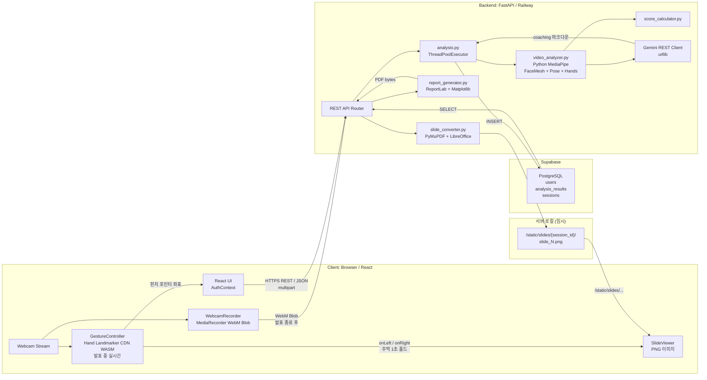
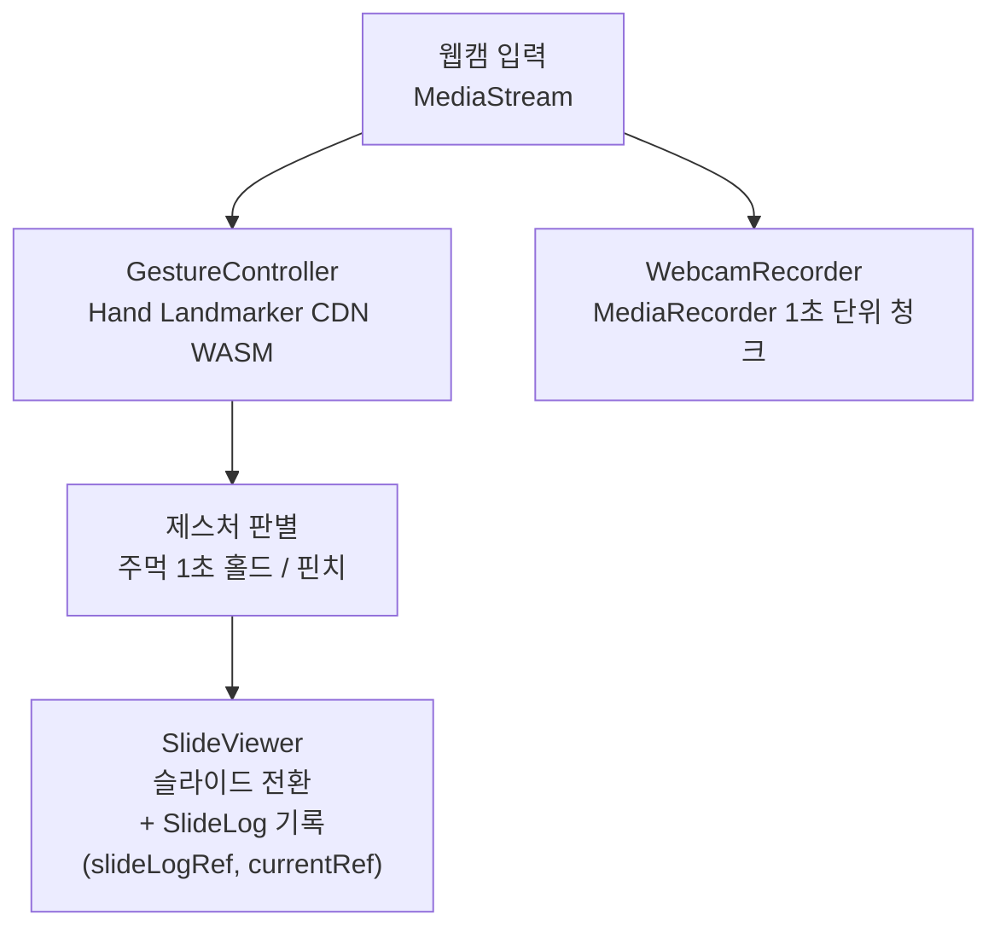
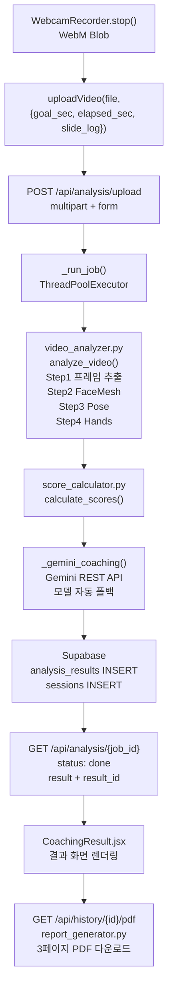
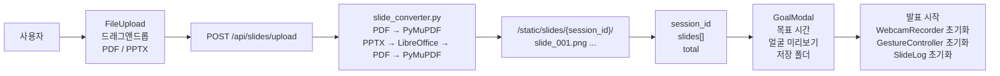
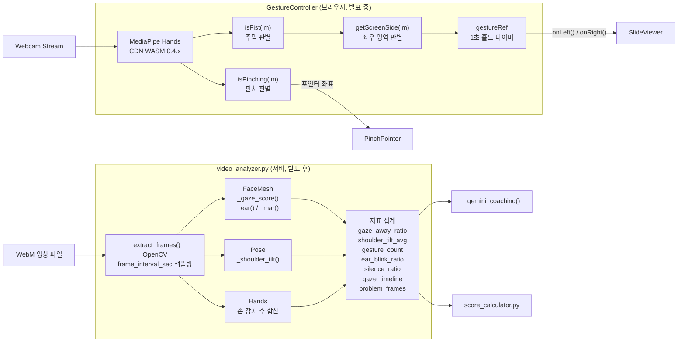
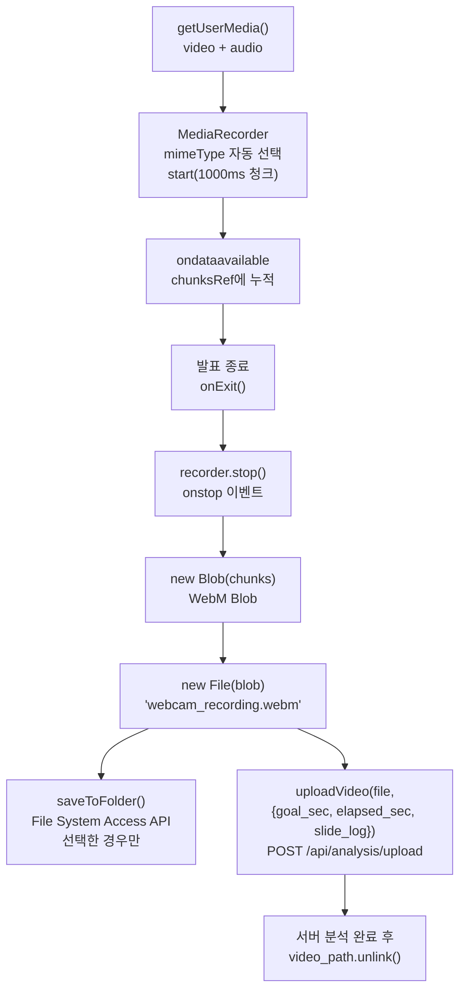
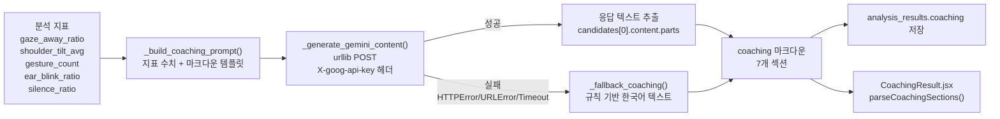
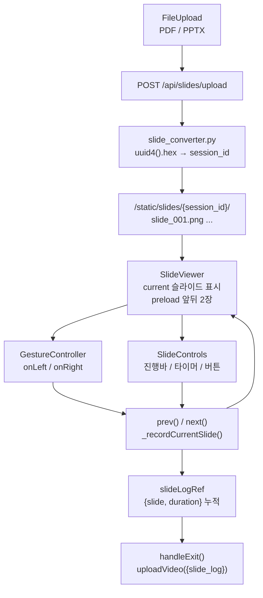

# Design Specification Document (DSD)
# 웹캠 기반 실시간 발표 분석 프로그램

| 항목 | 내용 |
|------|------|
| 종합설계 제목 | 웹캠 기반 실시간 발표 분석 프로그램 |
| 지도교수 | 서영석 |
| 팀장 | 안동규 |
| 팀원 | 김민서, 이보현, 이혜정, 전채현 |
| 주제 분류 | Data, AI |
| 작성일 | 2026년 5월 30일 |
| 버전 | 0.2 구현 기준 갱신 |

---

## 요약문

본 문서는 웹캠 기반 실시간 발표 분석 프로그램의 설계 명세서로, DRD에서 정의한 요구사항을 시스템 계층, 모듈, 데이터 흐름, 입출력 인터페이스, 핵심 알고리즘 단위로 구체화한다.
1차 프로토타입 기준으로 영상 분석은 발표 종료 후 서버(Python MediaPipe)에서 수행하는 방식으로 확정되었으며, 발표 중에는 브라우저에서 Hand Landmarker(CDN WASM)만 실행하여 제스처 기반 슬라이드 제어에 사용한다. 이 구조를 기준으로 각 모듈의 책임, 입출력 데이터, 내부 알고리즘, 외부 시스템 연동 방식을 정의하며, 구현 단계의 기준 문서로 사용한다.

---

## 목차

1. [서론](#1-서론)
   - 1.1 [개요](#11-개요)
   - 1.2 [범위](#12-범위)
   - 1.3 [용어 정의](#13-용어-정의)
   - 1.4 [설계 제한사항](#14-설계-제한사항)
   - 1.5 [Specification](#15-specification)
2. [시스템 아키텍처](#2-시스템-아키텍처)
   - 2.1 [전체 시스템 구성도](#21-전체-시스템-구성도)
   - 2.2 [계층별 역할 정의](#22-계층별-역할-정의)
   - 2.3 [데이터 흐름 개요](#23-데이터-흐름-개요)
3. [모듈별 DSD](#3-모듈별-dsd)
   - 3.1 [회원 관리 모듈](#31-회원-관리-모듈)
   - 3.2 [발표 환경 설정 모듈](#32-발표-환경-설정-모듈)
   - 3.3 [영상 분석 모듈](#33-영상-분석-모듈)
   - 3.4 [영상 녹화 및 캡처 모듈](#34-영상-녹화-및-캡처-모듈)
   - 3.5 [AI 코칭 모듈](#35-ai-코칭-모듈-gemini-api)
   - 3.6 [슬라이드 관리 모듈](#36-슬라이드-관리-모듈)
   - 3.7 [점수화 알고리즘 모듈](#37-점수화-알고리즘-모듈)
   - 3.8 [PDF 보고서 생성 모듈](#38-pdf-보고서-생성-모듈)
4. [데이터베이스 설계](#4-데이터베이스-설계)
   - 4.1 [ER 다이어그램](#41-er-다이어그램)
   - 4.2 [테이블 스키마](#42-테이블-스키마)
   - 4.3 [Storage 구조](#43-storage-구조)
5. [API 명세](#5-api-명세)
   - 5.1 [공통사항](#51-공통사항)
   - 5.2 [인증 API](#52-인증-api)
   - 5.3 [슬라이드 API](#53-슬라이드-api)
   - 5.4 [분석 결과 API](#54-분석-결과-api)
   - 5.5 [보고서 API](#55-보고서-api)
6. [프론트엔드 설계](#6-프론트엔드-설계)
   - 6.1 [페이지 구성 및 라우팅](#61-페이지-구성-및-라우팅)
   - 6.2 [상태 관리 설계](#62-상태-관리-설계)
   - 6.3 [주요 컴포넌트 명세](#63-주요-컴포넌트-명세)
7. [테스트 계획](#7-테스트-계획)
   - 7.1 [단위 테스트](#71-단위-테스트)
   - 7.2 [통합 테스트](#72-통합-테스트)
   - 7.3 [성능 기준](#73-성능-기준)
8. [참고 문헌](#8-참고-문헌)

---

## 1. 서론

### 1.1 개요

본 프로젝트는 노트북 웹캠만으로 발표자의 시선, 자세, 제스처를 분석하고, 발표 종료 후 문제 순간 캡처 이미지와 AI 코칭 텍스트가 포함된 PDF 보고서를 생성하는 PC용 웹 애플리케이션이다.
발표 중에는 브라우저에서 Hand Landmarker(CDN WASM)만 실행하여 슬라이드 제어에 사용하고, 발표 후 녹화 영상을 서버에 업로드하여 Python MediaPipe로 시선·자세·제스처를 분석한다.
본 DSD는 DRD의 요구사항을 실제 구현 가능한 설계 단위로 분해하여 각 모듈의 책임, 입출력 데이터, 내부 알고리즘, 외부 시스템 연동 방식을 정의한다.
문서의 설계 기준은 1차 프로토타입 제출 범위에 맞추며, 음성 분석처럼 일정상 후순위인 기능은 확장 항목으로 분리한다.

### 1.2 범위

| 포함 | 제외 |
|------|------|
| PC 웹 브라우저 기반 발표 분석 웹 애플리케이션 설계 | 모바일 앱 및 태블릿 전용 UI |
| React 클라이언트, FastAPI 백엔드, Supabase PostgreSQL 3계층 구조 | 관리자 페이지, 기관 관리 콘솔 |
| 발표 중 브라우저 Hand Landmarker(CDN WASM) 기반 제스처 제어 | 발표 중 실시간 시선·자세 분석 (발표 후 서버 처리로 대체) |
| 발표 종료 후 Python MediaPipe(서버) 기반 시선·자세·제스처 분석 | 음성 분석 및 Whisper 기반 전사 기능 (7월 이후 고도화) |
| 발표 슬라이드 제어, 영상 녹화, 문제 순간 캡처 연동 방식 | 다중 발표자 동시 분석, 실시간 협업 발표 |
| Gemini API 기반 발표 종료 후 AI 코칭 생성 방식 | 발표 중 실시간 AI 호출 및 실시간 음성 코칭 |
| PDF 보고서 생성을 위한 분석 결과 전달 구조 | Supabase Storage 연동 (현재 로컬 static 폴더 사용, 추후 고도화) |
| | 상용 결제, 구독, 라이선스 관리 기능 |

### 1.3 용어 정의

| 용어 | 정의 |
|------|------|
| Landmark | MediaPipe 모델이 얼굴, 손, 몸의 주요 지점을 정규화 좌표로 추출한 값이다. |
| WASM (WebAssembly) | 브라우저에서 네이티브에 가까운 속도로 모델 추론 코드를 실행하기 위한 바이너리 실행 형식이다. |
| GestureController | 발표 중 브라우저에서 MediaPipe Hands CDN WASM을 실행하여 주먹·핀치 제스처를 인식하고 슬라이드 제어 이벤트를 생성하는 프론트엔드 컴포넌트이다. |
| video_analyzer.py | 발표 종료 후 서버에서 Python MediaPipe(FaceMesh, Pose, Hands)로 영상을 분석하는 백엔드 서비스 모듈이다. |
| EAR (Eye Aspect Ratio) | 눈 주변 랜드마크 간 거리 비율로 눈 감김 여부를 판단하는 지표이다. 임계값 0.2 미만이면 눈 감음으로 분류한다. |
| MAR (Mouth Aspect Ratio) | 입 주변 랜드마크 간 거리 비율로 발화 여부를 판별하는 지표이다. 임계값 0.25 미만이면 침묵 구간으로 분류한다. |
| gaze_score | FaceMesh 랜드마크 기반 yaw·pitch 복합 시선 이탈 점수(0~1)이다. 0.35 초과 시 이탈 프레임으로 분류한다. |
| job_id | 영상 분석 비동기 작업의 식별자이다. 클라이언트는 job_id로 2초 간격 폴링하여 분석 진행 상태와 결과를 조회한다. |
| SlideLog | 슬라이드 전환 시 체류 시간을 기록한 배열이다. [{slide: 0, duration: 3.2}, ...] 형태로 분석 결과와 함께 저장된다. |
| problem_frames | gaze_score > 0.35 또는 shoulder_tilt > 10도인 프레임 중 각 카테고리별 최대값 프레임을 base64 JPEG로 저장한 목록이다. |
| score_calculator | 분석 지표를 DSD 3.7 clamp 공식으로 0~100 점수로 변환하는 서버 모듈이다. |
| SessionSummary | 발표 종료 시 분석 지표를 집계한 결과 딕셔너리이다. AI 코칭, 점수화, PDF 보고서 생성의 공통 입력으로 사용한다. |
| Signed URL | Supabase Storage의 비공개 파일에 제한된 시간 동안 접근할 수 있도록 발급하는 임시 URL이다. (추후 Storage 연동 시 적용 예정) |
| ThreadPoolExecutor | FastAPI에서 영상 분석 작업을 비동기로 실행하기 위한 Python 표준 라이브러리 스레드 풀이다. max_workers=2로 동시 분석 수를 제한한다. |

### 1.4 설계 제한사항

| 제한사항 | 설계 반영 |
|----------|-----------|
| 노트북 웹캠은 720p, 30fps, 고정 앵글, 깊이 정보 없음 | 3D 공간 분석이 아닌 2D 랜드마크 기반 상반신 분석으로 제한하고, 전후 방향 흔들림은 평가 항목에서 제외한다. |
| 조명과 카메라 위치에 따라 인식률 저하 가능 | 발표 시작 전 웹캠·조명 점검 안내를 제공하고, confidence가 낮은 프레임은 집계에서 제외한다. |
| MediaPipe 3개 모델 동시 브라우저 구동 시 부하 발생 | 발표 중에는 Hand Landmarker(CDN WASM)만 브라우저에서 실행하고, Face·Pose·Hand 전체 분석은 발표 종료 후 서버(Python MediaPipe)에서 수행한다. |
| Railway 백엔드 CPU 자원 제한 | 발표 중 실시간 추론은 브라우저(Hand Landmarker만)에서 수행하고, 백엔드는 발표 종료 후 영상 파일을 받아 MediaPipe 분석, Gemini 호출, PDF 생성을 처리한다. ThreadPoolExecutor max_workers=2로 동시 분석 수를 제한한다. |
| Gemini API 호출 제한 및 응답 지연 | 발표 중에는 API를 호출하지 않고, 발표 종료 후 분석 지표를 묶어 1회 일괄 호출한다. 실패 시 규칙 기반 fallback 텍스트를 자동 생성한다. |
| 개인정보 보호 필요 | 영상 파일은 분석 완료 후 서버에서 즉시 삭제한다(finally: video_path.unlink()). 보고서에는 집계값과 문제 프레임 캡처만 저장한다. |
| 다중 사용자 동시 세션 미지원 | 1인 1세션 구조로 설계하고, 세션 데이터는 user_id 기준으로 분리한다. |
| Supabase Storage 미연동 | 슬라이드 이미지는 현재 서버 로컬 static 폴더에 저장하며, Storage 연동은 추후 고도화 항목으로 분류한다. |
| 음성 분석은 7월 이후 고도화 항목 | MAR 기반 침묵 비율(silence_ratio)만 보조 지표로 수집하며, 음성 전사·필러워드 분석은 포함하지 않는다. |

### 1.5 Specification

상세 기능 명세는 DRD 2.5 Specification을 기준으로 하며, 본 DSD에서는 이를 구현 관점의 모듈 책임으로 재구성한다.

| 분야 | DSD 설계 대응 |
|------|---------------|
| 사용자 관리 | JWT 기반 인증(python-jose, bcrypt), Supabase users 테이블, localStorage 토큰 관리 |
| 발표 실행 | PDF/PPTX 업로드 → PyMuPDF·LibreOffice 변환 → 로컬 static PNG 서빙, 앞뒤 2장 preload |
| 제스처 제어 | MediaPipe Hands CDN WASM, 주먹 1초 홀드(시간 기반), 핀치 레이저 포인터 |
| 영상 분석 | Python MediaPipe FaceMesh·Pose·Hands, frame_interval_sec 간격 샘플링, ThreadPoolExecutor 비동기 |
| AI 피드백 | Gemini REST API(urllib), 모델 자동 폴백, 7개 섹션 마크다운 출력, 규칙 기반 fallback |
| 점수화 | score_calculator.py, DSD 3.7 clamp 공식, 가중합(시선 30%·자세 25%·제스처 15%·시간 30%) |
| 보고서 생성 | ReportLab + Matplotlib 3페이지 PDF, HTTP Response 직접 반환 |
| 시스템 환경 | React + Vite(Vercel), FastAPI(Railway), Supabase PostgreSQL |

---

## 2. 시스템 아키텍처

### 2.1 전체 시스템 구성도



발표 중에는 GestureController(Hand Landmarker CDN WASM)만 브라우저에서 실시간으로 실행하여 슬라이드 제어에 사용한다. 나머지 Face·Pose·Hand 분석은 발표 종료 후 WebM 영상을 서버에 업로드하여 Python MediaPipe로 처리한다. 슬라이드 이미지는 현재 서버 로컬 static 폴더에 저장하며, Supabase Storage 연동은 추후 고도화 항목이다.

### 2.2 계층별 역할 정의

| 계층 | 담당 | 기술 스택 | 배포 |
|------|------|----------|------|
| 클라이언트 UI | 전채현, 안동규(분석 연동) | React, Context API, WebRTC getUserMedia, Canvas API | Vercel |
| 영상 분석 Worker | 안동규 | MediaPipe Tasks Vision, WASM, Web Worker, requestVideoFrameCallback | 브라우저 내 실행 |
| 백엔드 API | 김민서, 이혜정 | FastAPI, Pydantic, JWT, Supabase SDK | Railway |
| 점수화 | 이보현 | score_calculator.py, DSD 3.7 가중합 공식 | Railway 백엔드 내부 |
| AI 코칭 처리 | 안동규 | Gemini API, 프롬프트 빌더, JSON 응답 파서 | Railway 백엔드 내부 |
| 보고서 생성 | 전채현, 김민서 | ReportLab, Matplotlib, BytesIO | Railway 백엔드 내부 |
| 데이터베이스 | 이혜정 | Supabase PostgreSQL, Row Level Security | Supabase |
| 파일 저장소 | 이혜정 | Supabase Storage, Signed URL, 비공개 버킷 | Supabase |

### 2.3 데이터 흐름 개요

그림 2는 발표 시작부터 보고서 다운로드까지의 핵심 데이터 흐름이다. 흐름은 발표 중 1단계와 발표 후 2단계로 분리된다.

**1단계: 발표 중**



**2단계: 발표 종료 후**



| 단계 | 데이터 형태 | 저장 위치 | 비고 |
|------|-------------|-----------|------|
| 웹캠 입력 | MediaStream | 브라우저 메모리 | 외부 전송 없음 |
| 제스처 추론 | Hand landmark 배열 | GestureController 메모리 | CDN WASM, 발표 중 실시간 |
| 녹화 영상 | MediaRecorder WebM Blob | 브라우저 메모리 | stop() 호출 시 File 변환 후 서버 업로드 |
| SlideLog | [{slide, duration}, ...] | Form 데이터(JSON 문자열) | uploadVideo와 함께 서버 전송 |
| 프레임 분석값 | gaze_away_ratio, shoulder_tilt_avg, gesture_count, ear_blink_ratio, silence_ratio, gaze_timeline, problem_frames | 서버 메모리(임시) | frame_interval_sec 간격 샘플링 |
| 점수 | score_gaze, score_pose, score_gesture, score_time, score_total | Supabase analysis_results | DSD 3.7 가중합 공식 |
| AI 코칭 | 마크다운 텍스트(7개 섹션) | Supabase analysis_results.coaching | Gemini 실패 시 규칙 기반 fallback |
| problem_frames | base64 JPEG 목록 | Supabase analysis_results.problem_frames | gaze>0.35, pose>10도 최대값 프레임 |
| 영상 파일 | WebM | 서버 임시 경로 | 분석 완료 후 즉시 삭제 |
| 최종 보고서 | PDF bytes | HTTP Response(스트리밍) | 현재 Storage 미저장, 직접 다운로드 |

---

## 3. 모듈별 DSD

### 3.1 회원 관리 모듈

#### 기능 설명

회원 관리 모듈은 사용자 계정의 생성(회원가입), 인증(로그인), 세션 종료(로그아웃), 비밀번호 변경, 현재 사용자 정보 조회 기능을 제공한다. FastAPI 백엔드에서 JWT Access Token을 발급하고 프론트엔드 AuthContext에서 localStorage로 관리한다.

#### 블록 다이어그램

```plaintext
회원가입 / 로그인 UI (Login.jsx)
        ↓
Auth API (/api/auth/signup, /api/auth/login)
        ↓
get_user_by_email() / create_user()  ← database.py
        ↓
hash_password() / verify_password()  ← bcrypt
        ↓
create_access_token()  ← python-jose HS256
        ↓
Supabase users 테이블 저장
        ↓
Frontend AuthContext → localStorage('token') 저장
        ↓
fetchMe() → user 상태 갱신
```

#### 입출력 파라미터

| 엔드포인트 | 입력 | 출력 | 에러 |
|-----------|------|------|------|
| POST /api/auth/signup | email, password, name(optional) | access_token, token_type | 409 이메일 중복, 422 비밀번호 6자 미만 |
| POST /api/auth/login | email, password | access_token, token_type | 401 이메일/비밀번호 불일치 |
| GET /api/auth/me | Authorization: Bearer token | id, email, name | 401 토큰 무효 |
| POST /api/auth/change-password | current_password, new_password | message | 401 현재 비밀번호 불일치, 422 6자 미만 |

#### 알고리즘

**비밀번호 해싱:** bcrypt, gensalt() 자동 적용

**JWT payload 구조:**
```json
{
  "sub": "user_id(hex)",
  "exp": "현재시각 + 1440분(24시간)"
}
```

알고리즘: HS256, 서명키: settings.secret_key

**토큰 검증 흐름:**
```plaintext
요청 Authorization: Bearer token
        ↓
oauth2_scheme → decode_token()
        ↓
jwt.decode() → user_id 추출
        ↓
get_user_by_id() → Supabase 조회
        ↓
CurrentUser(id, email, name) 반환
실패 시 → 401 Unauthorized
```

**name 컬럼 폴백:** users 테이블에 name 컬럼이 없을 때 _is_missing_name_column()으로 감지 후 name 제외하고 재시도, 결과에는 항상 user.setdefault("name", None) 보장

---

### 3.2 발표 환경 설정 모듈

#### 기능 설명

발표 환경 설정 모듈은 발표 시작 전 슬라이드 업로드, 목표 발표 시간 설정, 얼굴 미리보기 옵션 설정, 영상 저장 폴더 선택(File System Access API 지원 브라우저만) 기능을 담당한다. 설정값은 localStorage('presentationcoach.settings')에 저장되어 다음 세션에서 기본값으로 재사용된다.

슬라이드 파일은 POST /api/slides/upload로 업로드하면 서버에서 PNG로 변환 후 session_id와 이미지 URL 목록을 반환한다. 발표 시작 후 GoalModal 설정이 완료되면 WebcamRecorder와 GestureController가 초기화된다.

#### 블록 다이어그램



#### 입출력 파라미터

| 함수 / 엔드포인트 | 입력 | 출력 |
|----------------|------|------|
| POST /api/slides/upload | multipart: file(PDF/PPTX), 최대 500MB | session_id, slides([url,...]), total |
| DELETE /api/slides/{session_id} | session_id | {ok: true} |
| convert_to_slides(file_path, filename) | Path, 파일명 | (session_id, [image_url, ...]) |
| GoalModal.onStart(goal, folderHandle, options) | goal(초\|null), folderHandle, {showFacePreview} | — |

**localStorage 설정 구조:**
```json
{
  "showFacePreview": true,
  "defaultGoalMinutes": "",
  "autoOpenHistory": false
}
```

#### 알고리즘

1. 파일 업로드 시 확장자 검증(.pdf, .pptx, .ppt), 크기 초과 시 413 반환
2. 임시 파일 저장 후 변환:
   - PDF: fitz.open(pdf_path) → 페이지별 fitz.Matrix(2.0, 2.0) 픽셀맵 → slide_001.png 저장
   - PPTX: LibreOffice headless subprocess 호출(--headless --convert-to pdf, timeout 120초) → 생성된 PDF를 위 PDF 처리와 동일하게 처리
3. 변환된 이미지는 {static_dir}/slides/{session_id}/에 저장, URL /static/slides/{session_id}/slide_001.png 형태로 반환
4. 임시 업로드 파일 및 PPTX 변환용 임시 디렉토리는 finally 블록에서 즉시 삭제
5. GoalModal에서 목표 시간(분 → 초 변환), 얼굴 미리보기, 저장 폴더 설정 후 handleStart() 호출
6. 발표 시작 시 slideLogRef=[], slideStartRef=Date.now(), currentRef=0 초기화, 1초 interval 타이머 시작

---

### 3.3 영상 분석 모듈

#### 기능 설명

영상 분석은 역할에 따라 GestureController(브라우저)와 video_analyzer.py(서버) 두 가지로 분리된다.

**GestureController(발표 중 실시간, 브라우저):** MediaPipe Hands CDN WASM(0.4.x)을 동적 스크립트로 로드하여 브라우저에서 실행한다. requestAnimationFrame 루프로 웹캠 프레임을 전달하고 주먹 홀드(1초) 및 핀치 제스처를 판별하여 슬라이드 제어 이벤트를 생성한다. Face·Pose 분석은 수행하지 않아 브라우저 부하를 최소화한다.

**video_analyzer.py(발표 후 서버):** 발표 종료 후 WebM 영상 파일을 서버에 업로드하면 ThreadPoolExecutor에서 비동기로 실행된다. Python MediaPipe의 FaceMesh, Pose, Hands 모델을 순서대로 실행하며, settings.frame_interval_sec(기본 2초) 간격으로 프레임을 샘플링한다. 분석 진행 상태는 on_step 콜백(Step 1~5)으로 _jobs 딕셔너리에 저장되며, 클라이언트는 GET /api/analysis/{job_id} 2초 간격 폴링으로 상태를 확인한다.

| 모델 | 사용 시점 | 실행 환경 | 본 프로젝트 사용 값 |
|------|----------|-----------|---------------------|
| Hands (CDN WASM 0.4.x) | 발표 중 실시간 (GestureController) | 브라우저 | 주먹 1초 홀드 → 슬라이드 제어, 핀치 → 레이저 포인터 |
| FaceMesh | 발표 후 서버 (video_analyzer.py) | Railway 백엔드 | yaw/pitch 복합 gaze_score, EAR(눈 감음), MAR(침묵) |
| Pose | 발표 후 서버 (video_analyzer.py) | Railway 백엔드 | 어깨 기울기 atan2, problem_frames |
| Hands (Python) | 발표 후 서버 (video_analyzer.py) | Railway 백엔드 | 프레임당 감지된 손 수 합산 → gesture_count |

#### 블록 다이어그램



#### 입출력 파라미터

**GestureController 제스처 판별 기준:**

| 제스처 | 판별 함수 | 조건 |
|--------|----------|------|
| 주먹(fist) | isFist(lm) | 검지~소지 4개 중 tip.y > MCP.y 인 손가락 ≥ 3개 |
| 핀치(pinch) | isPinching(lm) | 엄지(lm[4])~검지(lm[8]) 거리 < palmSize×0.38, 검지 미접힘 조건 동시 충족 |
| 화면 우측 | getScreenSide(lm) | mirror 보정 후 raw x < 0.35 → right (다음 슬라이드) |
| 화면 좌측 | getScreenSide(lm) | mirror 보정 후 raw x > 0.65 → left (이전 슬라이드) |

주먹이 동일 영역에서 1000ms 이상 유지되면 콜백 1회 실행 후 gestureRef 초기화.
핀치 포인터 좌표: {x: clamp((1-x)*100, 4, 96), y: clamp(y*100, 6, 94)}

**video_analyzer.py 분석 지표:**

| # | 지표명 | 사용 모델 | 계산 방법 | 단위 |
|---|--------|---------|---------|------|
| 1 | gaze_away_ratio | FaceMesh | gaze_score > 0.35 프레임 비율 | 0~1 |
| 2 | gaze_score | FaceMesh | max(yaw_dev, pitch_dev×0.6), 클램프 0~1 | 0~1 |
| 3 | shoulder_tilt_avg | Pose | abs(atan2(l.y-r.y, l.x-r.x)) 평균 | 도(degree) |
| 4 | gesture_count | Hands | 프레임당 감지된 손 수 합산 | 횟수 |
| 5 | ear_blink_ratio | FaceMesh | EAR < 0.2 프레임 비율 | 0~1 |
| 6 | silence_ratio | FaceMesh | MAR < 0.25 프레임 비율 | 0~1 |
| 7 | gaze_timeline | FaceMesh | [{sec, score}, ...] | 리스트 |
| 8 | problem_frames | FaceMesh/Pose | gaze>0.35 또는 tilt>10도 최대값 프레임 base64 | 리스트 |

**FaceMesh 랜드마크 인덱스:**
```
NOSE_TIP        = 1
LEFT_EYE_OUTER  = 33,   RIGHT_EYE_OUTER = 263
LEFT_EYE_EAR    = [362, 385, 387, 263, 373, 380]
RIGHT_EYE_EAR   = [33,  160, 158, 133, 153, 144]
UPPER_LIP = 13,  LOWER_LIP  = 14
MOUTH_LEFT = 61, MOUTH_RIGHT = 291
```

**analyze_video() 반환 dict:**
```python
{
  "gaze_away_ratio": float,
  "shoulder_tilt_avg": float,
  "gesture_count": int,
  "ear_blink_ratio": float,
  "silence_ratio": float,
  "gaze_timeline": [{"sec": float, "score": float}, ...],
  "problem_frames": [
    {
      "type": "gaze" | "pose",
      "label": str,
      "sec": float,
      "score": float,
      "value": str,
      "image": str   # base64 JPEG
    }
  ]
}
```

#### 알고리즘

**1. 프레임 추출 (_extract_frames)**
- OpenCV VideoCapture로 영상 로드
- FPS 파싱 실패 시 기본값 30 적용 (브라우저 WebM 녹화본 FPS 파싱 불안정 대응)
- interval = max(1, int(fps × frame_interval_sec)) 간격으로 프레임 샘플링
- OpenCV stderr 억제 (EBML/webm 파싱 경고 차단)

**2. 시선 분석 (_gaze_score)**
```
face_cx   = (left.x + right.x) / 2
face_cy   = (left.y + right.y) / 2
eye_dist  = max(abs(right.x - left.x), 1e-6)
yaw_dev   = abs(nose.x - face_cx) / eye_dist
pitch_dev = abs(nose.y - face_cy) / eye_dist × 0.6
gaze_score = min(max(yaw_dev, pitch_dev), 1.0)
```
gaze_score > 0.35이고 현재까지의 최대값이면 problem_frames에 저장

**3. 눈 감음 분석 (_ear)**
```
EAR = (||p2-p6|| + ||p3-p5||) / (2 × ||p1-p4||)
임계값 0.2 미만 → 눈 감음 프레임
```

**4. 발화 분석 (_mar)**
```
MAR = |UPPER_LIP.y - LOWER_LIP.y| / max(|MOUTH_LEFT.x - MOUTH_RIGHT.x|, 1e-6)
임계값 0.25 미만 → 침묵 프레임
```

**5. 자세 분석 (_shoulder_tilt)**
```
tilt = abs(degrees(atan2(l.y - r.y, l.x - r.x)))
tilt > 10도이고 현재까지의 최대값이면 problem_frames에 저장
```

**6. 제스처 분석**
- mp_hands.Hands(static_image_mode=True, max_num_hands=2, min_detection_confidence=0.5)
- 프레임별 len(result.multi_hand_landmarks) 합산 → gesture_count

**7. 분석 단계 콜백 (on_step)**

| step | 내용 |
|------|------|
| 1 | 프레임 추출 |
| 2 | FaceMesh 분석 (시선 + EAR + MAR) |
| 3 | Pose 분석 (어깨 기울기) |
| 4 | Hands 분석 (제스처 횟수) |
| 5 | Gemini AI 코칭 생성 |

각 단계 진입 시 _jobs[job_id]["step"] = n 갱신, 클라이언트 폴링으로 AnalysisProgress.jsx stepHint에 반영
(백엔드 step 1~5 → 프론트 stepHint 0~4 오프셋 차이)

---

### 3.4 영상 녹화 및 캡처 모듈

#### 기능 설명

영상 녹화 모듈은 발표 중 브라우저에서 WebcamRecorder 컴포넌트가 MediaRecorder API로 웹캠 영상을 녹화하고, 발표 종료 시 WebM Blob을 반환하는 역할을 담당한다.

문제 순간 캡처는 별도의 Canvas 캡처 없이 서버 video_analyzer.py에서 수행한다. 분석 중 gaze_score > 0.35 또는 shoulder_tilt > 10도인 프레임 중 각 카테고리별 최대값 프레임을 cv2.imencode(".jpg") + base64로 인코딩하여 problem_frames에 저장한다.

발표 종료 시 webcamRef.current.stop() 호출로 Blob을 수신하고, PresentationMode.jsx의 handleExit()에서 uploadVideo(file, {goal_sec, elapsed_sec, slide_log})로 서버에 전송한다. 영상 파일은 분석 완료 후 서버에서 즉시 삭제(finally: video_path.unlink())한다.

#### 블록 다이어그램



#### 입출력 파라미터

| 항목 | 값 |
|------|-----|
| mimeType 우선순위 | video/webm;codecs=vp9,opus → video/webm;codecs=vp8,opus → video/webm → video/mp4 → '' |
| 청크 간격 | 1000ms (recorder.start(1000)) |
| ref.stop() 반환값 | Promise<Blob> |
| problem_frames 캡처 조건 | gaze_score > 0.35 최대값 1장 / shoulder_tilt > 10도 최대값 1장 |
| 캡처 인코딩 | cv2.imencode(".jpg", frame, [IMWRITE_JPEG_QUALITY, 70]) → base64 |

**WebcamRecorder 상태:**

| status | 표시 UI |
|--------|---------|
| init | "카메라 준비 중..." 박스 |
| recording | PIP 미리보기(w-32 h-24, 좌하단) + REC 인디케이터 |
| denied | "카메라 권한을 확인하세요" 에러 박스 |

**WebcamRecorder Props / Ref:**

| 항목 | 설명 |
|------|------|
| ref.stop() | Promise<Blob> 반환, recorder 정지 → tracks 정지 → chunks 합산 |
| onStream(stream) | 스트림 준비 시 콜백, GestureController에 stream 전달용 |
| showPreview | PIP 미리보기 표시 여부 (GoalModal 설정값 연동) |

#### 알고리즘

**녹화 시작:**
1. navigator.mediaDevices.getUserMedia({video: true, audio: true})
2. MediaRecorder.isTypeSupported()로 우선순위대로 지원 mimeType 자동 선택
3. recorder.start(1000) → ondataavailable에서 e.data.size > 0이면 chunksRef.current.push(e.data)
4. onStream(stream) 콜백 호출 → GestureController stream 전달
5. setStatus('recording')

**녹화 종료 (stop()):**
1. recorder.state !== 'inactive'이면 recorder.stop() 호출
2. recorder.onstop:
   - streamRef.current.getTracks().forEach(t => t.stop())
   - resolve(new Blob(chunksRef.current, {type: MIME_TYPE || 'video/webm'}))
3. 이미 inactive이면 현재 chunks로 즉시 Blob 생성 후 resolve

**handleExit() 흐름 (PresentationMode.jsx):**
1. clearInterval(timerRef) → 타이머 정지
2. _recordCurrentSlide() → 마지막 슬라이드 체류 시간 기록
3. setExiting(true) → 로딩 오버레이 표시
4. deleteSlides(session.sessionId) → 슬라이드 서버 정리
5. blob = await webcamRef.current?.stop()
6. blob && blob.size > 0이면:
   - folderHandleRef.current 있으면 saveToFolder(blob, folderHandle)
   - new File([blob], 'webcam_recording.webm', {type: blob.type})
   - uploadVideo(file, {goal_sec, elapsed_sec, slide_log: slideLogRef.current})
   - navigate('/analysis', {state: {jobId: job_id}})
7. blob 없거나 업로드 실패 시 navigate('/')

---

### 3.5 AI 코칭 모듈 (Gemini API)

#### 기능 설명

AI 코칭 모듈은 발표 종료 후 분석 지표 5개(gaze_away_ratio, shoulder_tilt_avg, gesture_count, ear_blink_ratio, silence_ratio)를 바탕으로 Gemini REST API를 호출하여 한국어 코칭 텍스트를 생성한다.

Gemini API는 urllib 기반 REST 직접 호출 방식을 사용한다. 응답은 마크다운 텍스트(7개 섹션) 형태로 받으며, 프론트엔드 parseCoachingSections()에서 섹션별로 파싱된다. API 호출 실패 시 _fallback_coaching()이 규칙 기반 한국어 코칭을 자동 생성한다.

| 설계 항목 | 결정 |
|-----------|------|
| 호출 시점 | _run_job() 내부, analyze_video() 완료 후 1회 |
| 모델 폴백 순서 | settings.gemini_model → gemini-flash-latest → gemini-2.5-flash → gemini-2.0-flash |
| 입력 | 분석 지표 5개 텍스트 (현재 이미지 미포함) |
| 출력 형식 | 마크다운 텍스트, ## 섹션 7개 |
| 실패 처리 | _fallback_coaching() 규칙 기반 자동 생성 |

#### 블록 다이어그램



#### 입출력 파라미터

**프롬프트 입력 구조 (_build_coaching_prompt):**
```
- 시선 이탈 비율: {gaze_away_ratio×100:.1f}%
- 어깨 기울기 평균: {shoulder_tilt_avg:.1f}도
- 제스처 횟수: {gesture_count}회
- 눈 감음 비율: {ear_blink_ratio×100:.1f}%
- 침묵 구간 비율: {silence_ratio×100:.1f}%
```

**출력 마크다운 섹션 구조:**

| 섹션 | 키 | 내용 |
|------|-----|------|
| ## 한줄 요약 | summary | 발표 전체 한 문장 요약 |
| ## 시선 | gaze | 진단 + 코칭 |
| ## 자세 | pose | 진단 + 코칭 |
| ## 제스처 | gesture | 진단 + 코칭 |
| ## 집중도 | focus | EAR 기반 진단 + 코칭 |
| ## 발화 | speech | MAR 기반 진단 + 코칭 |
| ## 다음 연습 우선순위 | priority | 번호 목록 2개 |

**프론트엔드 파싱 (parseCoachingSections):**
- ## 제목 패턴으로 섹션 분리
- HEADING_ALIASES로 유연한 제목 매핑 (예: "시선 이탈" → gaze)
- 섹션 없으면 fallbackSectionText(key, metrics)로 대체

#### 알고리즘

1. _gemini_model_candidates(): settings.gemini_model에서 models/ 접두어 제거 후 후보 목록 생성, 중복 제거
2. _generate_gemini_content(model_name, api_key, prompt):
   - URL: https://generativelanguage.googleapis.com/v1beta/models/{model_name}:generateContent
   - 헤더: Content-Type: application/json, X-goog-api-key: {api_key}
   - 응답: candidates[0].content.parts[].text 추출 후 join
3. 모델 순서대로 시도, HTTPError/URLError/TimeoutError/JSONDecodeError 발생 시 다음 모델로 폴백
4. 전체 실패 시 _fallback_coaching(metrics) 호출:
   - gaze_away_ratio, shoulder_tilt_avg, gesture_count, ear_blink_ratio, silence_ratio 기준값으로 분기
   - 각 지표별 diagnosis + coaching 문자열 생성
   - 우선순위 2개 자동 선택 후 동일한 7개 섹션 마크다운 반환

---

### 3.6 슬라이드 관리 모듈

#### 기능 설명

슬라이드 관리 모듈은 업로드된 PDF/PPTX 파일을 PNG 이미지로 변환하여 서버에 저장하고, 프론트엔드에서 슬라이드를 표시·전환하며 SlideLog를 기록하는 역할을 담당한다.

SlideViewer는 현재 슬라이드를 표시하고 앞뒤 2장을 preload하며 키보드 단축키를 처리한다. SlideControls는 진행바·타이머·네비게이션 버튼을 제공한다. 슬라이드 전환 시마다 _recordCurrentSlide()가 호출되어 체류 시간을 slideLogRef에 누적하고, 발표 종료 시 uploadVideo와 함께 서버에 전송된다.

#### 블록 다이어그램



#### 입출력 파라미터

| 함수 | 입력 | 출력 |
|------|------|------|
| convert_to_slides(file_path, filename) | Path, 파일명 | (session_id, ["/static/slides/.../slide_001.png", ...]) |
| delete_session(session_id) | session_id | None (디렉토리 삭제) |
| _recordCurrentSlide() | — | slideLogRef에 {slide: currentRef, duration: float} 추가 |
| prev() / next() | — | current 인덱스 변경, _recordCurrentSlide() 호출 |

**SlideLog 항목 구조:**
```json
{"slide": 0, "duration": 3.2}
```
duration 단위: 초(소수점 1자리), (Date.now() - slideStartRef) / 1000으로 계산

**SlideViewer preload 범위:**
```javascript
for i in range(max(0, current-2), min(slides.length-1, current+2)+1):
    if i != current: preload(slides[i])
```

**SlideControls 타이머:**
- elapsed > goalSec 이면 bg-red-600 animate-pulse
- fmt(sec): MM:SS 형식, Math.floor(sec/60).padStart(2,'0')

**키보드 단축키 (SlideViewer):**

| 키 | 동작 |
|----|------|
| ArrowLeft, ArrowUp | onPrev() |
| ArrowRight, ArrowDown, Space | onNext() + preventDefault |

#### 알고리즘

**슬라이드 전환 흐름:**
1. prev() 또는 next() 호출 (버튼·키보드·제스처 공통)
2. _recordCurrentSlide():
   - duration = (Date.now() - slideStartRef) / 1000
   - slideLogRef.current.push({slide: currentRef.current, duration})
   - slideStartRef.current = Date.now()
3. setCurrent(newIndex) + currentRef.current = newIndex 동기화 (클로저 문제 방지)
4. SlideViewer re-render → 현재 슬라이드 img 표시 + preload img 갱신

**발표 종료 시:**
1. clearInterval(timerRef) → 타이머 정지
2. _recordCurrentSlide() → 마지막 슬라이드 기록
3. deleteSlides(session.sessionId) → DELETE /api/slides/{session_id} → 서버 PNG 삭제
4. slideLogRef.current를 JSON.stringify하여 uploadVideo slide_log 파라미터로 전송

---

### 3.7 점수화 알고리즘 모듈

#### 기능 설명

점수화 알고리즘 모듈은 analyze_video() 반환값과 goal_sec을 입력으로 받아 시선·자세·제스처·시간 4개 카테고리 점수를 0~100 범위로 정량화하고, 가중합으로 최종 발표 점수를 산출한다. 가중치는 비언어적 커뮤니케이션 관련 선행 연구를 기반으로 설정하였다.

#### 블록 다이어그램

```plaintext
analyze_video() 결과 dict + goal_sec
            │
            ▼
 ┌──────────┬──────────┬──────────┬──────────┐
 ▼          ▼          ▼          ▼
[Gaze]   [Pose]   [Gesture]   [Time]
 score()  score()   V자 곡선    deviation
            │
            ▼
     가중합 (0.30 / 0.25 / 0.15 / 0.30)
            │
            ▼
  {score_gaze, score_pose, score_gesture,
   score_time, score_total}
```

#### 카테고리 및 가중치

| 카테고리 | 입력 지표 | 가중치 |
|----------|---------|--------|
| 시선 (Gaze) | gaze_away_ratio | 0.30 |
| 자세 (Pose) | shoulder_tilt_avg | 0.25 |
| 제스처 (Gesture) | gesture_count | 0.15 |
| 시간 (Time) | abs(elapsed_sec - goal_sec) / goal_sec | 0.30 |

#### 알고리즘

**공통 점수 변환 함수:**
```python
def _score(raw, good, bad):
    if abs(bad - good) < 1e-9:
        return 100
    return int(max(0, min(100, (1 - (raw - good) / (bad - good)) * 100)))
```

**(1) 시선 점수**

| 입력 | good | bad |
|------|------|-----|
| gaze_away_ratio | 0.0 | 0.5 |

```
score_gaze = _score(gaze_away_ratio, 0.0, 0.5)
```

**(2) 자세 점수**

| 입력 | good | bad |
|------|------|-----|
| shoulder_tilt_avg | 0.0 | 20.0 |

```
score_pose = _score(shoulder_tilt_avg, 0.0, 20.0)
```

**(3) 제스처 점수 (V자 곡선)**

15회가 최적, 0회 또는 50회 이상이면 감점:
```python
if gesture_count <= 15:
    score_gesture = _score(gesture_count, 15, 0)   # 0개→0점, 15개→100점
else:
    score_gesture = _score(gesture_count, 15, 50)  # 15개→100점, 50개→0점
score_gesture = max(0, min(100, score_gesture))
```

**(4) 시간 점수**

```python
if goal_sec and goal_sec > 0:
    elapsed = metrics.get("elapsed_sec") or goal_sec
    dev = abs(elapsed - goal_sec) / goal_sec
    score_time = _score(dev, 0.0, 0.3)
else:
    score_time = 80  # 목표 시간 미설정 시 기본값
```

**(5) 최종 점수**

```python
score_total = int(
    score_gaze    * 0.30 +
    score_pose    * 0.25 +
    score_gesture * 0.15 +
    score_time    * 0.30
)
```

출력:
```python
{
  "score_gaze": int,
  "score_pose": int,
  "score_gesture": int,
  "score_time": int,
  "score_total": int
}
```

---

### 3.8 PDF 보고서 생성 모듈

#### 기능 설명

PDF 보고서 생성 모듈은 Supabase analysis_results 테이블의 레코드 1개를 입력으로 받아 ReportLab과 Matplotlib으로 3페이지 PDF를 생성하고, HTTP Response로 직접 반환한다. 현재 Supabase Storage 미연동으로 파일 저장 없이 바이트 스트림을 클라이언트에 직접 전달한다.

#### 블록 다이어그램

```plaintext
generate_report(record: dict)
        ↓
폰트 설정
(Windows: malgun.ttf / malgunbd.ttf
 기타: HYGothic-Medium CID 폴백)
        ↓
_make_chart()          _make_score_chart()
가로 막대 차트 PNG      세로 막대 차트 PNG
(Matplotlib)           (Matplotlib)
        ↓
Page 1: 표지
  - 날짜 + 종합 점수(score_total)
        ↓
Page 2: 지표 + 차트
  - _metric_card() ×3 (시선/자세/제스처)
  - 가로 막대 차트
  - 항목별 점수 세로 막대 차트 + 테이블
        ↓
Page 3: 코칭
  - _problem_frame_cards() (gaze/pose 2열)
  - _coaching_cards() (마크다운 섹션별 카드)
        ↓
BytesIO → bytes 반환
        ↓
GET /api/history/{result_id}/pdf
Content-Disposition: attachment
```

#### 입출력 파라미터

**입력 record 필드:**

| 키 | 타입 | 설명 |
|----|------|------|
| created_at | str | 분석 생성 시각 (ISO 8601) |
| gaze_away_ratio | float | 시선 이탈 비율 |
| shoulder_tilt_avg | float | 어깨 기울기 평균 |
| gesture_count | int | 제스처 횟수 |
| ear_blink_ratio | float | 눈 감음 비율 |
| silence_ratio | float | 침묵 비율 |
| coaching | str | 마크다운 코칭 텍스트 |
| problem_frames | list\|str\|None | base64 캡처 이미지 목록 |
| elapsed_sec | float\|None | 실제 발표 시간(초) |
| goal_sec | float\|None | 목표 시간(초) |
| score_total | int\|None | 종합 점수 |
| score_gaze | int | 시선 점수 |
| score_pose | int | 자세 점수 |
| score_gesture | int | 제스처 점수 |
| score_time | int | 시간 점수 |

**출력:** bytes (PDF 바이너리)

**페이지 구성:**

| 페이지 | 내용 | 구성 요소 |
|--------|------|---------|
| 1 | 표지 | 날짜, 종합 점수(score_total 색상 표시) |
| 2 | 지표 + 차트 | _metric_card ×3, 가로 막대 차트, 세로 막대 차트, 점수 테이블 |
| 3 | AI 코칭 | _problem_frame_cards(gaze/pose 2열), _coaching_cards(섹션별 카드) |

#### 알고리즘

**1. 차트 생성 (_make_chart)**
- 시선 이탈률(%), 어깨 기울기(도), 제스처 횟수(회) 가로 막대
- 색상: gaze>0.3→red, >0.15→amber, 이하→green / tilt>15→red, >8→amber / gesture 범위 밖→amber

**2. 점수 차트 생성 (_make_score_chart)**
- score_gaze, score_pose, score_gesture, score_time 세로 막대
- 색상: ≥70→green, ≥50→amber, 미만→red

**3. 상태 판별 (_score_color)**
```
≥70 → _GREEN / ≥50 → _AMBER / 미만 → _RED
```

**4. 마크다운 렌더링**
- _markdown_inline(): **text** → <b>text</b> (XML escape 후 치환)
- _parse_markdown_sections(): ## 제목 기준으로 섹션 분리
- _markdown_lines_to_flowables(): 불릿(-*), 번호(1.), 일반 텍스트 → ReportLab Paragraph

**5. 문제 프레임 카드 (_problem_frame_cards)**
- _select_problem_frame(frames, "gaze"): type="gaze" 프레임 중 score 내림차순 1개, 없으면 legacy[0]
- _select_problem_frame(frames, "pose"): type="pose" 프레임 중 score 내림차순 1개, 없으면 legacy[3]
- 2열 Table 레이아웃, 이미지 최대 크기: col_width - 0.5cm × 4.2cm

**6. PDF 생성**
- SimpleDocTemplate, A4, 여백 1.6cm(좌우) / 1.7cm(상하)
- PageBreak()로 3페이지 분리
- doc.build(story) → BytesIO.read() 반환

---

## 4. 데이터베이스 설계

### 4.1 ER 다이어그램

**관계**
- users : sessions → 1:N
- users : analysis_results → 1:N
- sessions : analysis_results → 현재 미연결 (추후 session_id FK 연결 예정)

### 4.2 테이블 스키마

#### users

| 컬럼명 | 타입 | 제약 | 설명 |
|--------|------|------|------|
| id | TEXT | PK | uuid4().hex |
| email | TEXT | NOT NULL, UNIQUE | 로그인 이메일 |
| hashed_password | TEXT | NOT NULL | bcrypt 해시 비밀번호 |
| name | TEXT | NULLABLE | 사용자 이름 (선택) |
| created_at | TIMESTAMPTZ | DEFAULT NOW() | 생성 시간 |

#### sessions

| 컬럼명 | 타입 | 제약 | 설명 |
|--------|------|------|------|
| session_id | TEXT | PK | uuid4().hex |
| user_id | TEXT | FK → users(id) | 세션 소유자 |
| slide_log | JSONB | | [{slide, duration}, ...] |
| target_time | INT | | 목표 발표 시간(초) |
| created_at | TIMESTAMPTZ | DEFAULT NOW() | 생성 시간 |

※ title, video_url 컬럼 현재 미구현

#### analysis_results

| 컬럼명 | 타입 | 제약 | 설명 |
|--------|------|------|------|
| id | TEXT | PK | uuid4().hex |
| user_id | TEXT | FK → users(id) | 소유자 |
| gaze_away_ratio | FLOAT | | 시선 이탈 비율 |
| shoulder_tilt_avg | FLOAT | | 어깨 기울기 평균 |
| gesture_count | INT | | 제스처 횟수 |
| ear_blink_ratio | FLOAT | | 눈 감음 비율 |
| silence_ratio | FLOAT | | 침묵 비율 |
| coaching | TEXT | | 마크다운 코칭 텍스트 |
| problem_frames | JSONB | | base64 캡처 이미지 목록 |
| score_gaze | INT | | 시선 점수 |
| score_pose | INT | | 자세 점수 |
| score_gesture | INT | | 제스처 점수 |
| score_time | INT | | 시간 점수 |
| score_total | INT | | 종합 점수 |
| elapsed_sec | FLOAT | NULLABLE | 실제 발표 시간(초) |
| goal_sec | FLOAT | NULLABLE | 목표 시간(초) |
| created_at | TIMESTAMPTZ | DEFAULT NOW() | 생성 시간 |

※ session_id FK 현재 미연결 (user_id 기준으로만 연결)
※ reports 테이블 현재 미구현

### 4.3 Storage 구조

현재(1차 프로토타입)는 Supabase Storage 미연동 상태이며, 슬라이드 이미지는 서버 로컬 static 폴더에 저장된다.

**현재 구현 기준 로컬 파일 구조:**
```
{static_dir}/
└── slides/
    └── {session_id}/
        ├── slide_001.png
        ├── slide_002.png
        └── ...
```

URL: /static/slides/{session_id}/slide_001.png

**추후 고도화 목표 (Supabase Storage):**
```
bucket/
├── slides/{session_id}/slide_{n}.png
├── captures/{session_id}/capture_{n}.jpg
├── reports/{session_id}/report.pdf
└── videos/{session_id}/final.webm  ← 분석 후 즉시 삭제
```

RLS 정책, Signed URL 방식은 Storage 연동 고도화 시 적용 예정이다.

---

## 5. API 명세

### 5.1 공통사항

**Base URL:** /api

**인증 방식:** JWT Bearer Token
```http
Authorization: Bearer {access_token}
```

**공통 에러 코드:**

| 상태코드 | 설명 |
|---------|------|
| 400 | 잘못된 요청 |
| 401 | 인증 실패 |
| 403 | 접근 권한 없음 |
| 404 | 리소스 없음 |
| 409 | 데이터 충돌 |
| 413 | 파일 크기 초과 |
| 422 | 요청 데이터 검증 실패 |
| 500 | 서버 내부 오류 |

### 5.2 인증 API

| 메서드 | 경로 | 설명 | 인증 |
|--------|------|------|------|
| POST | /api/auth/signup | 회원가입 | X |
| POST | /api/auth/login | 로그인 | X |
| GET | /api/auth/me | 현재 사용자 정보 조회 | O |
| POST | /api/auth/change-password | 비밀번호 변경 | O |

#### 회원가입
```json
// Request
{"email": "user@example.com", "password": "password123", "name": "홍길동"}

// Response 201
{"access_token": "jwt_token", "token_type": "bearer"}
```

#### 로그인
```json
// Request
{"email": "user@example.com", "password": "password123"}

// Response 200
{"access_token": "jwt_token", "token_type": "bearer"}
```

#### 현재 사용자 정보 조회
```json
// Response 200
{"id": "hex", "email": "user@example.com", "name": "홍길동"}
```

#### 비밀번호 변경
```json
// Request
{"current_password": "old123", "new_password": "new456"}

// Response 200
{"message": "비밀번호가 변경되었습니다."}
```

### 5.3 슬라이드 API

| 메서드 | 경로 | 설명 | 인증 |
|--------|------|------|------|
| POST | /api/slides/upload | 슬라이드 파일 업로드 및 변환 | X |
| DELETE | /api/slides/{session_id} | 슬라이드 세션 삭제 | X |

#### 슬라이드 업로드
multipart/form-data, 허용 확장자: .pdf, .pptx, .ppt, 최대 500MB

```json
// Response 200
{
  "session_id": "hex",
  "slides": ["/static/slides/hex/slide_001.png", "..."],
  "total": 10
}
```

#### 슬라이드 삭제
```json
// Response 200
{"ok": true}
```

### 5.4 분석 결과 API

| 메서드 | 경로 | 설명 | 인증 |
|--------|------|------|------|
| POST | /api/analysis/upload | 영상 업로드 및 분석 job 생성 | O |
| GET | /api/analysis/{job_id} | 분석 진행 상태 및 결과 조회 | X |

#### 영상 업로드
multipart/form-data, 허용 확장자: .mp4, .mov, .avi, .webm, .mkv, 최대 500MB

**Form Fields:**

| 필드 | 타입 | 설명 |
|------|------|------|
| file | File | 녹화 영상 |
| goal_sec | float (optional) | 목표 시간(초) |
| elapsed_sec | float (optional) | 실제 경과 시간(초) |
| slide_log | string (optional) | SlideLog JSON 문자열 |

```json
// Response 200
{"job_id": "hex"}
```

#### 분석 상태 조회 (2초 간격 폴링)

```json
// 진행 중
{"status": "pending", "step": 2}

// 완료
{
  "status": "done",
  "step": 5,
  "result": {
    "gaze_away_ratio": 0.21,
    "shoulder_tilt_avg": 5.3,
    "gesture_count": 18,
    "ear_blink_ratio": 0.12,
    "silence_ratio": 0.34,
    "gaze_timeline": [{"sec": 0.0, "score": 0.15}],
    "problem_frames": [],
    "coaching": "## 한줄 요약\n...",
    "score_gaze": 74,
    "score_pose": 81,
    "score_gesture": 85,
    "score_time": 90,
    "score_total": 82
  },
  "result_id": "hex"
}

// 실패
{"status": "error", "step": 2, "error": "오류 메시지"}
```

step 값: 1=프레임 추출, 2=시선 분석, 3=자세 분석, 4=제스처 분석, 5=AI 코칭 생성

### 5.5 보고서 API

보고서는 별도 생성 요청 없이 히스토리 API에서 직접 다운로드한다. 현재 Supabase Storage 미연동으로 PDF는 생성 즉시 HTTP Response로 반환된다.

| 메서드 | 경로 | 설명 | 인증 |
|--------|------|------|------|
| GET | /api/history | 분석 히스토리 목록 조회 | O |
| GET | /api/history/{result_id}/pdf | PDF 보고서 다운로드 | O |

#### 히스토리 목록 조회

**Query Parameters:** page(기본 1), limit(기본 20, 최대 100)

```json
// Response 200
{
  "items": [
    {
      "id": "hex",
      "gaze_away_ratio": 0.21,
      "shoulder_tilt_avg": 5.3,
      "gesture_count": 18,
      "ear_blink_ratio": 0.12,
      "silence_ratio": 0.34,
      "coaching": "## 한줄 요약\n...",
      "created_at": "2026-05-30T10:00:00Z",
      "score_gaze": 74,
      "score_pose": 81,
      "score_gesture": 85,
      "score_time": 90,
      "score_total": 82,
      "elapsed_sec": 312,
      "goal_sec": 300
    }
  ],
  "page": 1,
  "limit": 20
}
```

#### PDF 보고서 다운로드

analysis_results에서 user_id 소유 레코드 조회 → PDF 생성 → 반환

```
Content-Type: application/pdf
Content-Disposition: attachment; filename=presentationcoach_report_{id8}.pdf
[PDF binary]
```

---

## 6. 프론트엔드 설계

### 6.1 페이지 구성 및 라우팅

| 경로 | 페이지 | 컴포넌트 | 인증 필요 |
|------|--------|---------|----------|
| /login | 로그인·회원가입 | Login.jsx | X |
| / | 홈 | Home.jsx | O |
| /presentation | 발표 모드 | PresentationMode.jsx | O |
| /analysis | 영상 분석 | VideoAnalysis.jsx | O |
| /history | 발표 히스토리 | History.jsx | O |

```plaintext
/login   로그인·회원가입 탭 전환
  ↓ 성공
/        홈 (기능 선택 카드)
  ├─ /presentation   발표 모드
  ├─ /analysis       영상 분석
  └─ /history        발표 히스토리
```

### 6.2 상태 관리 설계

| Context | 주요 상태 필드 | 역할 |
|---------|--------------|------|
| AuthContext | user({id, email, name}), loading, login(), signup(), logout() | JWT localStorage 기반 로그인 상태 관리 |

※ Session / Analysis / Report Context 미구현.
- 분석 결과: VideoAnalysis.jsx 로컬 상태(stage, result, resultId, stepHint)로 관리
- 발표 설정: localStorage('presentationcoach.settings')로 관리
- 슬라이드 세션: PresentationMode.jsx 로컬 상태(session, current, elapsed 등)로 관리

**AuthContext 초기화 흐름:**
```
localStorage 'token' 있음
  → fetchMe() → setUser(me)
  → 실패 시 token 삭제
  → finally: setLoading(false)
token 없음 → loading 초기값 false
```

### 6.3 주요 컴포넌트 명세

| 컴포넌트 | 페이지 | 역할 | 주요 Props / Ref |
|---------|--------|------|----------------|
| Login | /login | 로그인·회원가입 탭 전환 폼 | — |
| Home | / | 기능 선택 카드 + 메뉴 드롭다운 + 설정 모달 + 점수 정책 모달 | — |
| FileUpload | /presentation | 슬라이드 PDF/PPTX 업로드 드래그앤드롭 | onUpload, loading |
| SlideViewer | /presentation | 슬라이드 PNG 렌더링 + 키보드 제어 + preload(앞뒤 2장) | slides, current, onPrev, onNext |
| SlideControls | /presentation | 진행바 + 타이머(MM:SS) + 네비게이션 버튼 | current, total, elapsed, goalSec, onExit, exiting |
| WebcamRecorder | /presentation | 카메라 녹화 + PIP 미리보기(좌하단 w-32 h-24) | ref(stop()→Promise<Blob>), onStream, showPreview |
| GestureController | /presentation | Hand Landmarker CDN WASM 주먹/핀치 인식 + PinchPointer + GestureIndicator | stream, onLeft, onRight |
| VideoUpload | /analysis | 영상 파일 업로드 드래그앤드롭 | onUpload, loading |
| AnalysisProgress | /analysis | 분석 단계 진행 표시 (5단계, stepHint 0~4) | stepHint |
| CoachingResult | /analysis | 분석 결과 전체 화면 (MetricCard + AnalysisOverview + RadarChart + LineChart + CoachingSection) | result, resultId |
| History | /history | 히스토리 목록 + 페이지네이션(더 보기) + 상세 모달 + 인쇄/PDF | — |

---

## 7. 테스트 계획

### 7.1 단위 테스트

| 모듈 | 테스트 항목 | 도구 | 합격 기준 |
|------|------------|------|----------|
| 제스처 인식 | 주먹 홀드 1초 / 핀치 인식 정확도 | 테스트 영상 | 90% 이상 |
| 시선 분석 | gaze_score 계산 정확도 | 샘플 데이터 | ±5% 오차 |
| 자세 분석 | 어깨 기울기 계산 | 좌표 데이터 | ±3도 이하 |
| 점수화 알고리즘 | 경계값(0~100) 유지, V자 곡선 | pytest | 정상 범위 |
| JWT 인증 | 토큰 생성/검증/만료 | pytest | 100% 성공 |
| PDF 생성 | 3페이지 파일 생성 확인 | 자동 테스트 | 오류 없음 |
| 슬라이드 변환 | PDF/PPTX → PNG 변환 | 샘플 파일 | 페이지 수 일치 |

### 7.2 통합 테스트

| 시나리오 | 절차 | 합격 기준 |
|----------|------|----------|
| 전체 발표 흐름 | 로그인 → 슬라이드 업로드 → 발표 → 영상 분석 → 결과 확인 | 오류 없이 완료 |
| 제스처 슬라이드 제어 | 주먹 홀드로 슬라이드 전환 10회 | 오작동 ≤ 1회 |
| 분석 → AI 코칭 | 영상 업로드 후 Gemini 코칭 생성 | 7개 섹션 정상 생성 |
| 분석 → PDF 다운로드 | 분석 완료 후 PDF 다운로드 | 3페이지 PDF 정상 생성 |
| 히스토리 페이지네이션 | 더 보기 버튼 클릭 | 다음 페이지 정상 로드 |
| Gemini 실패 시 fallback | API 키 없는 환경에서 분석 | fallback 코칭 정상 생성 |

### 7.3 성능 기준

| 항목 | 목표 기준 |
|------|----------|
| GestureController 제스처 인식 지연 | 200ms 이하 |
| 슬라이드 렌더링 (PNG preload 포함) | 1초 이하 |
| 영상 분석 처리 (10분 영상 기준) | 3분 이하 |
| Gemini 코칭 생성 응답 | 10초 이하 |
| PDF 생성 시간 | 10초 이하 |
| API 응답 시간 (분석 외) | 500ms 이하 |
| 폴링 상태 갱신 주기 | 2초 |

---

## 8. 참고 문헌

1. 홍동표, 우운택, "제스처 기반 사용자 인터페이스에 대한 연구 동향", KCI, 2008
2. 변정민, "청중을 고려한 발표자의 언어적·비언어적 표현 연구", KCI, 2009
3. 이유나, 허경호, "발표상황에서 발표자의 비언어적 요소가 발표자의 이미지 및 메시지 인지도에 미치는 영향", KCI, 2008
4. Google MediaPipe Documentation, https://developers.google.com/mediapipe
5. Google AI Edge, "Hand landmark detection guide for Web", https://ai.google.dev/edge/mediapipe/solutions/vision/hand_landmarker/web_js
6. Google AI Edge, "Face landmark detection guide", https://ai.google.dev/edge/mediapipe/solutions/vision/face_landmarker
7. Google AI Edge, "Pose landmark detection guide for Web", https://ai.google.dev/edge/mediapipe/solutions/vision/pose_landmarker/web_js
8. Google AI for Developers, "Gemini API Structured outputs", https://ai.google.dev/gemini-api/docs/structured-output
9. Supabase Docs, "Create a signed URL", https://supabase.com/docs/reference/javascript/storage-from-createsignedurl
10. MDN Web Docs, "MediaRecorder", https://developer.mozilla.org/en-US/docs/Web/API/MediaRecorder
11. MDN Web Docs, "Using Web Workers", https://developer.mozilla.org/docs/Web/API/Web_Workers_API/Using_web_workersrkers
