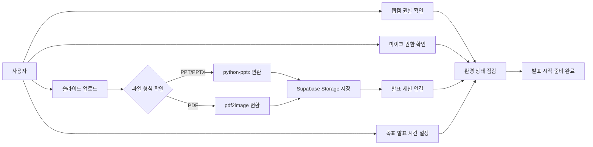

# Design Specification Document (DSD)
# 웹캠 기반 실시간 발표 분석 프로그램

| 항목 | 내용 |
|------|------|
| 종합설계 제목 | 웹캠 기반 실시간 발표 분석 프로그램 |
| 지도교수 | 서영석 |
| 팀장 | 안동규 |
| 팀원 | 김민서, 이보현, 이혜정, 전채현 |
| 주제 분류 | Data, AI |
| 작성일 |  |
| 버전 |  |

---

## 요약문

// 이 문서가 무엇인지 2~3줄 요약
// "PresentAI 각 모듈을 블록 레벨로 분해하여 기능·인터페이스·알고리즘을 정의한다" 방향으로

---

## 목차

1. [서론](#1-서론)
   - 1.1 [개요](#11-개요)
   - 1.2 [범위](#12-범위)
   - 1.3 [용어 정의](#13-용어-정의)
   - 1.4 [설계 제한사항](#14-설계-제한사항)
   - 1.5 [Specification](#15-specification)
2. [시스템 아키텍처](#2-시스템-아키텍처)
   - 2.1 [전체 시스템 구성도](#21-전체-시스템-구성도)
   - 2.2 [계층별 역할 정의](#22-계층별-역할-정의)
   - 2.3 [데이터 흐름 개요](#23-데이터-흐름-개요)
3. [모듈별 DSD](#3-모듈별-dsd)
   - 3.1 [회원 관리 모듈](#31-회원-관리-모듈)
   - 3.2 [발표 환경 설정 모듈](#32-발표-환경-설정-모듈)
   - 3.3 [영상 분석 모듈 (MediaPipe WASM)](#33-영상-분석-모듈-mediapipe-wasm)
   - 3.4 [영상 녹화 및 캡처 모듈](#34-영상-녹화-및-캡처-모듈)
   - 3.5 [AI 코칭 모듈 (Gemini API)](#35-ai-코칭-모듈-gemini-api)
   - 3.6 [슬라이드 관리 모듈](#36-슬라이드-관리-모듈)
   - 3.7 [점수화 알고리즘 모듈](#37-점수화-알고리즘-모듈)
   - 3.8 [PDF 보고서 생성 모듈](#38-pdf-보고서-생성-모듈)
4. [데이터베이스 설계](#4-데이터베이스-설계)
   - 4.1 [ER 다이어그램](#41-er-다이어그램)
   - 4.2 [테이블 스키마](#42-테이블-스키마)
   - 4.3 [Supabase Storage 구조](#43-supabase-storage-구조)
5. [API 명세](#5-api-명세)
   - 5.1 [인증 API](#51-인증-api)
   - 5.2 [발표 세션 API](#52-발표-세션-api)
   - 5.3 [분석 결과 API](#53-분석-결과-api)
   - 5.4 [보고서 API](#54-보고서-api)
6. [프론트엔드 설계](#6-프론트엔드-설계)
   - 6.1 [페이지 구성 및 라우팅](#61-페이지-구성-및-라우팅)
   - 6.2 [상태 관리 설계](#62-상태-관리-설계)
   - 6.3 [주요 컴포넌트 명세](#63-주요-컴포넌트-명세)
7. [테스트 계획](#7-테스트-계획)
   - 7.1 [단위 테스트](#71-단위-테스트)
   - 7.2 [통합 테스트](#72-통합-테스트)
   - 7.3 [성능 기준](#73-성능-기준)
8. [참고 문헌](#8-참고-문헌)

---

## 그림 목차

// 문서 완성 후 채울 것 (그림 번호 / 제목 / 페이지)

---

## 표 목차

// 문서 완성 후 채울 것 (표 번호 / 제목 / 페이지)

---

## 1. 서론

### 1.1 개요

// 프로젝트 한 줄 소개 + 이 문서의 목적 (모듈 분해 기준 문서임을 명시)
// DRD Executive Summary 압축 버전, 2~3문장이면 충분

### 1.2 범위

// 이 문서가 다루는 것 vs 다루지 않는 것을 표로 구분
// 제외 예시: 음성 분석(7월 이후), 모바일 앱, 관리자 페이지

| 포함 | 제외 |
|------|------|
|  |  |

### 1.3 용어 정의

// 본문에 나오는 기술 약어·신조어 정리 — 독자(교수, 팀원)가 모를 만한 것 위주
// 예: Landmark, WASM, EAR, Head Pose, MediaRecorder API, JWT

| 용어 | 정의 |
|------|------|
|  |  |

### 1.4 설계 제한사항

// DRD 2.4 제한조건을 설계 결정과 연결해서 재서술
// 단순 나열 X → "이 제한 때문에 이렇게 설계했다" 형식으로
// 예: 웹캠 깊이 정보 없음 → 전후 흔들림 감지 제외
//     Railway CPU 제한 → Whisper 7월 이후로 연기

### 1.5 Specification

// DRD 2.5 Specification 표 그대로 붙여넣거나 참조 표기로 처리
// "상세 기능 명세는 DRD 2.5를 따른다" 한 줄도 OK

---

## 2. 시스템 아키텍처

### 2.1 전체 시스템 구성도

// ★ 그림 필수 ★
// 클라이언트(Browser) / 백엔드(Railway) / DB(Supabase) 3계층 박스로 구성
// 각 계층 안에 핵심 모듈 이름, 계층 간 통신 방식 화살표로 표기 (HTTPS REST, WASM 등)
// draw.io 또는 Lucidchart 사용 권장

### 2.2 계층별 역할 정의

// 계층 / 담당자 / 기술 스택 / 배포 환경 표로 정리

| 계층 | 담당 | 기술 스택 | 배포 |
|------|------|----------|------|
|  |  |  |  |

### 2.3 데이터 흐름 개요

// ★ 그림 필수 ★
// 웹캠 → MediaPipe → 분석 엔진 → 캡처/버퍼 → 발표 종료 → 백엔드 → Gemini+PDF → Storage → 다운로드
// 화살표마다 데이터 형태 표기 (랜드마크 좌표 / JSON / Base64 이미지 등)

---

## 3. 모듈별 DSD

// 각 모듈은 아래 4가지 항목을 공통으로 채운다
// ① 기능 설명 ② 블록 다이어그램 ③ 입출력 파라미터 ④ 알고리즘

---

### 3.1 회원 관리 모듈

#### 기능 설명

// 회원가입 / 로그인 / 로그아웃 / 히스토리 조회 기능 한 단락 요약
// JWT 방식 채택 이유 한 줄 추가

#### 블록 다이어그램

// 그림 권장
// 흐름: 회원가입·로그인 Handler → UserService → JWTService → Supabase(users 테이블)
// 각 블록에 주요 함수명 적어둘 것

#### 입출력 파라미터

// 엔드포인트별 입력 / 출력 / 에러 케이스를 표로 정리
// 대상: /auth/signup, /auth/login, /auth/logout, /users/history

| 엔드포인트 | 입력 | 출력 | 에러 |
|-----------|------|------|------|
|  |  |  |  |

#### 알고리즘

// 비밀번호 해싱 방식 (bcrypt, salt rounds 몇으로 할지)
// JWT payload 구조 (필드명, 만료 시간)
// 토큰 검증 흐름 간략히

---

### 3.2 발표 환경 설정 모듈

#### 기능 설명

발표 환경 설정 모듈은 발표 시작 전 웹캠·마이크 권한 확인, 슬라이드 업로드, 목표 발표 시간 설정, 분석 준비 상태 점검 기능을 담당한다.

사용자는 발표 시작 전에 PPT 또는 PDF 슬라이드를 업로드하고 목표 발표 시간을 설정할 수 있으며, 시스템은 웹캠 연결 상태와 MediaPipe 분석 가능 여부를 확인한다.

현재 1차 프로토타입에서는 웹캠 기반 비언어 분석을 우선 구현하며, 마이크 입력은 향후 음성 분석 기능 확장을 고려하여 권한 상태만 확인한다.

업로드된 슬라이드 파일은 발표 세션과 연결되어 Supabase Storage에 저장되며, 발표 중 슬라이드 표시와 보고서 생성 과정에서 공통으로 사용된다.

본 모듈은 발표 분석이 안정적으로 수행될 수 있도록 브라우저 권한 상태와 입력 장치 상태를 사전에 점검하며, 설정 완료 후 발표 세션을 생성한다.


#### 블록 다이어그램



#### 입출력 파라미터

| 함수 | 입력 | 출력 |
|------|------|------|
| `/slides/upload` | multipart/form-data(PPT/PDF), sessionId | storagePath, slideCount |
| `convert_ppt()` | PPT/PPTX 파일 | PNG 슬라이드 이미지 리스트 |
| `convert_pdf()` | PDF 파일 | 페이지 이미지 리스트 |
| `checkWebcam()` | MediaDevices API | 웹캠 사용 가능 여부 |
| `createSession()` | PresentationSessionConfig | sessionId |


발표 환경 설정 완료 후, 해당 설정을 기반으로 다음 세션 생성 데이터가 활용된다.

`PresentationSessionConfig`는 발표 시작 전 사용자가 설정한 환경 정보 및 세션 초기 설정값을 저장하는 데이터 구조이며, 발표 세션 생성과 분석 초기화 과정의 공통 입력으로 사용한다.

```text
PresentationSessionConfig {
   targetTimeSec: number
   slideFileName: string
   webcamEnabled: boolean
   microphoneEnabled: boolean
}
```

#### 알고리즘

1. 사용자가 발표 환경 설정 화면에 진입하면 브라우저 권한 상태를 확인한다.
2. `getUserMedia()`를 사용하여 웹캠 및 마이크 접근 권한을 요청한다.
3. 사용자가 슬라이드 파일을 업로드하면 파일 확장자를 확인하여 PPT/PPTX와 PDF 형식으로 분기 처리한다.

4. PPT/PPTX 처리
   - `python-pptx`를 사용하여 슬라이드 정보를 파싱한다.
   - 각 슬라이드를 이미지 형태로 렌더링하기 위해 PIL(Python Imaging Library) 기반 변환 과정을 수행한다.
   - 변환된 슬라이드는 PNG 형식으로 저장한다.

5. PDF 처리
   - `pdf2image`의 `convert_from_bytes()` 함수를 사용하여 PDF 페이지를 이미지로 변환한다.
   - 변환 품질과 처리 속도의 균형을 위해 기본 DPI는 150으로 설정한다.
   - 변환된 페이지 이미지는 PNG 형식으로 저장한다.

6. 생성된 슬라이드 이미지는 다음 규칙으로 Supabase Storage에 업로드한다.

```text
slides/{session_id}/slide_{n}.png
```

7. 목표 발표 시간을 입력받아 세션 설정값으로 저장한다.
8. MediaPipe Worker 초기화 가능 여부와 입력 장치 상태를 점검한다.
9. 모든 필수 조건이 충족되면 발표 시작 버튼을 활성화한다.
10. 발표 시작 시 세션 정보를 FastAPI 서버로 전달하여 발표 세션을 생성한다.

---

### 3.3 영상 분석 모듈 (MediaPipe WASM)

#### 기능 설명

// Hand / Face / Pose 3개 모델 동시 구동 개요
// Web Worker 분리 이유: 메인 스레드 블로킹 방지
// VIDEO 모드 채택 이유: LIVE_STREAM 모드 callback hang 버그 회피

#### 블록 다이어그램

// ★ 그림 필수 ★
// Web Worker 박스 안에 3개 모델 병렬 구조로 표현
// 흐름: 웹캠 VideoFrame → 각 모델 → 지표 계산 엔진 → postMessage → React 메인 스레드

#### 입출력 파라미터

// 분석 지표 17개 전체를 표로 정리
// 표 형식: 번호 / 지표명 / 사용 모델 / 계산 방법 요약 / 단위

| # | 지표명 | 사용 모델 | 계산 방법 | 단위 |
|---|--------|---------|---------|------|
|  |  |  |  |  |

// 아래 두 데이터 구조도 정의할 것
// FrameData: 매 프레임 수집 데이터 (timestamp, 각 지표 raw 값)
// SessionSummary: 발표 종료 시 집계 데이터 (평균·비율·타임스탬프 목록 등)

#### 알고리즘

// 모델 초기화 순서 및 detect_for_video() 호출 루프 방식
// 제스처 판별 조건 — 손가락 굽힘 판정 공식, 10프레임 락, 쿨다운 처리
// 시선 분석 — Head Pose 추정 방법, 정면 응시 판정 조건 (yaw ±15°, pitch ±10°), EAR 공식
// 자세 분석 — 어깨 기울기 공식, 상체 흔들림 계산 (이동평균 표준편차)

---

### 3.4 영상 녹화 및 캡처 모듈

#### 기능 설명

// MediaRecorder API로 전 구간 녹화 + Canvas API로 문제 순간 캡처
// 발표 종료 후 캡처 이미지 Storage 업로드, 원본 영상 삭제 정책 명시

#### 블록 다이어그램

// ★ 그림 필수 ★
// 웹캠 스트림을 두 갈래로 분기: MediaRecorder(녹화) / Canvas(캡처)
// 캡처 트리거 판단 → drawImage() → JPEG 저장 → captureBuffer 누적
// 발표 종료 → stop() → Blob 수집 → Storage 업로드 → 원본 메모리 해제

#### 입출력 파라미터

// 캡처 트리거 임계값 표로 정리
// 표 형식: 지표 / 트리거 조건 / 쿨다운 시간

| 지표 | 트리거 조건 | 쿨다운 |
|------|-----------|--------|
|  |  |  |

#### 알고리즘

// MediaRecorder 초기화 옵션 (mimeType, 비트레이트 등)
// JPEG 압축 품질 설정값
// 발표 종료 처리 순서: stop → Blob 수집 → 이미지 업로드 → 영상 메모리 해제

---

### 3.5 AI 코칭 모듈 (Gemini API)

#### 기능 설명

// 발표 중 호출 없이 종료 후 1회 일괄 호출 방식 채택 이유 (API 호출 제한 고려)
// SessionSummary + 캡처 이미지 → Gemini → 코칭 텍스트 생성 흐름 한 단락

#### 블록 다이어그램

// 그림 권장
// 흐름: 입력(SessionSummary + 캡처 URL) → 프롬프트 빌더 → Gemini API → 응답 파싱 → CoachingResult[]

#### 입출력 파라미터

// CoachingRequest / CoachingResult 데이터 구조 정의
// CoachingResult 필드 예시: category / captureUrl / issue / coaching / improvement

#### 알고리즘

// 프롬프트 구성 방식: System Instruction / 수치 JSON / 이미지 / 출력 포맷 지시 파트별로
// 이미지 전달 방식 결정 (Signed URL vs Base64) + 최대 이미지 수 제한 이유
// API 실패 시 폴백 처리 방식 (재시도 or 규칙 기반 텍스트)

---

### 3.6 슬라이드 관리 모듈

#### 기능 설명

// Storage에서 슬라이드 이미지 로드 → 렌더링 → 제스처 이벤트 수신 → 전환 + 타임스탬프 기록

#### 블록 다이어그램

// 흐름: 슬라이드 이미지 배열 → SlideViewer → 제스처 이벤트 수신 → 인덱스 업데이트 + SlideLog 기록

#### 입출력 파라미터

// initSlides() / nextSlide() / prevSlide() / getSlideTimings() 각 입출력 표
// SlideLog 데이터 구조 정의: slideIndex / enterTime / exitTime / duration

| 함수 | 입력 | 출력 |
|------|------|------|
|  |  |  |

#### 알고리즘

// 슬라이드 전환 시 performance.now()로 타임스탬프 기록
// SlideLog 배열 누적 방식

---

### 3.7 점수화 알고리즘 모듈

#### 기능 설명

// SessionSummary + SlideLog → 카테고리 4개 점수(0~100) + 종합 점수 산출
// 담당: 이보현 / 가중치 근거는 DRD 참고문헌 인용

#### 블록 다이어그램

// 흐름: 입력 데이터 → 시선/자세/제스처/시간 점수 각각 계산 → 가중 합산 → ScoreResult 출력

#### 카테고리 및 가중치

// 표: 카테고리 / 포함 지표 목록 / 가중치

| 카테고리 | 포함 지표 | 가중치 |
|----------|---------|--------|
|  |  |  |

#### 알고리즘

// 카테고리별 점수 계산 공식을 의사코드로 기술
// 정면 응시율 → 점수 변환 방식
// 슬라이드 시간 오차율 → 점수 변환 방식
// 종합 점수 공식: Σ(카테고리 점수 × 가중치)

---

### 3.8 PDF 보고서 생성 모듈

#### 기능 설명

// 입력: ScoreResult + CoachingResult[] + SlideLog[]
// 출력: PDF → Supabase Storage 저장 → 다운로드 URL 반환
// 사용 라이브러리: ReportLab (레이아웃) + Matplotlib (그래프)

#### 블록 다이어그램

// ★ 그림 필수 ★ — PDF 페이지 레이아웃 스케치
// 1페이지: 표지 (점수 요약 + 레이더 차트)
// 2페이지: 카테고리별 바 차트 + 슬라이드별 시간 그래프
// 3페이지~: 코칭 섹션 반복 (좌: 캡처 이미지 / 우: 코칭 텍스트, 2단 레이아웃)
// 실제 여백·비율 비례하게 표현하면 구현할 때 훨씬 편함

#### 입출력 파라미터

// 표: 페이지 번호 / 포함 내용 / 사용 라이브러리

| 페이지 | 내용 | 라이브러리 |
|--------|------|----------|
|  |  |  |

#### 알고리즘

// 1. Matplotlib으로 레이더 차트 / 바 차트 / 시간 그래프 PNG 생성
// 2. ReportLab Frame 2개로 2단 레이아웃 구현 (LEFT_FRAME: 이미지, RIGHT_FRAME: 텍스트)
// 3. CoachingResult 수만큼 페이지 반복 추가
// 4. PDF BytesIO 버퍼 → Supabase Storage 업로드

---

## 4. 데이터베이스 설계

### 4.1 ER 다이어그램

// ★ 그림 필수 ★
// 엔티티: users / sessions / analysis_results / reports
// 관계: users 1:N sessions / sessions 1:1 analysis_results / sessions 1:1 reports
// PK, FK, 주요 속성 표기 / draw.io 또는 dbdiagram.io 사용 권장

### 4.2 테이블 스키마

// 각 테이블마다 컬럼명 / 타입 / 제약조건(PK·FK·NOT NULL 등) / 설명 표로 작성

#### users

| 컬럼명 | 타입 | 제약 | 설명 |
|--------|------|------|------|
|  |  |  |  |

#### sessions

| 컬럼명 | 타입 | 제약 | 설명 |
|--------|------|------|------|
|  |  |  |  |

#### analysis_results

| 컬럼명 | 타입 | 제약 | 설명 |
|--------|------|------|------|
|  |  |  |  |

#### reports

| 컬럼명 | 타입 | 제약 | 설명 |
|--------|------|------|------|
|  |  |  |  |

### 4.3 Supabase Storage 구조

// 버킷 구조와 파일 경로 규칙을 트리 형식으로 표현
// RLS 정책 한 줄 요약 포함 — 본인 소유 파일만 접근, 공개 URL 미사용 등

---

## 5. API 명세

본 시스템은 FastAPI 기반 REST API 서버를 통해 클라이언트와 데이터를 통신한다.
대부분의 API 데이터는 JSON 형식으로 송수신하며, 슬라이드 및 캡처 이미지 업로드는 multipart/form-data 형식을 사용한다.
발표 관련 데이터는 발표 세션(Session) 단위로 관리하며, 사용자 인증 및 계정 정보는 Supabase Authentication 기반으로 처리한다.
데이터베이스 및 사용자 인증 기능은 Supabase를 사용한다.

발표 중 실시간 영상 분석은 브라우저 내부에서 수행하며, 서버에는 발표 종료 후 집계 데이터와 캡처 이미지, 보고서 생성 요청만 전달한다.
REST API는 발표 세션 관리, 분석 결과 저장, 보고서 생성 및 조회 기능을 담당한다.

### 5.1 공통사항
#### 1. Base URL
`/api`

모든 API는 `/api ` 경로를 기준으로 동작한다.

#### 2. 인증 방식  -> 로그인 기능 작성되면 수정 필요
본 시스템은 Supabase Authentication을 이용하여 회원가입 및 로그인 기능을 제공한다.
인증 완료 후 발급된 JWT 기반 Access Token을 사용하며, 인증이 필요한 API 요청 시 Authorization 헤더에 포함한다.
```http
Authorization: Bearer {access_token}
```

#### 3. 공통 응답 형식
성공 응답은 다음 형식을 사용한다.
```JSON
{
   "status": "success",
   "data": {}
}
```
실패 응답은 다음 형식을 사용한다.
```JSON
{
   "status": "error",
   "message": "Invalid request"
}
```

#### 4. 공통 에러 코드
| 상태코드 | 설명 |
| --- | --- |
| 400 | 잘못된 요청 |
| 401 | 인증 실패 |
| 403 | 접근 권한 없음 |
| 404 | 요청한 리소스를 찾을 수 없음 |
| 500 | 서버 내부 오류 |

### 5.2 인증 API -> 로그인 기능 작성되면 수정 필요
인증 API는 사용자 회원가입, 로그인, 로그아웃 및 사용자 인증 상태 확인 기능을 담당한다.
사용자 인증은 Supabase Authentication 기반으로 처리하며, 로그인 성공 시 JWT Access Token을 반환한다.

#### API 목록
| 메서드 | 경로 | 설명 | 인증 |
|---|---|---|---|
| POST | `/api/auth/signup` | 회원가입 | X |
| POST | `/api/auth/login` | 로그인 | X |
| POST | `/api/auth/logout` | 로그아웃 | O |
| GET | `/api/auth/me` | 현재 사용자 정보 조회 | O |

#### 로그인
##### Request Body
```json
{
  "email": "user@example.com",
  "password": "password123"
}
```
##### Response Body
```json
{
  "status": "success",
  "access_token": "jwt_token"
}
```

### 5.2 발표 세션 API
발표 세션 API는 발표 시작 전 세션 생성, 슬라이드 업로드, 발표 설정 저장 기능을 담당한다.
업로드된 슬라이드는 Supabase Storage에 저장되며, 발표 진행 중 분석 결과와 연결된다.

#### API 목록
| 메서드 | 경로 | 설명 | 인증 |
|--------|------|------|------|
| POST | `/api/sessions` | 발표 세션 생성 | O |
| GET | `/api/sessions/{id}` | 발표 세션 조회 | O |
| DELETE | `/api/sessions/{id}` | 발표 세션 종료 | O |
| POST | `/api/sessions/{id}/slides` | 발표 슬라이드 업로드 | O |

#### 발표 세션 생성
##### Request Body
```JSON
{
   "target_time": 300
}
```
##### Response Body
```JSON
{
   "status": "success",
   "session_id": "s001"
}
```

#### 슬라이드 업로드
슬라이드 파일은 multipart/form-data 형식으로 업로드하며, PPT 또는 PDF 파일을 허용한다.
업로드된 파일은 서버에서 슬라이드 이미지로 변환된 뒤 Supabase Storage에 저장한다.

##### Response Body
```JSON
{
   "status": "uploaded",
   "slide_count": 10
}
```

### 5.3 분석 결과 API
분석 결과 API는 발표 중 생성되는 FrameData와 문제 순간 캡처 이미지를 저장한다.
클라이언트는 일정 주기마다 분석 결과를 FastAPI 서버로 전송하며, 서버는 이를 세션 단위로 저장한다.

발표 종료 후에는 FrameData를 집계하여 SessionSummary를 생성하며, 이는 AI 코칭 및 PDF 보고서 생성의 입력으로 사용된다.

#### API 목록
| 메서드 | 경로 | 설명 | 인증 |
|--------|------|------|------|
| POST | `/api/sessions/{id}/analysis` | 분석 데이터 저장 | O |
| GET | `/api/sessions/{id}/analysis` | 분석 결과 조회 | O |
| POST | `/api/sessions/{id}/captures` | 문제 순간 캡처 업로드 | O |

#### 분석 데이터 저장
##### Request Body
```JSON
{
   "timestamp": 1710000000,
   "gaze_score": 0.82,
   "posture_score": 0.74,
   "gesture_score": 0.69
}
```
##### Response Body
```JSON
{
   "status": "saved"
}
```
#### 문제 순간 캡처 업로드
캡처 이미지는 `multipart/form-data` 형식으로 업로드하며, 문제 발생 시점의 `timestamp`와 `category` 정보를 함께 저장한다.

##### Response Body
```JSON
{
   "status": "uploaded",
   "capture_id": "c001"
}
```


### 5.4 보고서 API

보고서 API는 발표 종료 후 SessionSummary와 캡처 이미지를 기반으로 AI 코칭 보고서를 생성한다.
보고서 생성 과정에는 Gemini API 호출 및 PDF 생성이 포함되므로 비동기 방식으로 처리한다.

클라이언트는 보고서 생성 요청 후 pooling 방식으로 상태 조회 API를 호출하여 진행 상태를 확인한다.

#### API 목록
| 메서드 | 경로 | 설명 | 인증 |
|--------|------|------|------|
| POST | `/api/sessions/{id}/report` | 보고서 생성 요청 | O |
| GET | `/api/sessions/{report_id}` | 보고서 생성 상태 조회 | O |
| GET | `/api/reports/{report_id}/download` | PDF 보고서 다운로드 | O |

#### 보고서 생성 요청
##### Response Body
```JSON
{
   "status": "processing",
   "report_id": "r001"
}
```
#### 보고서 상태 조회
##### Response Body (생성 중)
```JSON
{
   "status": "processing"
}
```
##### Response Body (완료)
```JSON
{
   "status": "complted",
   "report_url": "/reports/r001.pdf"
}
```

---

## 6. 프론트엔드 설계

### 6.1 페이지 구성 및 라우팅

// 그림 권장 — 페이지 트리 또는 플로우차트
// 각 경로에 Protected 여부 + 이동 트리거 표기 (로그인 성공, 발표 종료 등)

| 경로 | 페이지명 | 인증 필요 |
|------|---------|---------|
|  |  |  |

### 6.2 상태 관리 설계

// Context API 4개(Auth / Session / Analysis / Report) 각각의 주요 상태 필드와 역할을 표로

| Context | 주요 상태 필드 | 역할 |
|---------|-------------|------|
|  |  |  |

### 6.3 주요 컴포넌트 명세

// 핵심 컴포넌트 위주로 표 작성
// WebcamAnalyzer / SlideViewer / GestureOverlay / TimerBar / ReportViewer / CoachingCard / RadarChart

| 컴포넌트 | 위치(페이지) | 역할 | 주요 Props |
|----------|------------|------|-----------|
|  |  |  |  |

---

## 7. 테스트 계획

### 7.1 단위 테스트

// 모듈별 핵심 로직 테스트 항목과 합격 기준
// 최소 포함: 제스처 정확도 / 점수 경계값 / JWT 검증 / PDF 생성 확인

| 모듈 | 테스트 항목 | 도구 | 합격 기준 |
|------|-----------|------|---------|
|  |  |  |  |

### 7.2 통합 테스트

// 주요 사용자 시나리오 단위로 작성
// 최소 포함: 전체 발표 플로우 (시작~보고서 다운로드) / 제스처 슬라이드 전환 10회 / Gemini 응답 확인

| 시나리오 | 절차 | 합격 기준 |
|---------|------|---------|
|  |  |  |

### 7.3 성능 기준

// 수치로 명확하게 작성
// 최소 포함: MediaPipe 프레임레이트(목표 fps) / 슬라이드 렌더링 시간 / 보고서 생성 시간 / API 응답 시간

| 항목 | 목표 기준 |
|------|---------|
|  |  |

---

## 8. 참고 문헌

// DRD 참고문헌 3편 + 사용 라이브러리 공식 문서
// MediaPipe / Gemini API / FastAPI / Supabase / ReportLab / React / MDN MediaRecorder API

1.
2.
3.
