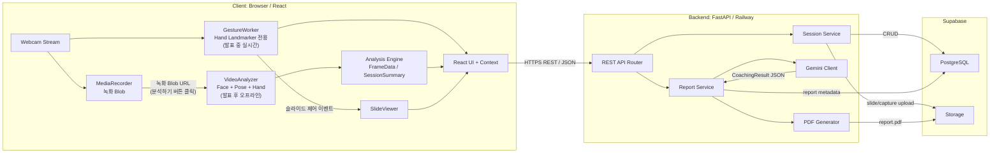
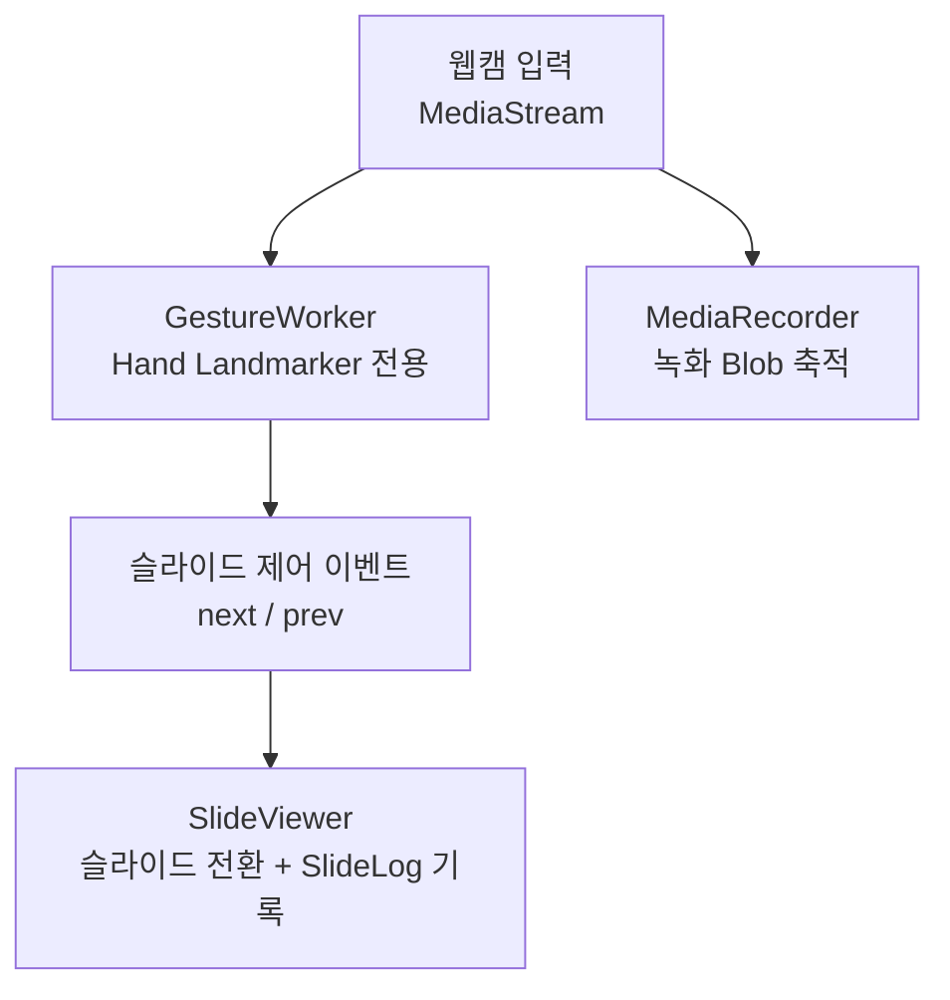
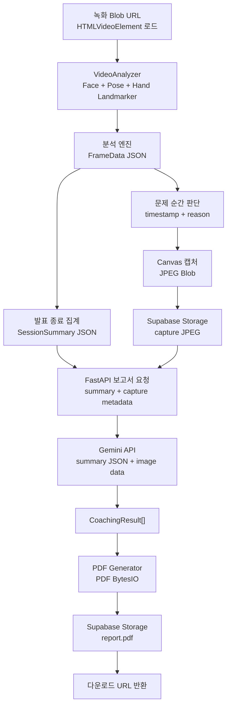
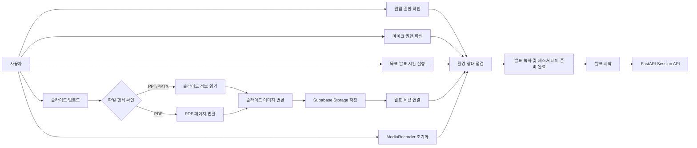
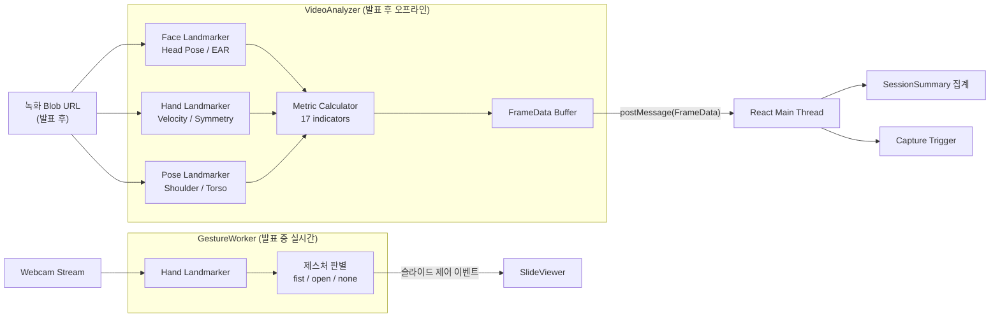
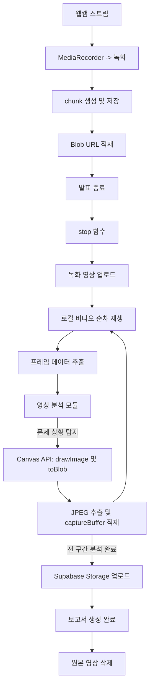
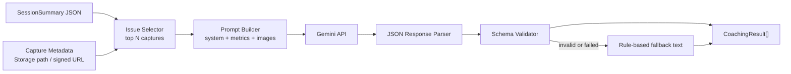
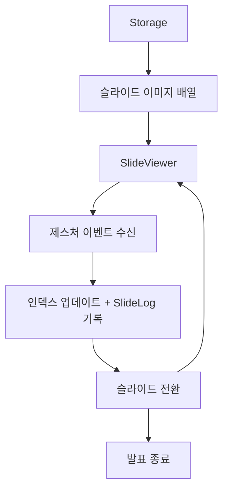

# Design Specification Document (DSD)
# 웹캠 기반 실시간 발표 분석 프로그램

| 항목 | 내용 |
|------|------|
| 종합설계 제목 | 웹캠 기반 실시간 발표 분석 프로그램 |
| 지도교수 | 서영석 |
| 팀장 | 안동규 |
| 팀원 | 김민서, 이보현, 이혜정, 전채현 |
| 주제 분류 | Data, AI |
| 작성일 | 2026년 5월 7일 |
| 버전 | 0.1 DSD 초안 |

---

## 요약문

본 문서는 웹캠 기반 실시간 발표 분석 프로그램의 설계 명세서로, DRD에서 정의한 요구사항을 시스템 계층, 모듈, 데이터 흐름, 입출력 인터페이스, 핵심 알고리즘 단위로 구체화한다.
특히 클라이언트에서 실행되는 MediaPipe WASM 분석 구조와 발표 종료 후 Gemini API를 활용한 AI 코칭 생성 흐름을 명확히 정의하여 구현 단계의 기준 문서로 사용한다.

---

## 목차

1. [서론](#1-서론)
   - 1.1 [개요](#11-개요)
   - 1.2 [범위](#12-범위)
   - 1.3 [용어 정의](#13-용어-정의)
   - 1.4 [설계 제한사항](#14-설계-제한사항)
   - 1.5 [Specification](#15-specification)
2. [시스템 아키텍처](#2-시스템-아키텍처)
   - 2.1 [전체 시스템 구성도](#21-전체-시스템-구성도)
   - 2.2 [계층별 역할 정의](#22-계층별-역할-정의)
   - 2.3 [데이터 흐름 개요](#23-데이터-흐름-개요)
3. [모듈별 DSD](#3-모듈별-dsd)
   - 3.1 [회원 관리 모듈](#31-회원-관리-모듈)
   - 3.2 [발표 환경 설정 모듈](#32-발표-환경-설정-모듈)
   - 3.3 [영상 분석 모듈 (MediaPipe WASM)](#33-영상-분석-모듈-mediapipe-wasm)
   - 3.4 [영상 녹화 및 캡처 모듈](#34-영상-녹화-및-캡처-모듈)
   - 3.5 [AI 코칭 모듈 (Gemini API)](#35-ai-코칭-모듈-gemini-api)
   - 3.6 [슬라이드 관리 모듈](#36-슬라이드-관리-모듈)
   - 3.7 [점수화 알고리즘 모듈](#37-점수화-알고리즘-모듈)
   - 3.8 [PDF 보고서 생성 모듈](#38-pdf-보고서-생성-모듈)
4. [데이터베이스 설계](#4-데이터베이스-설계)
   - 4.1 [ER 다이어그램](#41-er-다이어그램)
   - 4.2 [테이블 스키마](#42-테이블-스키마)
   - 4.3 [Supabase Storage 구조](#43-supabase-storage-구조)
5. [API 명세](#5-api-명세)
   - 5.1 [인증 API](#51-인증-api)
   - 5.2 [발표 세션 API](#52-발표-세션-api)
   - 5.3 [분석 결과 API](#53-분석-결과-api)
   - 5.4 [보고서 API](#54-보고서-api)
6. [프론트엔드 설계](#6-프론트엔드-설계)
   - 6.1 [페이지 구성 및 라우팅](#61-페이지-구성-및-라우팅)
   - 6.2 [상태 관리 설계](#62-상태-관리-설계)
   - 6.3 [주요 컴포넌트 명세](#63-주요-컴포넌트-명세)
7. [테스트 계획](#7-테스트-계획)
   - 7.1 [단위 테스트](#71-단위-테스트)
   - 7.2 [통합 테스트](#72-통합-테스트)
   - 7.3 [성능 기준](#73-성능-기준)
8. [참고 문헌](#8-참고-문헌)

---

## 그림 목차

// 문서 완성 후 채울 것 (그림 번호 / 제목 / 페이지)

---

## 표 목차

// 문서 완성 후 채울 것 (표 번호 / 제목 / 페이지)

---

## 1. 서론

// 점검 메모: DRD 내용과 표현이 어긋나지 않는지, 제외 범위(음성 분석·모바일·관리자 페이지)가 팀 방향과 맞는지 확인한다.
// 용어 정의가 교수님도 이해 가능한 수준인지, 설계 제한사항이 "제한 → 설계 반영" 구조로 자연스러운지 점검한다.

### 1.1 개요

본 프로젝트는 노트북 웹캠만으로 발표자의 시선, 자세, 제스처를 실시간 분석하고, 발표 종료 후 문제 순간 캡처 이미지와 AI 코칭 텍스트가 포함된 PDF 보고서를 생성하는 PC용 웹 애플리케이션이다.
본 DSD는 DRD의 요구사항을 실제 구현 가능한 설계 단위로 분해하여 각 모듈의 책임, 입출력 데이터, 내부 알고리즘, 외부 시스템 연동 방식을 정의한다.
문서의 설계 기준은 1차 프로토타입 제출 범위에 맞추며, 음성 분석처럼 일정상 후순위인 기능은 확장 항목으로 분리한다.

### 1.2 범위

| 포함 | 제외 |
|------|------|
| PC 웹 브라우저 기반 발표 분석 웹 애플리케이션 설계 | 모바일 앱 및 태블릿 전용 UI |
| React 클라이언트, FastAPI 백엔드, Supabase DB/Storage 3계층 구조 | 관리자 페이지, 기관 관리 콘솔 |
| MediaPipe WASM 기반 시선·자세·제스처 분석 구조 | 음성 분석 및 Whisper 기반 전사 기능(7월 이후 고도화) |
| 발표 슬라이드 제어, 영상 녹화, 문제 순간 캡처 연동 방식 | 다중 발표자 동시 분석, 실시간 협업 발표 |
| Gemini API 기반 발표 종료 후 AI 코칭 생성 방식 | 발표 중 실시간 AI 호출 및 실시간 음성 코칭 |
| PDF 보고서 생성을 위한 분석 결과 전달 구조 | 상용 결제, 구독, 라이선스 관리 기능 |

### 1.3 용어 정의

| 용어 | 정의 |
|------|------|
| Landmark | MediaPipe 모델이 얼굴, 손, 몸의 주요 지점을 정규화 좌표로 추출한 값이다. |
| WASM(WebAssembly) | 브라우저에서 네이티브에 가까운 속도로 모델 추론 코드를 실행하기 위한 바이너리 실행 형식이다. |
| MediaPipe Tasks | Google MediaPipe에서 제공하는 Face Landmarker, Hand Landmarker, Pose Landmarker 등 고수준 비전 추론 API 묶음이다. |
| Web Worker | 브라우저 메인 스레드와 분리된 백그라운드 스레드로, 영상 분석 작업이 UI 렌더링을 막지 않도록 사용한다. |
| VIDEO 모드 | MediaPipe 모델 호출 시 프레임과 타임스탬프를 직접 전달하는 동영상 처리 모드이다. |
| Head Pose | 얼굴 랜드마크를 기반으로 발표자의 머리 방향을 yaw, pitch, roll 각도로 추정한 값이다. |
| EAR(Eye Aspect Ratio) | 눈 주변 랜드마크 간 거리 비율로 눈 깜빡임 또는 눈 감김을 판단하는 지표이다. |
| FrameData | 매 프레임에서 추출한 분석 원시값과 이벤트를 담는 클라이언트 내부 데이터 구조이다. |
| SessionSummary | 발표 종료 시 FrameData를 집계하여 평균, 비율, 문제 타임스탬프, 캡처 목록으로 정리한 데이터 구조이다. |
| Signed URL | Supabase Storage의 비공개 파일에 제한된 시간 동안 접근할 수 있도록 발급하는 임시 URL이다. |
| Gemini API | 분석 수치와 캡처 이미지를 입력으로 받아 발표 코칭 텍스트를 생성하는 생성형 AI API이다. |

### 1.4 설계 제한사항

DRD의 현실적 제한조건은 다음 설계 결정에 반영한다. 제한사항은 단순히 기능을 줄이는 기준이 아니라, 프로토타입 단계에서 안정적으로 동작하는 범위를 정하는 기준으로 사용한다.

| 제한사항 | 설계 반영 |
|----------|-----------|
| 노트북 웹캠은 720p, 30fps, 고정 앵글, 깊이 정보 없음 | 3D 공간 분석이 아닌 2D 랜드마크 기반 상반신 분석으로 제한하고, 전후 방향 흔들림은 평가 항목에서 제외한다. |
| 조명과 카메라 위치에 따라 인식률 저하 가능 | 발표 시작 전 웹캠·조명 점검 단계를 두고, 모델 confidence가 낮은 프레임은 집계에서 제외한다. |
| MediaPipe 3개 모델 동시 구동 시 브라우저 부하 발생 가능 | Face, Hand, Pose 추론을 Web Worker에서 실행하고, 필요 시 분석 프레임레이트를 15~20fps로 제한한다. |
| Railway 백엔드 CPU 자원 제한 | 실시간 영상 추론은 클라이언트에서 수행하고, 백엔드는 세션 저장, Gemini 호출, PDF 생성처럼 발표 종료 후 처리에 집중한다. |
| Gemini API 호출 제한 및 응답 지연 | 발표 중에는 API를 호출하지 않고, 발표 종료 후 SessionSummary와 선별된 캡처 이미지를 묶어 1회 일괄 호출한다. |
| 개인정보 보호 필요 | 원본 녹화 영상은 보고서 생성 후 삭제하고, 보고서에는 문제 순간 캡처 이미지와 집계값만 저장한다. |
| 다중 사용자 동시 세션 미지원 | 1인 1세션 구조로 설계하고, 세션 데이터는 user_id 기준으로 분리한다. |
| 음성 분석은 7월 이후 고도화 항목 | 1차 DSD의 핵심 데이터 구조에는 음성 전사·필러워드 분석을 포함하지 않는다. |

### 1.5 Specification

상세 기능 명세는 DRD 2.5 Specification을 기준으로 하며, 본 DSD에서는 이를 구현 관점의 모듈 책임으로 재구성한다.

| 분야 | DSD 설계 대응 |
|------|---------------|
| 사용자 관리 | JWT 기반 인증, 사용자별 발표 세션 및 보고서 조회 구조 |
| 발표 실행 | PPT/PDF 업로드, 목표 발표 시간 설정, 슬라이드 이미지 로딩 구조 |
| 영상 분석 | MediaPipe Face/Hand/Pose 모델을 Web Worker에서 실행하고 FrameData로 집계 |
| 영상 녹화 및 캡처 | MediaRecorder와 Canvas 캡처를 분석 이벤트와 연결 |
| AI 피드백 | SessionSummary와 캡처 이미지를 Gemini API 입력으로 변환 |
| 보고서 생성 | ScoreResult, CoachingResult, SlideLog를 PDF 생성 모듈로 전달 |
| 시스템 환경 | React, FastAPI, Supabase, Vercel, Railway 기반 3계층 배포 구조 |

---

## 2. 시스템 아키텍처

// 점검 메모: Mermaid 다이어그램을 최종본에서 draw.io 그림으로 바꿀지, 담당자/역할 표가 실제 팀 분담과 맞는지 확인한다.
// 영상 원본을 서버로 보내지 않는 구조와 Supabase·Railway·Vercel 사용 전제가 팀 결정과 일치하는지 점검한다.

### 2.1 전체 시스템 구성도

그림 1은 1차 프로토타입 기준 전체 시스템 구성도 초안이다. 실제 제출 문서에서는 동일 구조를 draw.io 또는 Lucidchart 그림으로 변환한다.



발표 중에는 GestureWorker(Hand Landmarker 전용)만 실시간으로 실행하여 슬라이드 제어에 사용하고, 나머지 Face·Pose·Hand 분석 지표는 발표 종료 후 "분석하기" 버튼 클릭 시 VideoAnalyzer가 녹화 영상을 입력받아 처리한다. 영상 프레임 원본은 서버에 전송하지 않으며, 서버로 전송되는 데이터는 발표 종료 후의 집계 JSON, 캡처 이미지, 슬라이드 로그, 보고서 생성 요청으로 제한한다.

### 2.2 계층별 역할 정의

| 계층 | 담당 | 기술 스택 | 배포 |
|------|------|----------|------|
| 클라이언트 UI | 전채현, 안동규(분석 연동) | React, Context API, WebRTC getUserMedia, Canvas API | Vercel |
| 영상 분석 Worker | 안동규 | MediaPipe Tasks Vision, WASM, Web Worker, requestVideoFrameCallback | 브라우저 내 실행 |
| 백엔드 API | 김민서, 이혜정 | FastAPI, Pydantic, JWT, Supabase SDK | Railway |
| AI 코칭 처리 | 안동규 | Gemini API, 프롬프트 빌더, JSON 응답 파서 | Railway 백엔드 내부 |
| 보고서 생성 | 전채현, 김민서 | ReportLab, Matplotlib, BytesIO | Railway 백엔드 내부 |
| 데이터베이스 | 이혜정 | Supabase PostgreSQL, Row Level Security | Supabase |
| 파일 저장소 | 이혜정 | Supabase Storage, Signed URL, 비공개 버킷 | Supabase |

### 2.3 데이터 흐름 개요

그림 2는 발표 시작부터 보고서 다운로드까지의 핵심 데이터 흐름이다. 흐름은 발표 중 1단계와 발표 후 2단계로 분리된다.

**1단계: 발표 중**



**2단계: 발표 후 ("분석하기" 버튼 클릭)**



| 단계 | 데이터 형태 | 저장 위치 | 비고 |
|------|-------------|-----------|------|
| 웹캠 입력 | MediaStream / VideoFrame | 클라이언트 메모리 | 외부 전송 없음 |
| 제스처 추론 | Hand landmark 배열 | GestureWorker 메모리 | 발표 중 실시간, 슬라이드 제어 전용 |
| 녹화 영상 | MediaRecorder Blob | 클라이언트 메모리 | 발표 종료 후 VideoAnalyzer 입력으로 사용 |
| 랜드마크 추론 | Face/Hand/Pose landmark 배열 | VideoAnalyzer 메모리 | 발표 후 오프라인, 프레임 단위 처리 후 원본 폐기 |
| 프레임 분석값 | FrameData JSON | 클라이언트 임시 버퍼 | timestamp 기준으로 누적 |
| 문제 순간 캡처 | JPEG Blob | Supabase Storage | 보고서 근거 이미지로 사용 |
| 발표 집계 | SessionSummary JSON | PostgreSQL analysis_results | 평균, 비율, 이벤트 타임라인 |
| AI 코칭 결과 | CoachingResult[] JSON | PostgreSQL analysis_results 또는 reports | Gemini 응답 파싱 결과 |
| 최종 보고서 | PDF 파일 | Supabase Storage | 다운로드 URL 반환 |

---

## 3. 모듈별 DSD

// 각 모듈은 아래 4가지 항목을 공통으로 채운다
// ① 기능 설명 ② 블록 다이어그램 ③ 입출력 파라미터 ④ 알고리즘

---

### 3.1 회원 관리 모듈

#### 기능 설명

회원 관리 모듈은 사용자 계정의 생성(회원가입), 인증(로그인), 세션 종료(로그아웃) 및 발표 분석 히스토리 조회 기능을 제공한다. 사용자는 안전하게 계정을 관리하고, FastAPI 백엔드 서버에서 발급한 JWT 기반 Access Token을 통해 보호된 서비스에 접근할 수 있다.
JWT 방식 채택 이유: 서버 상태를 유지하지 않는 Stateless 구조로 확장성과 보안성이 뛰어나며, 프론트엔드와 백엔드 간 인증 처리를 효율적으로 수행할 수 있기 때문이다.

#### 블록 다이어그램
```plaintext
회원가입 / 로그인 UI
        ↓
Auth API (/auth/signup, /auth/login)
        ↓
UserService
        ↓
bcrypt 비밀번호 검증
        ↓
JWTService (Access Token 발급)
        ↓
사용자 정보 DB 저장(Supabase users 테이블 저장)
        ↓
Frontend AuthContext/localStorage 저장
```


#### 입출력 파라미터

// 엔드포인트별 입력 / 출력 / 에러 케이스를 표로 정리
// 대상: /auth/signup, /auth/login, /auth/logout, /users/history

| 엔드포인트          | 입력                    | 출력                 | 프론트 처리          |
| --------------      | ---------------------   | ------------         | --------------- |
| /auth/signup        | email, password, name   | user                 | 성공/실패 메시지 UI    |
| /auth/login         | email, password         | access_token, user   | 로그인 성공 → 페이지 이동 |
| /auth/logout        | Authorization header    | success              | 상태 초기화          |
| /users/history      | page, size              | history list         | 리스트 렌더링 + 정렬    |


#### 알고리즘

// 비밀번호 해싱 방식 (bcrypt, salt rounds 몇으로 할지)

알고리즘: bcrypt

salt rounds: 12

// JWT payload 구조 (필드명, 만료 시간)

{
  "sub": "user_id",
  
  "email": "user@example.com",
  
  "name": "사용자이름",
  
  "iat": 1717000000,
  
  "exp": 1717086400,
  
  "type": "access"
  
}

exp: 24시간

type: access / refresh 구분

// 토큰 검증 흐름 간략히
```plaintext
클라이언트 요청 (Authorization: Bearer token)
        ↓
JWTService.verifyToken()
        ↓
유효 → 요청 처리
무효 → 401 Unauthorized
```
---

### 3.2 발표 환경 설정 모듈

#### 기능 설명

발표 환경 설정 모듈은 발표 시작 전 웹캠·마이크 권한 확인, 슬라이드 업로드, 목표 발표 시간 설정, 녹화 및 분석 준비 상태 점검 기능을 담당한다.

사용자는 발표 시작 전에 PPT 또는 PDF 슬라이드를 업로드하고 목표 발표 시간을 설정할 수 있으며, 시스템은 웹캠 연결 상태와 GestureWorker 초기화 가능 여부를 확인한다.

현재 1차 프로토타입에서는 웹캠 기반 비언어 분석을 우선 구현하며, 발표 중에는 Hand Landmarker 기반 GestureWorker만 실시간으로 동작한다. 마이크 입력은 향후 음성 분석 기능 확장을 고려하여 권한 상태만 확인한다.

발표 영상은 MediaRecorder를 통해 클라이언트에서 로컬로 녹화되며, 서버로 실시간 전송되지는 않는다. 해당 영상은 발표 종료 후 VideoAnalyzer의 입력 데이터로 사용된다.

업로드된 슬라이드 파일은 발표 세션과 연결되어 Supabase Storage에 저장되며, 발표 중 슬라이드 표시 및 보고서 생성 과정에서 공통으로 사용된다.

본 모듈은 발표 시작 전 필요한 환경 설정과 입력 장치 상태 점검을 수행하며, 사용자가 발표를 시작하면 해당 설정값을 기반으로 FastAPI 서버에서 발표 세션(Session)이 생성된다.


#### 블록 다이어그램



#### 입출력 파라미터

슬라이드 업로드 API는 생성된 발표 세션(session_id) 기준으로 동작한다.

| 함수 | 입력 | 출력 |
|------|------|------|
| `/api/sessions/{id}/slides` | multipart/form-data(PPT/PDF) | storagePath, slideCount |
| `convert_ppt()` | PPT/PPTX 파일 | PNG 슬라이드 이미지 리스트 |
| `convert_pdf()` | PDF 파일 | 페이지 이미지 리스트 |
| `checkWebcam()` | MediaDevices API | 웹캠 사용 가능 여부 |
| `createSession()` | PresentationSessionConfig | sessionId |


발표 환경 설정 완료 후, 해당 설정을 기반으로 다음 세션 생성 데이터가 활용된다.

`PresentationSessionConfig`는 발표 시작 전 사용자가 설정한 환경 정보 및 세션 초기 설정값을 저장하는 데이터 구조이며, 발표 세션 생성과 분석 초기화 과정의 공통 입력으로 사용한다.

```text
PresentationSessionConfig {
   targetTimeSec: number
   slideFileName: string
   webcamEnabled: boolean
   microphoneEnabled: boolean
   recordingEnabled: boolean
}
```

#### 알고리즘

1. 사용자가 발표 환경 설정 화면에 진입하면 브라우저 권한 상태를 확인한다.
2. `getUserMedia()`를 사용하여 웹캠 및 마이크 접근 권한을 요청한다.
3. 사용자가 슬라이드 파일을 업로드하면 파일 확장자를 확인하여 PPT/PPTX와 PDF 형식으로 분기 처리한다.

4. PPT/PPTX 처리
   - `python-pptx`를 사용하여 슬라이드 정보를 읽어온다.
   - 이후 슬라이드 이미지는 별도의 렌더링 또는 변환 과정을 통해 PNG 형식으로 생성한다.

5. PDF 처리
   - `pdf2image`의 `convert_from_bytes()` 함수를 사용하여 PDF 페이지를 이미지로 변환한다.
   - 변환 품질과 처리 속도의 균형을 위해 기본 DPI는 150으로 설정한다.

6. 생성된 슬라이드 이미지는 다음 경로로 Supabase Storage에 업로드된다.

```text
slides/{session_id}/slide_{n}.png
```

7. 목표 발표 시간을 입력받아 세션 설정값으로 저장한다.
8. GestureWorker 및 발표 후 VideoAnalyzer 실행 가능 여부를 점검한다.
   - Hand Landmarker 기반 GestureWorker 초기화 여부를 확인
   - WebAssembly(WASM), MediaRecorder, HTMLVideoElement 등 핵심 브라우저 API 지원 여부 확인
   - 필수 API가 미지원 시 발표 시작 제한 또는 경고 메시지 출력
9. 모든 조건이 충족되면 발표 시작 버튼을 활성화한다.
10. 사용자가 발표를 시작하면 FastAPI 서버로 세션 생성 요청을 전송한다.

---

### 3.3 영상 분석 모듈 (MediaPipe WASM)

// 점검 메모: 분석 지표 17개와 임계값(yaw ±15도, pitch ±10도, 10프레임 유지, 1초 쿨다운)이 적절한지 확인한다.
// 손 제스처 매핑, 상체 앞쏠림 표현, FrameData/SessionSummary 구조가 다른 담당 파트와 연결되기 쉬운지 점검한다.

#### 기능 설명

영상 분석 모듈은 역할에 따라 GestureWorker와 VideoAnalyzer 두 가지로 분리된다.

**GestureWorker(발표 중 실시간):** 발표 중에는 Hand Landmarker만 실시간으로 구동하여 손 제스처를 인식하고 슬라이드 제어 이벤트를 생성한다. Face·Pose 분석은 수행하지 않아 브라우저 부하를 최소화한다.

**VideoAnalyzer(발표 후 오프라인):** 발표 종료 후 사용자가 "분석하기" 버튼을 클릭하면 VideoAnalyzer가 녹화 영상 Blob URL을 입력으로 받아 Face Landmarker, Pose Landmarker, Hand Landmarker를 순서대로 실행한다. 발표자의 시선, 자세, 제스처 관련 17개 지표를 프레임 단위로 계산하고 SessionSummary로 집계한다.

MediaPipe 호출 방식은 두 컴포넌트 모두 `VIDEO` 모드를 사용하며 프레임 타임스탬프를 명시적으로 전달한다. VideoAnalyzer의 경우 입력 소스는 실시간 웹캠 스트림이 아닌 녹화된 Blob URL을 HTMLVideoElement에 로드한 것이다.

공식 문서 확인 결과, MediaPipe Web 태스크의 `detect()`와 `detectForVideo()` 호출은 동기적으로 실행되어 UI 스레드를 블로킹할 수 있으므로 Web Worker 분리 설계가 필요하다. 또한 Hand Landmarker는 손당 21개 랜드마크와 handedness를 제공하고, Face Landmarker는 얼굴 랜드마크·blendshape·facial transformation matrix를 제공하며, Pose Landmarker는 자세 랜드마크와 world landmark를 제공한다. 본 모듈은 이 출력값 중 발표 분석에 직접 필요한 값만 FrameData로 축약한다.

| 모델 | 사용 시점 | 공식 출력 | 본 프로젝트 사용 값 |
|------|----------|-----------|---------------------|
| Hand Landmarker | 발표 중 실시간 (GestureWorker) | 손 랜드마크 21개, handedness, world landmark | 왼손/오른손 구분, 주먹/손바닥 제스처 → 슬라이드 제어 |
| Face Landmarker | 발표 후 오프라인 (VideoAnalyzer) | 얼굴 랜드마크, blendshape, facial transformation matrix | yaw/pitch, 정면 응시 여부, EAR, 깜빡임 |
| Hand Landmarker | 발표 후 오프라인 (VideoAnalyzer) | 손 랜드마크 21개, handedness, world landmark | 손 움직임 속도, 양손 대칭성 분석 지표 |
| Pose Landmarker | 발표 후 오프라인 (VideoAnalyzer) | 자세 랜드마크, world landmark | 어깨 기울기, 상체 중심, 상체 흔들림 |

초기 설정값은 1차 프로토타입 기준으로 다음과 같이 둔다.

| 항목 | 설정값 | 이유 |
|------|--------|------|
| runningMode | `VIDEO` | 프레임 timestamp를 직접 관리하고 동기 추론 결과를 일관되게 수집한다. VideoAnalyzer는 Blob URL 기반 HTMLVideoElement를 입력 소스로 사용한다. |
| numFaces / numHands / numPoses | 얼굴 1명, 손 2개, 자세 1명 | DRD의 1인 1세션 조건과 일치한다. |
| confidence threshold | 기본 0.5부터 시작, 테스트 후 조정 | 공식 기본값을 기준으로 조명·웹캠 환경 테스트 결과에 따라 보정한다. |
| 분석 fps (VideoAnalyzer) | 목표 15~20fps | 녹화 영상 전체를 처리할 때 CPU 사용량을 줄이기 위해 프레임 샘플링을 적용한다. |

#### 블록 다이어그램



#### 입출력 파라미터

| # | 지표명 | 사용 모델 | 계산 방법 | 단위 |
|---|--------|---------|---------|------|
| 1 | 얼굴 검출 신뢰도 | Face Landmarker | 얼굴 landmark confidence 평균 | 0~1 |
| 2 | yaw 각도 | Face Landmarker | 얼굴 기준점의 좌우 회전 추정값 | degree |
| 3 | pitch 각도 | Face Landmarker | 얼굴 기준점의 상하 회전 추정값 | degree |
| 4 | 정면 응시 여부 | Face Landmarker | `abs(yaw) <= 15` 및 `abs(pitch) <= 10` | boolean |
| 5 | 시선 좌우 편향 | Face Landmarker | yaw 평균값의 부호와 크기로 좌/우 편향 계산 | degree |
| 6 | 시선 분산도 | Face Landmarker | 최근 N프레임 yaw/pitch 표준편차 | degree |
| 7 | EAR | Face Landmarker | 눈 세로 거리 합 / 눈 가로 거리 | ratio |
| 8 | 눈 깜빡임 횟수 | Face Landmarker | EAR이 임계값 이하로 내려갔다가 회복되는 이벤트 카운트 | count |
| 9 | 어깨 기울기 | Pose Landmarker | 좌우 어깨 좌표의 기울기 `atan2(dy, dx)` | degree |
| 10 | 상체 중심 X | Pose Landmarker | 좌우 어깨와 좌우 골반 중심의 평균 X 좌표 | normalized |
| 11 | 상체 중심 Y | Pose Landmarker | 좌우 어깨와 좌우 골반 중심의 평균 Y 좌표 | normalized |
| 12 | 상체 흔들림 | Pose Landmarker | 최근 N프레임 상체 중심 좌표의 이동평균 표준편차 | normalized |
| 13 | 상체 앞쏠림 추정 | Pose Landmarker | 어깨 중심과 골반 중심의 상대 위치 변화량 | normalized |
| 14 | 왼손 제스처 | Hand Landmarker | 손가락 굽힘 상태 기반 `fist/open/none` 판정 | enum |
| 15 | 오른손 제스처 | Hand Landmarker | 손가락 굽힘 상태 기반 `fist/open/none` 판정 | enum |
| 16 | 손 움직임 속도 | Hand Landmarker | 손목 좌표의 프레임 간 이동거리 / 시간차 | normalized/sec |
| 17 | 양손 대칭성 | Hand/Pose Landmarker | 양손 위치와 어깨 중심 간 거리 차이의 절댓값 | normalized |

`FrameData`는 매 분석 프레임에서 생성되는 원시 데이터 구조이다.

```text
FrameData {
  timestampMs: number
  face: {
    confidence: number
    yawDeg: number
    pitchDeg: number
    frontGaze: boolean
    gazeDispersionDeg: number
    ear: number
    blinkEvent: boolean
  }
  pose: {
    shoulderTiltDeg: number
    torsoCenterX: number
    torsoCenterY: number
    torsoSway: number
    forwardLean: number
  }
  hand: {
    leftGesture: "fist" | "open" | "none"
    rightGesture: "fist" | "open" | "none"
    handVelocity: number
    bilateralSymmetry: number
  }
  events: string[]
}
```

`SessionSummary`는 발표 종료 시 FrameData를 집계한 결과이며 AI 코칭, 점수화, PDF 보고서 생성의 공통 입력으로 사용한다.

```text
SessionSummary {
  sessionId: string
  durationSec: number
  frameCount: number
  frontGazeRatio: number
  avgYawDeg: number
  avgPitchDeg: number
  blinkCount: number
  avgShoulderTiltDeg: number
  torsoSwayAvg: number
  gestureCounts: { leftFist: number, rightFist: number, openPalm: number }
  issueEvents: Array<{ timestampMs: number, category: string, reason: string, severity: number }>
  captureIds: string[]
}
```

#### 알고리즘

1. 모델 초기화
   - **GestureWorker(발표 중):** 클라이언트가 웹캠 권한을 획득하면 GestureWorker를 생성한다. Worker는 MediaPipe Vision WASM 리소스를 로드한 뒤 `HandLandmarker`만 `runningMode: "VIDEO"`로 초기화한다. 메인 스레드는 `requestVideoFrameCallback` 또는 동등한 타이머로 웹캠 프레임과 타임스탬프를 Worker에 전달하고, Worker는 제스처 판별 결과를 슬라이드 제어 이벤트로 반환한다.
   - **VideoAnalyzer(발표 후):** 사용자가 "분석하기" 버튼을 클릭하면 VideoAnalyzer Worker를 생성한다. Worker는 `FaceLandmarker`, `HandLandmarker`, `PoseLandmarker`를 순서대로 초기화한다. 메인 스레드는 녹화 Blob URL을 HTMLVideoElement에 로드하고, 프레임 단위로 `detectForVideo()`를 호출하여 타임스탬프와 함께 전달한다. 세 모델 추론 결과가 모두 도착하면 동일 timestamp 기준으로 하나의 FrameData를 생성한다.

2. 제스처 판별
   - 손가락 i에 대해 `fingerCurl_i = distance(tip_i, wrist) / distance(mcp_i, wrist)`로 굽힘 정도를 계산한다.
   - 엄지를 제외한 네 손가락의 `fingerCurl_i`가 기준값보다 작으면 해당 손가락을 접힌 상태로 본다.
   - 접힌 손가락이 4개 이상이면 `fist`, 펴진 손가락이 4개 이상이면 `open`, 그 외는 `none`으로 판정한다.
   - 동일 제스처가 10프레임 이상 유지될 때만 슬라이드 제어 이벤트를 발생시키고, 이벤트 발생 후 1초 쿨다운을 적용한다.
   - 왼손 `fist`는 이전 슬라이드, 오른손 `fist`는 다음 슬라이드, `open`은 레이저 포인터 후보 입력으로 전달한다.

3. 시선 분석
   - Face Landmarker의 코, 양 눈가, 얼굴 윤곽 기준점을 이용해 Head Pose의 yaw, pitch를 추정한다.
   - `abs(yaw) <= 15`이고 `abs(pitch) <= 10`이면 정면 응시 프레임으로 분류한다.
   - 시선 분산도는 최근 N프레임의 yaw, pitch 표준편차로 계산한다.
   - EAR은 `(||p2-p6|| + ||p3-p5||) / (2 * ||p1-p4||)`로 계산하며, 임계값 이하로 내려간 뒤 회복되는 순간을 깜빡임 이벤트로 기록한다.

4. 자세 분석
   - 어깨 기울기는 `atan2(rightShoulder.y - leftShoulder.y, rightShoulder.x - leftShoulder.x)`로 계산한다.
   - 상체 중심은 좌우 어깨와 좌우 골반 중심점의 평균 좌표로 정의한다.
   - 상체 흔들림은 최근 N프레임 상체 중심 좌표에 대한 이동평균 표준편차로 계산한다.
   - confidence가 낮거나 필수 landmark가 누락된 프레임은 결측 프레임으로 표시하고 평균 계산에서 제외한다.

---

### 3.4 영상 녹화 및 캡처 모듈

#### 기능 설명

&emsp; 이 모듈의 목적은 발표 분석을 위해 발표 영상 및 음성을 녹화하고 분석 데이터를 수집하는 것이다. 발표 종료 후 녹화 영상을 기반으로 문제 상황이 발생한 시점의 프레임을 캡쳐하여 분석 데이터로 활용하는 것이다.</br></br>
&emsp; 브라우저의 MediaRecorder API를 사용하여 발표 전 구간을 WebM 형식으로 녹화한다. 이때 브라우저 호환성과 MediaRecorder 기본 지원 포멧을 고려하여 WebM 형식을 사용하며, 대용량 영상의 서버 업로드에 따른 네트워크 오버헤드와 자원 낭비를 방지하기 위해 녹화된 영상은 브라우저 로컬 메모리(Blob URL)에 임시 저장된다. 특히, 브라우저 재실행되거나 새로고침하여 녹화 데이터가 유실되는 것을 방지하기 위해 Storage에 chunk 단위로 데이터를 주기적으로 저장한다.</br></br>
&emsp; 발표가 종료되면, 시스템은 분석에 소요되는 시간과 자원을 최적화하기 위해 이 로컬 Blob URL 영상을 백그라운드 비디오 요소를 통해 순차적으로 재생(디코딩)한다. 재생되는 영상의 각 프레임은 영상 분석 모듈(3.3)로 전달되며, 분석 모듈의 실시간 연산 결과를 바탕으로 문제 상황이 탐지되는 즉시 캡처를 수행한다. 이때 Canvas API의 drawImage()와 toBlob()을 사용하여 문제 발생 시점의 프레임을 JPEG 이미지로 추출 및 저장한다. </br></br>
&emsp; 녹화 영상 전 구간에 대하여 추출한 문제 상황의 프레임들은 Supabase Storage에 업로드되어 보고서 작성 시 사용된다.
</br>
</br>

본 모듈의 주요 기능은 다음과 같다.
 1. MediaRecorder API를 활용한 실시간 영상 및 음성 녹화 기능
 2. 유실 방지용 영상 임시 백업
 3. 영상 녹화 후 Canvas API를 활용한 문제 순간 캡쳐 기능:
 4. Supabase Storage에 캡쳐 이미지 저장 및 관리 기능
</br>

**오류 처리**</br>
&emsp;  녹화 중 오류가 발생하면 데이터 손실을 방지하기 위해 수집된 chunk를 Storage에 임시 저장한 뒤 녹화 중단 및 스트림 종료한다. 
</br>

**데이터 활용 및 삭제**</br>
&emsp;  - 수집된 데이터는 이후 발표 평가 및 문제 구간 분석을 목적으로 활용된다.</br>
&emsp;  - 분석 및 보고서 생성 완료 후 videos/{session_id}/ 이하의 segment 파일 및 final.webm 파일 즉시 삭제하여 개인정보를 보호한다.
</br>

**고려 사항 및 주의점**</br>
&emsp;  - MediaRecorder는 브라우저별로 지원하는 코덱 및 동작 방식이 다르므로 isTypeSupported() 기반 mimeType 검증 및 fallback 전략을 적용한다.
&emsp;  - 장시간 녹화 시 메모리 사용량 증가 및 chunk 데이터 손실 가능성이 존재하므로 일정 주기마다 chunk 단위로 데이터를 Supabase Storage에 임시 저장하여 안정성을 확보한다.
</br>

#### 블록 다이어그램


</br>

#### 입출력 파라미터

| 지표 | 트리거 조건 | 지속 조건 | 쿨다운 |
|------|-----------|----------|--------|
| 시선 이탈 | abs(pitch_degree) > 15.0 또는 abs(yaw_degree) > 15.0 | 2초 이상 지속 | 5초 |
| 어깨 기울기 | 어깨 기울기 >= 8° | 3초 이상 지속 | 5초 |
| 손과 얼굴의 거리(가림 판단) | distance(hand, face_center) < face_width * 0.6 AND IoU(hand_Bbox, face_Bbox) > 0.25 AND Hand_Velocity < 0.05 | 1.5초 이상 지속 | 3초 |
| 상체 흔들림 | mean(abs(상체의 중심좌표 X의 이동량 / shoulder_width)) >= 0.08 | 2초 이상 지속 | 5초 |
| 상체 앞쏠림 | Distance_current $\sqrt{(X_Shoulder - X_Hip)^2 + (Y_Shoulder - Y_Hip)^2}$ </br> Ratio_current = Distance_current / (X_RightShoulder - X_LeftShoulder) </br> Ratio_base - Ratio_current >= 0.15 | 3초 이상 지속 | 5초 |
| 대본 리딩(시선 고정) | (yaw_degree > 20도 AND pitch_degree < -10) 또는 시선 좌우 편향 > 0.7 | 4초 이상 지속 | 5초 |
| 산만한 과잉 제스처 | 정규화된 손 움직임 속도 > 0.75 AND 양손 대칭성 < 0.3 AND 제스처 빈도 > 임계값 | 3초 이상 지속 | 5초 |
| 긴장성 신체 동결 | EAR < EAR_base * 0.75 and 눈 깜빡임 <=  5/min and hand_velocity < 0.01 | 3초 이상 지속| 5초 |

사용자별 자세 및 움직임 차이를 보정하기 발표 시작 전 초기 base 값을 측정한다.</br>
각 트리거 조건이 만족되면 문제가 확정된 시점의 timestamp를 기록하고 캡쳐를 진행한다.
</br>

#### 알고리즘

**녹화 설정:**
  1. navigator.mediaDevices.getUserMedia()를 호출하여 stream 가져오기
  2. MediaRecorder 생성
      - mimeType: MediaRecorder.isTypeSupported()를 통해 지원 가능한 mimeType을 적용
      - videoBitsPerSecond: 1500000 
      - audioBitsPerSecond: 128000 
  3. 녹화 데이터 저장을 위한 chunk 배열 초기화
  4. video.srcObject를 통해 웹캠 스트림과 비디오 요소를 연결
 </br>
 
**녹화 시작:**
  1. MediaRecorder.start(timeslice)를 호출하여 녹화 시작
     - timeslice: 1000ms
        -> 1초 단위로 데이터를 생성
  2. ondataavailable 이벤트로 실시간으로 생성되는 영상 데이터를 chunk 단위로 수집한다. 
      - event.data.size > 0이면 chunks.push(event.data) 수행
  3. 수집된 chunk 데이터는 메모리 사용량 증가 및 데이터 손실 방지를 위해 일정 개수(예: 30초 단위)마다 임시 WebM 세그먼트 파일로 Storage에 업로드한다.
</br>

**녹화 종료:**
  1. stop()으로 녹화 종료
  2. onstop 이벤트:
      1. 수집된 모든 chunk → 하나의 Blob으로 병합 -> 최종 영상 파일 생성
      2. 생성된 영상을 브라우저 내부 가상 메모리 주소인 Blob URL(URL.createObjectURL(finalBlob)) 형태로 변환하여 할당한다.
  3. 최종 영상 파일은 Supabase Storage의 videos/{session_id}/final.webm 경로에 Signed URL 형태로 저장한다.
  4. track.stop()을 호출하여 카메라 및 마이크 리소스 해제
</br
   
**녹화 중 오류 처리:**
  1. onerror 이벤트를 통해 녹화 중 발생한 오류 감지
  2. 오류 발생 시 다음 실행하여 현재 세션을 안전 종료:</br>
    &emsp;   (1) 현재까지의 chunk를 Storage에 임시 저장</br>
    &emsp;   (2) stop()을 통해 녹화 종료</br>
    &emsp;   (3) track.stop()으로 리소스 해제
   3. 사용자에게 비정상 종료 알림 및 재시작 안내 제공
</br>

**사후 영상 프레임 캡쳐:**
  1. 프레임 캡쳐를 위한 canvas 준비
  2. `<video>` 요소를 생성하고, Blob URL을 연결한다.
     - Blob URL을 사용하여 로컬에서 캡쳐를 하여 속도를 향상시킨다.
  3. 프레임 캡쳐를 위해 Canvas 객체 및 captureBuffer[] 초기화한다.
  4. video.play()로 비디오를 재생시키면서 requestVideoFrameCallback()를 통해 실시간으로 각 프레임의 이미지 데이터를 추출한다
  5. 추출한 이미지 데이터를 영상 분석 모듈로 분석을 수행한다.
  6. 분석 결과에 대한 연산 결과가 캡처 조건을 충족하면 해당 프레임을 캡처한다.
     - video.currentTime을 문제 발생 타임스탬플 수집한다.
     - canvas.drawImage(video, 0, 0)를 통해 현재 비디오 프레임을 Canvas에 렌더링
  7. canvas.toBlob()을 사용하여 JPEG 이미지로 변환
     - 이미지 형식: "image/jpeg",
     - 품질 설정: jpegQuality=0.8
  8. 생성된 캡쳐 이미지는 captureBuffer[]에 임시 저장되며 캡쳐 이미지 수 증가에 따른 메모리 사용량 증가를 방지하기 위해 일정 개수 이상 누적 시 Supabase Storage에 즉시 업로드 후 임시 저장된 이미지를 삭제한다.
</br>

**메모리해제**
-  캡쳐 완료 후:</br>
&emsp; • chunk[] 초기화</br>
&emsp; • captureBuffer[] 초기화</br>
&emsp; • URL.revokeObjectURL(finalBlob) 수행 </br>
   
---

### 3.5 AI 코칭 모듈 (Gemini API)

// 점검 메모: Gemini를 발표 종료 후 1회 호출하는 방식, 캡처 이미지 최대 5개 제한, Base64 inlineData 방식이 팀 방향과 맞는지 확인한다.
// CoachingResult 필드가 PDF 보고서에 충분한지, API 실패 시 규칙 기반 fallback 문구가 필요한지 점검한다.

#### 기능 설명

AI 코칭 모듈은 발표 종료 후 `SessionSummary`와 문제 순간 캡처 이미지를 바탕으로 Gemini API를 호출하여 행동 개선 중심의 코칭 텍스트를 생성한다.
발표 중에는 Gemini API를 호출하지 않고, 발표 종료 후 1회 일괄 호출하는 방식을 채택한다. 이는 발표 중 지연을 없애고, API 호출 제한과 비용을 줄이며, 전체 발표 맥락을 반영한 코칭을 생성하기 위한 설계이다.
Gemini 응답은 `CoachingResult[]` 구조로 파싱되어 PDF 보고서와 결과 화면에서 공통으로 사용된다.

추가 조사 기준으로 Gemini API는 텍스트와 이미지를 함께 입력하는 multimodal prompting을 지원하고, 작은 이미지는 Base64 `inlineData`로 직접 전달할 수 있다. 또한 `response_mime_type: application/json`과 JSON Schema를 이용한 structured output을 지원하므로, 코칭 결과는 자연어를 다시 파싱하는 방식이 아니라 명시적 스키마를 따르는 JSON 배열로 받는다.

| 설계 항목 | 결정 |
|-----------|------|
| 호출 시점 | 발표 종료 후 1회 일괄 호출 |
| 모델 후보 | Gemini 2.5 Flash 계열, structured output 지원 모델 사용 |
| 이미지 입력 | 캡처 JPEG를 5개 이하로 선별 후 Base64 `inlineData`로 전달 |
| 출력 형식 | `CoachingResult[]` JSON Schema 기반 structured output |
| 검증 방식 | Pydantic 모델로 JSON 필드와 enum 값을 검증 후 저장 |

#### 블록 다이어그램



#### 입출력 파라미터

`CoachingRequest`는 백엔드 내부에서 Gemini 호출 직전에 구성하는 입력 데이터이다.

| 필드 | 타입 | 설명 |
|------|------|------|
| sessionId | string | 발표 세션 식별자 |
| userId | string | 사용자 식별자 |
| durationSec | number | 전체 발표 시간 |
| summary | SessionSummary | 영상 분석 집계 데이터 |
| slideLogs | SlideLog[] | 슬라이드별 진입·종료·체류 시간 |
| captures | CaptureItem[] | 문제 순간 캡처 이미지와 원인 메타데이터 |
| maxCoachingItems | number | 생성할 코칭 항목 최대 개수, 기본값 5 |

`CaptureItem`은 Gemini에 전달할 이미지 후보를 표현한다.

| 필드 | 타입 | 설명 |
|------|------|------|
| captureId | string | 캡처 이미지 식별자 |
| storagePath | string | Supabase Storage 내부 경로 |
| signedUrl | string | 백엔드가 이미지를 조회하기 위한 임시 URL |
| timestampMs | number | 문제 발생 시점 |
| category | string | gaze, posture, gesture, time 중 하나 |
| reason | string | 캡처가 발생한 규칙 또는 지표 설명 |
| severity | number | 문제 심각도, 0~1 |

`CoachingResult`는 Gemini 응답 파싱 후 저장되는 출력 데이터이다.

| 필드 | 타입 | 설명 |
|------|------|------|
| category | string | 코칭 분류(gaze, posture, gesture, time 등) |
| captureId | string | 연결된 캡처 이미지 ID |
| captureUrl | string | 결과 화면 또는 PDF에서 사용할 이미지 URL |
| issue | string | 발견된 문제 요약 |
| evidence | string | 수치 근거 또는 캡처 시점 설명 |
| coaching | string | 발표자에게 제공할 코칭 문장 |
| improvement | string | 다음 연습에서 실행할 개선 행동 |
| severity | number | 정렬과 보고서 우선순위에 사용할 심각도 |

Gemini 응답은 다음 JSON 배열 형태를 요구한다.

```json
[
  {
    "category": "posture",
    "captureId": "capture_003",
    "issue": "오른쪽 어깨 기울기가 기준값보다 오래 유지됨",
    "evidence": "3번 슬라이드 42초 지점, shoulderTiltDeg 평균 8.5도",
    "coaching": "문장을 시작하기 전 양발을 고르게 딛고 어깨 높이를 맞춘 뒤 말하면 화면상 안정감이 좋아집니다.",
    "improvement": "다음 연습에서는 슬라이드 전환 직후 2초 동안 정면 자세를 유지합니다.",
    "severity": 0.82
  }
]
```

#### 알고리즘

1. 코칭 대상 선별
   - `issueEvents`를 severity 내림차순으로 정렬한다.
   - 동일 카테고리만 과도하게 선택되지 않도록 gaze, posture, gesture, time 카테고리별 최소 1개 후보를 우선 배치한다.
   - Gemini 입력 이미지 수는 기본 5개 이하로 제한한다. 이는 응답 지연과 토큰 사용량을 줄이고 PDF 보고서의 코칭 섹션이 과도하게 길어지는 것을 방지하기 위함이다.

2. 이미지 전달 방식
   - 캡처 이미지는 Supabase Storage의 비공개 버킷에 저장한다.
   - 백엔드는 짧은 만료 시간의 Signed URL을 발급해 이미지를 조회한 뒤, Gemini 요청에는 Base64 `inlineData` 형태로 포함한다.
   - 이 방식은 이미지를 공개 URL로 노출하지 않으면서도 Gemini 요청을 하나의 self-contained payload로 구성할 수 있다.

3. 프롬프트 구성
   - System Instruction: 발표 코치 역할, 한국어 응답, 비난이 아닌 행동 개선 중심 문체를 지정한다.
   - Metrics JSON: `SessionSummary`, `SlideLog`, issueEvents의 핵심 수치를 전달한다.
   - Image Part: 선별된 캡처 이미지와 각 이미지의 timestamp, category, reason을 함께 제공한다.
   - Output Instruction: `response_mime_type`을 `application/json`으로 설정하고, `CoachingResult[]` JSON Schema를 함께 전달한다.

```json
{
  "type": "array",
  "items": {
    "type": "object",
    "properties": {
      "category": { "type": "string", "enum": ["gaze", "posture", "gesture", "time"] },
      "captureId": { "type": "string" },
      "issue": { "type": "string" },
      "evidence": { "type": "string" },
      "coaching": { "type": "string" },
      "improvement": { "type": "string" },
      "severity": { "type": "number", "minimum": 0, "maximum": 1 }
    },
    "required": ["category", "captureId", "issue", "evidence", "coaching", "improvement", "severity"]
  },
  "minItems": 1,
  "maxItems": 5
}
```

4. 응답 처리
   - Gemini 응답 문자열에서 JSON 배열을 파싱한다.
   - 필수 필드(`category`, `captureId`, `issue`, `coaching`, `improvement`)가 없으면 해당 항목을 폐기하거나 fallback 항목으로 대체한다.
   - 파싱된 결과는 severity 기준으로 정렬하고 PDF 보고서 생성 모듈에 전달한다.

5. 실패 처리
   - Gemini 호출 실패 시 최대 2회까지 지수 백오프 방식으로 재시도한다.
   - 재시도 후에도 실패하면 규칙 기반 템플릿을 사용한다. 예를 들어 정면 응시율이 낮으면 "발표 중 화면 밖을 보는 시간이 길었습니다. 핵심 문장을 말할 때 카메라 방향을 2초 이상 유지해 보세요."와 같은 기본 코칭을 생성한다.
   - fallback 여부는 보고서 메타데이터에 기록하여 추후 품질 개선 시 확인할 수 있도록 한다.

---

### 3.6 슬라이드 관리 모듈

#### 기능 설명

이 모듈은 발표 자료를 이미지 형태로 렌더링하고, 발표자의 제스처 이벤트를 수신하여 슬라이드를 전환하는 역할을 한다.

&emsp; 발표 전 Supabase Storage에 저장된 슬라이드 이미지를 로드하여 SlideViewer 컴포넌트에 전달하며, 영상 분석 모듈에서 전달된 제스처 이벤트를 수신하여 슬라이드 전환을 수행한다.

&emsp; 또한 각 슬라이드의 진입 시각과 종료 시각을 기록하여 SlideLog를 생성하여 이후 발표 분석에 사용한다.

&emsp; 슬라이드 렌더링 중 오류가 발생하면 이전 슬라이드를 유지하여 화면 중단을 방지한다. 오류 로그를 기록하고 최대 3회 동안 일정 시간 간격으로 이미지 로딩을 자동 재시도한다. 재시도 후에도 로딩 실패 시 재시도를 중단하고 사용자에게 '네트워크 연결 확인' 경고 알림을 띄운다.
</br>

#### 블록 다이어그램


</br>

#### 입출력 파라미터

| 함수 | 입력 | 출력 |
|------|------|------|
| initSlides() | slideURLs[] | 슬라이드 이미지 배열 가져오기 -> 초기 상태 설정 -> 첫 슬라이드 렌더링 -> 타임 스탬프 기록 시작 |
| nextSlide() | slideIndex | Min(slideIndex+1, totalSlides -1) |
| prevSlide() | slideIndex | Max(slideIndex-1, 0) |
| getSlideTimings() | slideLog[] | 슬라이드별 발표 시간 |
</br>
SlideLog 구조:</br>
interface SlideLog{</br>
&emsp;    slideIndex: number,</br>
&emsp;    enterTime: number,</br>
&emsp;    exitTime: number,</br>
&emsp;    duration: number</br>
}

| 필드 | 설명 |
|----|-----|
| slideIndex | 슬라이드 번호 |
| enter Time | 슬라이드 진입 시각(ms) |
| exitTime | 슬라이드 종료 시각(ms) |
| duration | 머문 시간(ms) |

** 마지막 슬라이드에서 exitTime은 발표 종료했을 때의 시각이다.
</br>

#### 알고리즘

**초기화**
  1. 슬라이드 전환 기록을 저장하기 위한 SlideLog 배열 초기화
  2. performance.now()로 발표 시작 시점의 상대 시간 저장(startTime)
  3. 현재 슬라이드 인덱스를 0으로 초기화(currentSlideIndex)
  4. 현재 슬라이드 진입 시간을 기록하기 위해 enterTime에 performance.now()를 사용하여 상대 시간 저장
  5. Storage에서 슬라이드 이미지 목록 조회
  6. currentSlideIndex로 현재 인데스에 맞는 슬라이드를 렌더링
  7. 현재 슬라이드 기준 앞뒤 슬라이드 이미지를 각각 2개씩 preload한다.
     - 모든 슬라이드 이미지를 가져오면 초기 로딩이 오래 걸리고 부담이 큼
     - 슬라이드를 하나씩 가져오면 전환 지연 발생 가능
     - 네트워크 지연 시에도 즉시 전환과 메모리 사용량 증가를 고려하여 preload 개수는 2개로 제한한다.
</br>

**슬라이드 전환 및 시간 기록**
  - SlideLog 시간은 performance.now() 기준 상대 시간이다.
  1. 영상 분석 모듈(3.3)에서 전달된 GestureEvent를 수신하여 슬라이드 전환
     - 오른손 fist를 전달받으면 nextSlide()를 호출, 왼손 fist를 전달받으면 prevSlide()를 호출한다.
     - 첫 슬라이드에서 prevSlide() 호출 시 상태 유지
     - 마지막 슬라이드에서 nextSlide() 호출 시 즉시 종료하지 않고 발표 종료 여부를 사용자에게 확인하는 단계를 거침.
     - 예외 처리:</br>
       사용자가 키보드(방향키)나 마우스 클릭으로 슬라이드를 넘겼을 때의 예외 처리를 하도록하여 제스처를 인식 못하거나 놓쳐서 사용자가 직접 넘겨도 잘 작동하고 SlideLog를 정확히 기록하도록 함.
       
  2. performance.now()를 호출하여 현재 상대 시간 저장(now)
  3. 현재 슬라이드의 정보를 SlideLog 배열에 누적
       slideIndex: 현재 슬라이드 인덱스 (currentSlideIndex)
       enterTime: 현재 프레임에 들어온 상대 시각 - 발표 시작의 상대 시각
       exitTime: 현재 상대 시각 - 발표 시작의 상대 시각
       duration: 현재 상대 시각 - 현재 프레임에 들어온 상대 시각

  4. 다음 슬라이드 기록을 위해 enterTime을 now 값으로 갱신
  5. currentSlideIndex를 새 슬라이드 인덱스로 변경
  6. 마지막 슬라이드 여부(isLast)를 확인하여 종료 처리 수행
</br>

**발표 종료:**
  1. 누적된 SlideLog를 sessions 테이블의 slide_log(JSONB)에 저장한다.
  2. preload된 이미지 캐시 및 이벤트 리스너를 해제한다.
</br>

**오류 처리:**</br>
&emsp; 슬라이드 전환 또는 렌더링 중 오류가 발생하면 다음 작업을 수행한다.
  1. 현재 슬라이드를 유지하여 화면 중단 방지
  2. 오류 로그를 SlideLog 배열에 기록
  3. 현재 슬라이드 인덱스를 기반으로 슬라이드 렌더링을 일정 시간 간격으로 최대 3회 재시도한다.
  4. 재시도 후에도 실패하면 사용자에게 결고 알림을 띄운다.

</br>

발표 종료 후 전체 SlideLog를 기반으로:</br>
&emsp; • 슬라이드별 발표 시간 </br>
&emsp; • 평균 슬라이드 체류 시간</br>
&emsp; • 목표 시간 대비 오차율</br>
등을 계산한다.

---

### 3.7 점수화 알고리즘 모듈

#### 기능 설명

// SessionSummary + SlideLog → 카테고리 4개 점수(0~100) + 종합 점수 산출
// 담당: 이보현 / 가중치 근거는 DRD 참고문헌 인용

#### 블록 다이어그램

// 흐름: 입력 데이터 → 시선/자세/제스처/시간 점수 각각 계산 → 가중 합산 → ScoreResult 출력

#### 카테고리 및 가중치

// 표: 카테고리 / 포함 지표 목록 / 가중치

| 카테고리 | 포함 지표 | 가중치 |
|----------|---------|--------|
|  |  |  |

#### 알고리즘

// 카테고리별 점수 계산 공식을 의사코드로 기술
// 정면 응시율 → 점수 변환 방식
// 슬라이드 시간 오차율 → 점수 변환 방식
// 종합 점수 공식: Σ(카테고리 점수 × 가중치)

---

### 3.8 PDF 보고서 생성 모듈

#### 기능 설명
PDF 보고서 생성 모듈은 분석 결과 데이터를 기반으로 시각화된 리포트를 생성하고, 프론트엔드에서는 이를 미리보기 및 다운로드 기능으로 제공한다. 사용자는 리포트를 확인하고 파일로 저장할 수 있다.

// 입력: ScoreResult + CoachingResult[] + SlideLog[]

// 출력: PDF → Supabase Storage 저장 → 다운로드 URL 반환

// 사용 라이브러리: ReportLab (레이아웃) + Matplotlib (그래프)

#### 블록 다이어그램
```plaintext
입력 데이터
(ScoreResult, CoachingResult[], SlideLog[])
        ↓       
Matplotlib (차트 생성)
        ↓      
ReportLab (PDF 생성)
        ↓        
Supabase Storage (업로드)
        ↓        
다운로드 URL 반환
```


// 실제 여백·비율 비례하게 표현하면 구현할 때 훨씬 편함

#### 입출력 파라미터

| 페이지 | 내용                | 라이브러리                 |
| ---    | -------------       | ---------------------      |
| 1      | 표지 + 레이더 차트   | ReportLab, Matplotlib      |
| 2      | 바 차트 + 시간 그래프 | ReportLab, Matplotlib      |
| 3~N    | 코칭 반복            | ReportLab                  |

#### 알고리즘

// 1. Matplotlib으로 레이더 차트 / 바 차트 / 시간 그래프 PNG 생성

// 2. ReportLab Frame 2개로 2단 레이아웃 구현 (LEFT_FRAME: 이미지, RIGHT_FRAME: 텍스트)

// 3. CoachingResult 수만큼 페이지 반복 추가

// 4. PDF BytesIO 버퍼 → Supabase Storage 업로드

---

## 4. 데이터베이스 설계

### 4.1 ER 다이어그램


**관계**
- users:sessions -> 1:N
- sessions:analysis_results -> 1:1
- sessions:reports -> 1:1

### 4.2 테이블 스키마

#### users

| 컬럼명 | 타입 | 제약 | 설명 |
|--------|------|------|------|
| id | UUID | PK | 사용자 고유 식별 |
| name | VARCHAR | NOT NULL | 사용자 이름 |
| email | VARCHAR | NOT NULL, UNIQUE | 로그인 이메일  |
| password_hash | TEXT | NOT NULL | bcypt 해시 비밀번호 |

#### sessions

| 컬럼명 | 타입 | 제약 | 설명 |
|--------|------|------|------|
| session_id | UUID | PK | 세션 고유 아이디 |
| user_id | UUID | FK, REFERENCES users(id) ON DELETE CASCADE | 세션과 사용자 매칭 |
| title | VARCHAR | NOT NULL | 발표 제목 |
| slide_log | JSONB |  | SlideLog 배열 저장 |
| target_time | INT | NOT NULL | 목표 발표 시간(초) |
| video_url | TEXT |  | 발표 영상 |
| created_at | TIMESTAMPTZ | DEFAULT CURRENT_TIMESTAMP | 생성 시간 |

#### analysis_results

| 컬럼명 | 타입 | 제약 | 설명 |
|--------|------|------|------|
| analysis_id | UUID | PK | 분석 결과 고유 아이디 |
| session_id | UUID | FK, REFERENCES sessions(session_id) ON DELETE CASCADE | 분석 결과와 세션 매칭 |
| session_summary | JSONB | NOT NULL | 집계 데이터(평균, 비율, 타임스탬프) |
| score_result | JSONB | NOT NULL | 점수 산출 결과 |
| coaching | JSONB | | AI 코칭 결과 |
| created_at | TIMESTAMPTZ | DEFAULT CURRENT_TIMESTAMP | 생성 시간 |


#### reports

| 컬럼명 | 타입 | 제약 | 설명 |
|--------|------|------|------|
| report_id | UUID | PK | 보고서 고유 아이 |
| session_id | UUID | FK, REFERENCES sessions(session_id) ON DELETE CASCADE | 보고서와 세션 매칭 |
| report_url | TEXT | NOT NULL | 보고서 링크 |
| created_at | TIMESTAMPTZ | DEFAULT CURRENT_TIMESTAMP | 생성 시간 |

### 4.3 Supabase Storage 구조

bucket</br>
|</br>
|---- slides/</br>
|&emsp;&emsp;   |---- {session_id}/</br>
|&emsp;&emsp;&emsp;&emsp;       |---- slide_1.png</br>
|&emsp;&emsp;&emsp;&emsp;       |---- slide_2.png</br>
|&emsp;&emsp;&emsp;&emsp;       |---- ...</br>
|</br>
|---- captures/</br>
|&emsp;&emsp;   |---- {session_id}/</br>
|&emsp;&emsp;&emsp;&emsp;       |---- capture_1.jpg</br>
|&emsp;&emsp;&emsp;&emsp;       |---- capture_2.jpg</br>
|&emsp;&emsp;&emsp;&emsp;       |---- ...</br>
|</br>
|---- reports/</br>
|&emsp;&emsp;   |---- {session_id}/</br>
|&emsp;&emsp;&emsp;&emsp;       |---- report.pdf</br>
|</br>
|----videos/</br>
&emsp;&emsp;   |---- {session_id}/</br>
&emsp;&emsp;&emsp;&emsp;       |---- segments/</br>
&emsp;&emsp;&emsp;&emsp;&emsp;          |---- segment_001.webm</br>
&emsp;&emsp;&emsp;&emsp;&emsp;          |---- segment_002.webm</br>
&emsp;&emsp;&emsp;&emsp;&emsp;         |---- ...</br>
&emsp;&emsp;&emsp;&emsp;      |---- final.webm</br>
</br>

**파일 경로 규칙**
| 유형 | 경로 규칙 | 설명 |
|-----|----------|-------|
| 슬라이드 | slides/{session_id}/slide_{n}.png | 발표 자료에서 추출한 이미지 |
| 캡쳐 이미지 | captures/{session_id}/capture_{n}.jpg | 문제 상황 구단 프레임 이미지 |
| 보고서 PDF | reports/{session_id}/report.pdf |  |
| 분할 백업 | videos/{session_id}/segments/segment_{n}.webm | chunk 유실 방지용 30초 분할 임시본 |
| 발표 영상 | videos/{session_id}/final.webm | 최종 영상|

** 분석 및 보고서 작성 완료 후 분할 백업과 발표 영상은 개인정보 보호를 위해 즉시 삭제된다.
</br>

**RLS 정책**
| 정책 | 설명 |
|-----|-----|
| 사용자별 접근 제한 | auth.uid() 기반 본인 데이터만 접근 가능 |
| 공개 URL 미사용 | Signed URL 방식으로만 파일 접근 |
| 세션 단위 권한 분리 | session.user_id 검증 후 접근 허용 |
| 업로드 제한 | 인증 사용자만 업로드 가능 |

---

## 5. API 명세

본 시스템은 FastAPI 기반 REST API 서버를 통해 클라이언트와 데이터를 통신한다.
대부분의 데이터는 JSON 형식으로 송수신하며, 슬라이드 및 캡처 이미지 업로드는 multipart/form-data 형식을 사용한다.
발표 관련 데이터는 발표 세션(Session) 단위로 관리하며, 사용자 인증 및 계정 정보는 Supabase Authentication 기반으로 처리한다.
데이터 저장 및 사용자 인증 기능은 Supabase 기반으로 구성한다.

발표 중 실시간 영상 분석은 브라우저 내부(Web Worker 기반 VideoAnalyzer)에서 수행되며, 서버에는 원본 영상이나 FrameData는 전송하지 않는다.
서버에는 발표 종료 후 SessionSummary, SlideLog, 캡처 메타데이터, 보고서 생성 요청만 전달된다.

REST API는 발표 세션 관리, 분석 결과 저장, 보고서 생성 및 조회 기능을 담당한다.


### 5.1 공통사항

#### 1. Base URL
`/api`

모든 API는 `/api ` 경로를 기준으로 동작한다.

#### 2. 인증 방식

본 시스템은 JWT 기반 사용자 인증 방식을 사용한다.

사용자는 회원가입 및 로그인 후 JWT 기반 Access Token을 발급받으며, 인증이 필요한 API 요청 시 Authorization 헤더에 Bearer 토큰 형태로 포함한다.

```http
Authorization: Bearer {access_token}
```
서버는 전달된 JWT 토큰을 검증하여 사용자 인증 상태를 확인한다.

※ 세부 인증 흐름 및 토큰 관리 방식은 구현 단계에서 변경될 수 있다.

#### 3. 공통 응답 형식
성공 응답은 다음 형식을 사용한다.
```JSON
{
   "status": "success",
   "data": {}
}
```
실패 응답은 다음 형식을 사용한다.
```JSON
{
   "status": "error",
   "error": {
     "message": "Invalid request"
   }
}
```

#### 4. 공통 에러 코드
| 상태코드 | 설명 |
| --- | --- |
| 400 | 잘못된 요청 |
| 401 | 인증 실패 |
| 403 | 접근 권한 없음 |
| 404 | 요청한 리소스를 찾을 수 없음 |
| 409 | 데이터 충돌 |
| 422 | 요청 데이터 검증 실패 |
| 500 | 서버 내부 오류 |


### 5.2 인증 API
인증 API는 사용자 회원가입, 로그인, 로그아웃 및 사용자 인증 상태 조회 기능을 담당한다.

사용자는 로그인 성공 시 JWT 기반 Access Token을 발급받으며, 인증이 필요한 API 요청 시 Authorization 헤더를 통해 사용자 인증을 수행한다.

※ 인증 처리 세부 로직 및 토큰 관리 방식은 구현 단계에서 조정될 수 있다.

#### API 목록
※ 모든 응답은 공통 응답 형식(5.1_3)을 따른다
| 메서드 | 경로 | 설명 | 인증 |
|---|---|---|---|
| POST | `/api/auth/signup` | 회원가입 | X |
| POST | `/api/auth/login` | 로그인 | X |
| POST | `/api/auth/logout` | 로그아웃 | O |
| GET | `/api/auth/me` | 현재 사용자 정보 조회 | O |

#### 회원가입
##### Request Body
```json
{
  "email": "user@example.com",
  "password": "password123",
  "name": "user name"
}
```
##### Response Body
```json
{
  "status": "success",
  "data": {
    "user_id": "uuid"
  }
}
```

#### 로그인
##### Request Body
```json
{
  "email": "user@example.com",
  "password": "password123"
}
```
##### Response Body
```json
{
  "status": "success",
  "data": {
    "access_token": "jwt_token"
  }
}
```

#### 로그아웃
##### Response Body
```json
{
  "status": "success",
  "data": {}
}
```

#### 현재 사용자 정보 조회
##### Response Body
```json
{
  "status": "success",
  "data": {
    "user_id": "uuid",
    "email": "user@example.com",
    "name": "user name"
  }
}
```


### 5.3 발표 세션 API
발표 세션 API는 발표 시작 전 세션 생성, 발표 설정 저장, 슬라이드 업로드 및 세션 조회 기능을 담당한다.
업로드된 슬라이드는 Supabase Storage에 저장되며, 발표 세션 및 슬라이드 이벤트 로그(SlideLog)와 연결된다.

#### API 목록
※ 모든 응답은 공통 응답 형식(5.1_3)을 따른다
| 메서드 | 경로 | 설명 | 인증 |
|--------|------|------|------|
| POST | `/api/sessions` | 발표 세션 생성 | O |
| GET | `/api/sessions/{id}` | 발표 세션 조회 | O |
| DELETE | `/api/sessions/{id}` | 발표 세션 종료 (soft delete) | O |
| POST | `/api/sessions/{id}/slides` | 발표 슬라이드 업로드 | O |

#### 발표 세션 생성
##### Request Body
```JSON
{
   "target_time": 300
}
```
##### Response Body
```JSON
{
   "status": "success",
   "data": {
      "session_id": "s001"
   }
}
```

#### 발표 세션 조회
##### Response Body
```json
{
  "status": "success",
  "data": {
    "session_id": "s001",
    "target_time_sec": 300,
    "created_at": "2026-05-15T10:00:00",
    "slide_count": 10
  }
}
```

#### 슬라이드 업로드
슬라이드 파일은 multipart/form-data 형식으로 업로드하며, PPT 또는 PDF 파일을 허용한다.

업로드된 파일은 서버에서 PPT/PPTX 또는 PDF 형식에 따라 슬라이드 이미지로 변환된 뒤 Supabase Storage에 저장한다.

##### Response Body
```JSON
{
   "status": "success",
   "data": {
      "session_id": "s001",    
      "slide_count": 10
   }
}
```


### 5.4 분석 결과 API
분석 결과 API는 발표 종료 후 생성된 FrameData, 집계 결과(SessionSummary), 문제 순간 캡처 이미지를 저장 및 조회하는 기능을 담당한다.

발표 중에는 GestureWorker(Hand Landmarker 전용)만 실시간으로 동작하여 슬라이드 제어 이벤트를 처리하며, 영상 원본 및 분석 데이터는 서버로 전송하지 않는다.

발표 종료 후 사용자가 "분석하기" 버튼을 클릭하면 VideoAnalyzer가 녹화 영상을 기반으로 Face·Pose·Hand 분석을 수행한다.
분석 과정에서 생성된 FrameData는 SessionSummary 생성에 사용되며, 서버에는 세션 단위의 집계 결과(SessionSummary)와 필요한 분석 메타데이터만 저장한다.

SessionSummary에는 발표 시간 통계, 시선·자세·제스처 분석 결과, 슬라이드 이벤트 로그(SlideLog) 등이 포함될 수 있으며, AI 코칭 및 PDF 보고서 생성의 공통 입력 데이터로 사용된다.

#### API 목록
※ 모든 응답은 공통 응답 형식(5.1_3)을 따른다
| 메서드 | 경로 | 설명 | 인증 |
|--------|------|------|------|
| POST | `/api/sessions/{id}/analysis` | 분석 데이터 저장 | O |
| GET | `/api/sessions/{id}/analysis` | 분석 결과 조회 | O |
| POST | `/api/sessions/{id}/captures` | 문제 순간 캡처 업로드 | O |

#### 분석 데이터 저장
발표 종료 후 VideoAnalyzer가 녹화 영상을 분석하여 생성한 FrameData 및 SessionSummary 데이터를 저장한다.

frames 배열은 분석 구조 예시를 위한 축약 데이터이며, 실제 저장 범위는 구현 단계에서 조정될 수 있다.

##### Request Body
```JSON
{
  "frames": [
    {
      "timestampMs": 1710000000,

      "face": {
        "yawDeg": 3.2,
        "pitchDeg": -1.5,
        "frontGaze": true
      },

      "pose": {
        "shoulderTiltDeg": 4.1,
        "torsoSway": 0.08
      },

      "hand": {
        "leftGesture": "open",
        "rightGesture": "none"
      }
    }
  ],

  "summary": {
    "durationSec": 312,
    "frameCount": 4280,
    "frontGazeRatio": 0.78,
    "avgYawDeg": 2.4,
    "blinkCount": 21
  }
}
```
##### Response Body
```JSON
{
   "status": "success",
   "data": {
      "analysis_id": "a001"
   }
}
```
#### 분석 결과 조회
발표 세션에 저장된 분석 결과(SessionSummary, FrameData, 캡처 목록)를 조회한다.

필요 시 일부 FrameData 샘플만 반환할 수 있으며, 전체 프레임 데이터 반환 범위는 구현 단계에서 조정될 수 있다.

##### Response Body
```json
{
  "status": "success",
  "data": {
    "session_id": "s001",
    "summary": {
      "durationSec": 312,
      "frontGazeRatio": 0.78,
      "avgYawDeg": 2.4
    },
    "frames": [],
    "captures": [
      {
        "capture_id": "c001",
        "timestampMs": 42000,
        "category": "posture"
      }
    ]
  }
}
```

#### 문제 순간 캡처 업로드
캡처 이미지는 `multipart/form-data` 형식으로 업로드하며, 문제 발생 시점의 `timestamp`와 `category` 정보를 함께 저장한다.

##### Response Body
```JSON
{
   "status": "success",
   "data": {
      "capture_id": "c001"
   }
}
```


### 5.5 보고서 API
보고서 API는 발표 종료 후 SessionSummary와 캡처 이미지를 기반으로 AI 코칭 보고서를 생성한다.
보고서 생성 과정에는 Gemini API 호출 및 PDF 생성이 포함되며, 처리 시간이 필요한 작업이므로 비동기 방식으로 처리한다.

클라이언트는 보고서 생성 요청 후 polling 방식으로 상태 조회 API를 호출하여 진행 상태를 확인한다.
보고서 생성 상태는 processing, completed, failed 상태값으로 구분한다.

#### API 목록
※ 모든 응답은 공통 응답 형식(5.1_3)을 따른다
| 메서드 | 경로 | 설명 | 인증 |
|--------|------|------|------|
| POST | `/api/sessions/{id}/report` | 보고서 생성 요청 | O |
| GET | `/api/reports/{report_id}` | 보고서 생성 상태 조회 | O |
| GET | `/api/reports/{report_id}/download` | PDF 보고서 다운로드 | O |

#### 보고서 생성 요청
##### Response Body
```JSON
{
  "status": "success",
  "data": {
    "report_id": "r001",
    "state": "processing"
  }
}
```
#### 보고서 상태 조회
##### Response Body (생성 중)
```JSON
{
  "status": "success",
  "data": {
    "state": "processing"
  }
}
```
##### Response Body (완료)
```JSON
{
  "status": "success",
  "data": {
    "state": "completed"
  }
}
```
#### PDF 보고서 다운로드
##### Response Body
```JSON
{
  "status": "success",
  "data": {
    "report_url": "signed_url"
  }
}
```

---

## 6. 프론트엔드 설계

### 6.1 페이지 구성 및 라우팅
// 각 경로에 Protected 여부 + 이동 트리거 표기 (로그인 성공, 발표 종료 등)
```plaintext
Landing (/)
   ↓ 로그인
Login (/login)
   ↓ 성공
Dashboard (/dashboard) [Protected]
   ├─ Practice (/practice)
   ├─ Analyze (/analyze)
   ├─ Report (/report)
   ├─ History (/history)
   └─ Profile (/profile)
```

| 경로         | 페이지명    | 인증 필요 |
| ----------   | -------     | ----- |
| /            | Landing     | X     |
| /login       | 로그인      | X      |
| /dashboard   | 대시보드    | O      |
| /practice    | 발표 연습   | O      |
| /analyze     | 분석        | O     |
| /report      | 보고서      | O      |
| /history     | 히스토리    | O      |

### 6.2 상태 관리 설계

// Context API 4개(Auth / Session / Analysis / Report) 각각의 주요 상태 필드와 역할

| Context  | 주요 상태 필드                             | 역할               |
| -------- | ------------------------------------ | ---------------- |
| Auth     | user, accessToken, isAuthenticated   | JWT 기반 로그인 상태 관리 |
| Session  | sessionId, isRecording, elapsedTime  | 발표 세션 관리         |
| Analysis | scoreResult, coachingList, slideLogs | 분석 결과 저장         |
| Report   | reportUrl, isGenerating              | PDF 상태 관리        |


### 6.3 주요 컴포넌트 명세

// WebcamAnalyzer / SlideViewer / GestureOverlay / TimerBar / ReportViewer / CoachingCard / RadarChart

| 컴포넌트           | 위치         | 역할         | 주요 Props    |
| --------------    | ----------    | -------       | ----------- |
| WebcamAnalyzer    | /practice     | 영상 분석      | isRecording |
| SlideViewer       | /practice     | 슬라이드 표시  | slides      |
| GestureOverlay    | /practice     | 제스처 표시    | landmarks   |
| TimerBar          | /practice     | 시간 표시      | elapsedTime |
| ReportViewer      | /report       | PDF 표시       | url         |
| CoachingCard      | /analyze      | 코칭 내용      | text        |
| RadarChart        | /dashboard    | 점수 시각화     | data        |


---

## 7. 테스트 계획

### 7.1 단위 테스트

// 모듈별 핵심 로직 테스트 항목과 합격 기준
// 최소 포함: 제스처 정확도 / 점수 경계값 / JWT 검증 / PDF 생성 확인

| 모듈 | 테스트 항목 | 도구 | 합격 기준 |
|------|-----------|------|---------|
|  |  |  |  |

### 7.2 통합 테스트

// 주요 사용자 시나리오 단위로 작성
// 최소 포함: 전체 발표 플로우 (시작~보고서 다운로드) / 제스처 슬라이드 전환 10회 / Gemini 응답 확인

| 시나리오 | 절차 | 합격 기준 |
|---------|------|---------|
|  |  |  |

### 7.3 성능 기준

// 수치로 명확하게 작성
// 최소 포함: MediaPipe 프레임레이트(목표 fps) / 슬라이드 렌더링 시간 / 보고서 생성 시간 / API 응답 시간

| 항목 | 목표 기준 |
|------|---------|
|  |  |

---

## 8. 참고 문헌

1. 홍동표, 우운택, "제스처 기반 사용자 인터페이스에 대한 연구 동향", KCI, 2008
2. 변정민, "청중을 고려한 발표자의 언어적·비언어적 표현 연구", KCI, 2009
3. 이유나, 허경호, "발표상황에서 발표자의 비언어적 요소가 발표자의 이미지 및 메시지 인지도에 미치는 영향", KCI, 2008
4. Google MediaPipe Documentation, https://developers.google.com/mediapipe
5. Google AI Edge, "Pose landmark detection guide for Web", https://ai.google.dev/edge/mediapipe/solutions/vision/pose_landmarker/web_js
6. Google AI Edge, "Hand landmark detection guide for Web", https://ai.google.dev/edge/mediapipe/solutions/vision/hand_landmarker/web_js
7. Google AI Edge, "Face landmark detection guide", https://ai.google.dev/edge/mediapipe/solutions/vision/face_landmarker
8. Google AI for Developers, "Gemini API Structured outputs", https://ai.google.dev/gemini-api/docs/structured-output
9. Google AI for Developers, "Gemini API Image understanding", https://ai.google.dev/gemini-api/docs/image-understanding
10. Supabase Docs, "Create a signed URL", https://supabase.com/docs/reference/javascript/storage-from-createsignedurl
11. MDN Web Docs, "MediaRecorder", https://developer.mozilla.org/en-US/docs/Web/API/MediaRecorder
12. MDN Web Docs, "CanvasRenderingContext2D: drawImage()", https://developer.mozilla.org/en-US/docs/Web/API/CanvasRenderingContext2D/drawImage
13. MDN Web Docs, "Using Web Workers", https://developer.mozilla.org/docs/Web/API/Web_Workers_API/Using_web_workers
