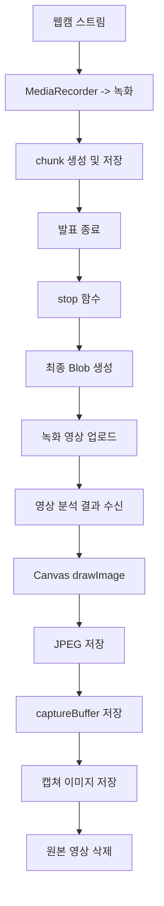
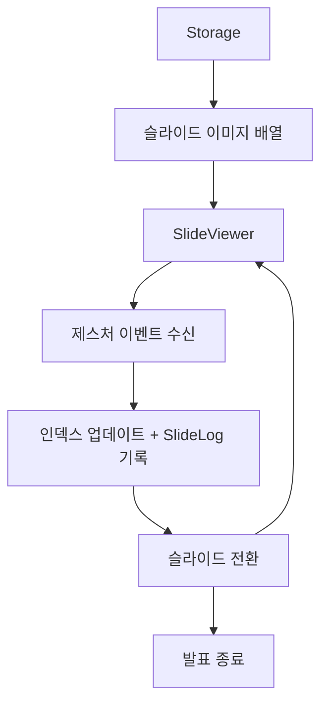
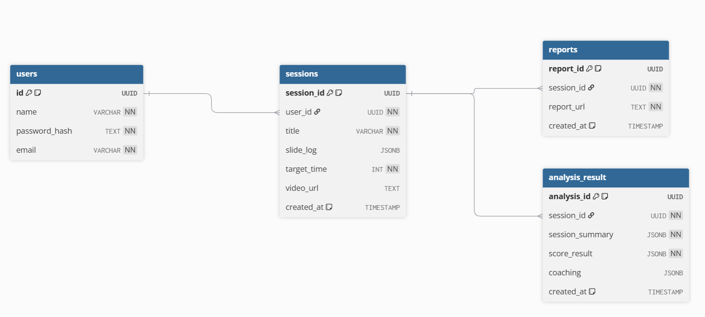

# Design Specification Document (DSD)
# 웹캠 기반 실시간 발표 분석 프로그램

| 항목 | 내용 |
|------|------|
| 종합설계 제목 | 웹캠 기반 실시간 발표 분석 프로그램 |
| 지도교수 | 서영석 |
| 팀장 | 안동규 |
| 팀원 | 김민서, 이보현, 이혜정, 전채현 |
| 주제 분류 | Data, AI |
| 작성일 |  |
| 버전 |  |

---

## 요약문

// 이 문서가 무엇인지 2~3줄 요약
// "PresentAI 각 모듈을 블록 레벨로 분해하여 기능·인터페이스·알고리즘을 정의한다" 방향으로

---

## 목차

1. [서론](#1-서론)
   - 1.1 [개요](#11-개요)
   - 1.2 [범위](#12-범위)
   - 1.3 [용어 정의](#13-용어-정의)
   - 1.4 [설계 제한사항](#14-설계-제한사항)
   - 1.5 [Specification](#15-specification)
2. [시스템 아키텍처](#2-시스템-아키텍처)
   - 2.1 [전체 시스템 구성도](#21-전체-시스템-구성도)
   - 2.2 [계층별 역할 정의](#22-계층별-역할-정의)
   - 2.3 [데이터 흐름 개요](#23-데이터-흐름-개요)
3. [모듈별 DSD](#3-모듈별-dsd)
   - 3.1 [회원 관리 모듈](#31-회원-관리-모듈)
   - 3.2 [발표 환경 설정 모듈](#32-발표-환경-설정-모듈)
   - 3.3 [영상 분석 모듈 (MediaPipe WASM)](#33-영상-분석-모듈-mediapipe-wasm)
   - 3.4 [영상 녹화 및 캡처 모듈](#34-영상-녹화-및-캡처-모듈)
   - 3.5 [AI 코칭 모듈 (Gemini API)](#35-ai-코칭-모듈-gemini-api)
   - 3.6 [슬라이드 관리 모듈](#36-슬라이드-관리-모듈)
   - 3.7 [점수화 알고리즘 모듈](#37-점수화-알고리즘-모듈)
   - 3.8 [PDF 보고서 생성 모듈](#38-pdf-보고서-생성-모듈)
4. [데이터베이스 설계](#4-데이터베이스-설계)
   - 4.1 [ER 다이어그램](#41-er-다이어그램)
   - 4.2 [테이블 스키마](#42-테이블-스키마)
   - 4.3 [Supabase Storage 구조](#43-supabase-storage-구조)
5. [API 명세](#5-api-명세)
   - 5.1 [인증 API](#51-인증-api)
   - 5.2 [발표 세션 API](#52-발표-세션-api)
   - 5.3 [분석 결과 API](#53-분석-결과-api)
   - 5.4 [보고서 API](#54-보고서-api)
6. [프론트엔드 설계](#6-프론트엔드-설계)
   - 6.1 [페이지 구성 및 라우팅](#61-페이지-구성-및-라우팅)
   - 6.2 [상태 관리 설계](#62-상태-관리-설계)
   - 6.3 [주요 컴포넌트 명세](#63-주요-컴포넌트-명세)
7. [테스트 계획](#7-테스트-계획)
   - 7.1 [단위 테스트](#71-단위-테스트)
   - 7.2 [통합 테스트](#72-통합-테스트)
   - 7.3 [성능 기준](#73-성능-기준)
8. [참고 문헌](#8-참고-문헌)

---

## 그림 목차

// 문서 완성 후 채울 것 (그림 번호 / 제목 / 페이지)

---

## 표 목차

// 문서 완성 후 채울 것 (표 번호 / 제목 / 페이지)

---

## 1. 서론

### 1.1 개요

// 프로젝트 한 줄 소개 + 이 문서의 목적 (모듈 분해 기준 문서임을 명시)
// DRD Executive Summary 압축 버전, 2~3문장이면 충분

### 1.2 범위

// 이 문서가 다루는 것 vs 다루지 않는 것을 표로 구분
// 제외 예시: 음성 분석(7월 이후), 모바일 앱, 관리자 페이지

| 포함 | 제외 |
|------|------|
|  |  |

### 1.3 용어 정의

// 본문에 나오는 기술 약어·신조어 정리 — 독자(교수, 팀원)가 모를 만한 것 위주
// 예: Landmark, WASM, EAR, Head Pose, MediaRecorder API, JWT

| 용어 | 정의 |
|------|------|
|  |  |

### 1.4 설계 제한사항

// DRD 2.4 제한조건을 설계 결정과 연결해서 재서술
// 단순 나열 X → "이 제한 때문에 이렇게 설계했다" 형식으로
// 예: 웹캠 깊이 정보 없음 → 전후 흔들림 감지 제외
//     Railway CPU 제한 → Whisper 7월 이후로 연기

### 1.5 Specification

// DRD 2.5 Specification 표 그대로 붙여넣거나 참조 표기로 처리
// "상세 기능 명세는 DRD 2.5를 따른다" 한 줄도 OK

---

## 2. 시스템 아키텍처

### 2.1 전체 시스템 구성도

// ★ 그림 필수 ★
// 클라이언트(Browser) / 백엔드(Railway) / DB(Supabase) 3계층 박스로 구성
// 각 계층 안에 핵심 모듈 이름, 계층 간 통신 방식 화살표로 표기 (HTTPS REST, WASM 등)
// draw.io 또는 Lucidchart 사용 권장

### 2.2 계층별 역할 정의

// 계층 / 담당자 / 기술 스택 / 배포 환경 표로 정리

| 계층 | 담당 | 기술 스택 | 배포 |
|------|------|----------|------|
|  |  |  |  |

### 2.3 데이터 흐름 개요

// ★ 그림 필수 ★
// 웹캠 → MediaPipe → 분석 엔진 → 캡처/버퍼 → 발표 종료 → 백엔드 → Gemini+PDF → Storage → 다운로드
// 화살표마다 데이터 형태 표기 (랜드마크 좌표 / JSON / Base64 이미지 등)

---

## 3. 모듈별 DSD

// 각 모듈은 아래 4가지 항목을 공통으로 채운다
// ① 기능 설명 ② 블록 다이어그램 ③ 입출력 파라미터 ④ 알고리즘

---

### 3.1 회원 관리 모듈

#### 기능 설명

// 회원가입 / 로그인 / 로그아웃 / 히스토리 조회 기능 한 단락 요약
// JWT 방식 채택 이유 한 줄 추가

#### 블록 다이어그램

// 그림 권장
// 흐름: 회원가입·로그인 Handler → UserService → JWTService → Supabase(users 테이블)
// 각 블록에 주요 함수명 적어둘 것

#### 입출력 파라미터

// 엔드포인트별 입력 / 출력 / 에러 케이스를 표로 정리
// 대상: /auth/signup, /auth/login, /auth/logout, /users/history

| 엔드포인트 | 입력 | 출력 | 에러 |
|-----------|------|------|------|
|  |  |  |  |

#### 알고리즘

// 비밀번호 해싱 방식 (bcrypt, salt rounds 몇으로 할지)
// JWT payload 구조 (필드명, 만료 시간)
// 토큰 검증 흐름 간략히

---

### 3.2 발표 환경 설정 모듈

#### 기능 설명

// 파일 업로드 → 슬라이드 변환 → Storage 저장 흐름 + 목표 시간 설정 + 웹캠 사전 점검 요약

#### 블록 다이어그램

// 그림 권장
// 흐름: 파일 업로드 → 확장자 분기(PPT/PDF) → 변환(python-pptx / pdf2image) → Storage 저장

#### 입출력 파라미터

// /slides/upload, convert_ppt(), convert_pdf() 각각 입출력을 표로

| 함수 | 입력 | 출력 |
|------|------|------|
|  |  |  |

#### 알고리즘

// 1. 확장자 확인 후 분기
// 2. PPT: python-pptx로 파싱 → PIL 이미지 렌더링
// 3. PDF: pdf2image convert_from_bytes(), DPI 설정값 명시
// 4. Storage 업로드 경로 규칙 — slides/{session_id}/slide_{n}.png

---

### 3.3 영상 분석 모듈 (MediaPipe WASM)

#### 기능 설명

// Hand / Face / Pose 3개 모델 동시 구동 개요
// Web Worker 분리 이유: 메인 스레드 블로킹 방지
// VIDEO 모드 채택 이유: LIVE_STREAM 모드 callback hang 버그 회피

#### 블록 다이어그램

// ★ 그림 필수 ★
// Web Worker 박스 안에 3개 모델 병렬 구조로 표현
// 흐름: 웹캠 VideoFrame → 각 모델 → 지표 계산 엔진 → postMessage → React 메인 스레드

#### 입출력 파라미터

// 분석 지표 17개 전체를 표로 정리
// 표 형식: 번호 / 지표명 / 사용 모델 / 계산 방법 요약 / 단위

| # | 지표명 | 사용 모델 | 계산 방법 | 단위 |
|---|--------|---------|---------|------|
|  |  |  |  |  |

// 아래 두 데이터 구조도 정의할 것
// FrameData: 매 프레임 수집 데이터 (timestamp, 각 지표 raw 값)
// SessionSummary: 발표 종료 시 집계 데이터 (평균·비율·타임스탬프 목록 등)

#### 알고리즘

// 모델 초기화 순서 및 detect_for_video() 호출 루프 방식
// 제스처 판별 조건 — 손가락 굽힘 판정 공식, 10프레임 락, 쿨다운 처리
// 시선 분석 — Head Pose 추정 방법, 정면 응시 판정 조건 (yaw ±15°, pitch ±10°), EAR 공식
// 자세 분석 — 어깨 기울기 공식, 상체 흔들림 계산 (이동평균 표준편차)

---

### 3.4 영상 녹화 및 캡처 모듈

#### 기능 설명

&emsp; 이 모듈의 목적은 발표 분석을 위해 발표 영상 및 음성을 녹화하고 분석 데이터를 수집하는 것이다. 발표 종료 후 녹화 영상을 기반으로 문제 상황이 발생한 시점의 프레임을 캡쳐하여 분석 데이터로 활용하는 것이다.
&emsp; 브라우저의 MediaRecorder API를 사용하여 발표 전 구간을 WebM 형식으로 녹화하여 Supabase Storage에 저장한다. 이때 브라우저 호환성과 MediaRecorder 기본 원 포멧을 고려하여 WebM 형식을 사용한다. 발표 후 영상 분석 모듈(3.3)에서 분석 결과를 전달받아서 문제 상황을 탐지한다. 이때 Canvas API의 drawImage()와 toBlob()을 사용하여 해당 시점의 프레임을 JPEG로 추출 및 저장한다. 녹화 영상 전 구간에 대하여 추출한 문제 상황의 프레임들은 Supabase Storage에 업로드되어 보고서 작성 시 사용된다.

본 모듈의 주요 기능은 다음과 같다.
 1. MediaRecorder API를 활용한 실시간 영상 및 음성 녹화 기능
 2. Canvas API를 활용한 녹화 영상 기반 문제 순간 캡쳐 기능
 3. Supabase Storage에 녹화 영상과 캡쳐 이미지 저장 및 관리 기능

**오류 처리** 
&emsp;  녹화 중 오류가 발생하면 데이터 손실을 방지하기 위해 수집된 chunk를 Storage에 임시 저장한 뒤 녹화 중단 및 스트림 종료한다. 

**데이터 활용 및 삭제** 
&emsp;  수집된 데이터는 이후 발표 평가 및 문제 구간 분석을 목적으로 활용된다.

&emsp;  분석 및 보고서 생성 완료 후 videos/{session_id}/ 이하의 segment 파일 및 final.webm 파일 즉시 삭제하여 개인정보를 보호한다.

**고려 사항 및 주의점** 
&emsp;  MediaRecorder는 브라우저별로 지원하는 코덱 및 동작 방식이 다르므로 isTypeSupported() 기반 mimeType 검증 및 fallback 전략을 적용한다.

&emsp; 장시간 녹화 시 메모리 사용량 증가 및 chunk 데이터 손실 가능성이 존재하므로 일정 주기마다 chunk 단위로 데이터를 Supabase Storage에 임시 저장하여 안정성을 확보한다.

#### 블록 다이어그램

#### 입출력 파라미터

| 지표 | 트리거 조건 | 지속 조건 | 쿨다운 |
|------|-----------|----------|--------|
| 시선 이탈 | abs(pitch_degree) > 15.0 또는 abs(yaw_degree) > 15.0 | 2초 이상 지속 | 5초 |
| 어깨 기울기 | 어깨 기울기 >= 8° | 3초 이상 지속 | 5초 |
| 손과 얼굴의 거리(가림 판단) | distance(hand, face_center) < face_width * 0.6 AND IoU(hand_Bbox, face_Bbox) > 0.25 AND Hand_Velocity < 0.05 | 1.5초 이상 지속 | 3초 |
| 상체 흔들림 | mean(abs(상체의 중심좌표 X의 이동량 / shoulder_width)) >= 0.08 | 2초 이상 지속 | 5초 |
| 상체 앞쏠림 | Distance_current $\sqrt{(X_Shoulder - X_Hip)^2 + (Y_Shoulder - Y_Hip)^2}$   Ratio_current = Distance_current / (X_RightShoulder - X_LeftShoulder)   abs(Ratio_base - Ratio_current) >= 0.15 | 3초 이상 지속 | 5초 |
| 대본 리딩(시선 고정) | yaw_degree > 20도 또는 시선 좌우 편향 > 0.7 | 4초 이상 지속 | 5초 |
| 산만한 과잉 제스처 | 정규화된 손 움직임 속도 > 0.75 AND 양손 대칭성 < 0.3 AND 제스처 빈도 > 임계값 | 3초 이상 지속 | 5초 |
| 긴장성 신체 동결 | EAR < EAR_base * 0.75 and 눈 깜빡임 <=  5/min and hand_velocity < 0.01 | 3초 이상 지속| 5초 |

사용자별 자세 및 움직임 차이를 보정하기 발표 시작 전 초기 base 값을 측정한다. 
각 트리거 조건이 만족되면 해당 시점의 timestamp를 기록하며, timestamp 기반으로 캡쳐 진행

#### 알고리즘

**녹화 설정:**
  1. navigator.mediaDevices.getUserMedia()를 호출하여 stream 가져오기
  2. MediaRecorder 생성
      - mimeType: MediaRecorder.isTypeSupported()를 통해 지원 가능한 mimeType을 적용
      - videoBitsPerSecond: 1500000 
      - audioBitsPerSecond: 128000 
  3. 녹화 데이터 저장을 위한 chunk 배열 초기화
  4. video.srcObject를 통해 웹캠 스트림과 비디오 요소를 연결
 
**녹화 시작:**
  1. MediaRecorder.start(timeslice)를 호출하여 녹화 시작
     - timeslice: 1000ms
        -> 1초 단위로 데이터를 생성
  2. ondataavailable 이벤트로 실시간으로 생성되는 영상 데이터를 chunk 단위로 수집한다. 
      - event.data.size > 0이면 chunks.push(event.data) 수행
  3. 수집된 chunk 데이터는 메모리 사용량 증가 및 데이터 손실 방지를 위해 일정 개수(예: 30초 단위)마다 임시 WebM 세그먼트 파일로 Storage에 업로드한다.

**녹화 종료:**
  1. stop()으로 녹화 종료
  2. onstop 이벤트:
      1. 수집된 모든 chunk → 하나의 Blob으로 병합 -> 최종 영상 파일 생성
      2. Blob 업로드 가능한 상태로 전환
  3. 최종 영상 파일은 Supabase Storage의 videos/{session_id}/final.webm 경로에 Signed URL 형태로 저장한다.
  4. track.stop()을 호출하여 카메라 및 마이크 리소스 해제

**녹화 중 오류 처리:**
  1. onerror 이벤트를 통해 녹화 중 발생한 오류 감지
  2. 오류 발생 시 다음 실행하여 현재 세션을 안전 종료: 
    &emsp;   (1) 현재까지의 chunk를 Storage에 임시 저장 
    &emsp;   (2) stop()을 통해 녹화 종료 
    &emsp;   (3) track.stop()으로 리소스 해제
   3. 사용자에게 재시작 안내 제공

**프레임 캡쳐:** 
- 프레임 캡쳐를 위한 canvas 준비
- 발표 종료 후 영상 분석 모듈에서 전달받은 분석 결과 기준으로 캡쳐 실행

  1. video.currentTime = timestamp를 통해 문제 발생 위치로 이동
  2. seeked 이벤트 발 후 현재 프레임 접근
  3. canvas.drawImage(video, 0, 0)를 통해 현재 비디오 프레임을 Canvas에 렌더링
  4. canvas.toBlob()을 사용하여 JPEG 이미지로 변환
     - 이미지 형식: "image/jpeg",
     - 품질 설정: jpegQuality=0.8
  5. 생성된 캡쳐 이미지는 captureBuffer[]에 임시 저장되며 캡쳐 이미지 수 증가에 따른 메모리 사용량 증가를 방지하기 위해 일정 개수 이상 누적 시 Supabase Storage에 즉시 업로드 후 임시 저장된 이미지를 삭제한다.

**메모리해제**
-  캡쳐 완료 후: 
&emsp; • chunk[] 초기화
&emsp; • captureBuffer[] 초기화
&emsp; • URL.revokeObjectURL() 수행
&emsp; • Blob 및 video 리소스 해제 
   
---

### 3.5 AI 코칭 모듈 (Gemini API)

#### 기능 설명

// 발표 중 호출 없이 종료 후 1회 일괄 호출 방식 채택 이유 (API 호출 제한 고려)
// SessionSummary + 캡처 이미지 → Gemini → 코칭 텍스트 생성 흐름 한 단락

#### 블록 다이어그램

// 그림 권장
// 흐름: 입력(SessionSummary + 캡처 URL) → 프롬프트 빌더 → Gemini API → 응답 파싱 → CoachingResult[]

#### 입출력 파라미터

// CoachingRequest / CoachingResult 데이터 구조 정의
// CoachingResult 필드 예시: category / captureUrl / issue / coaching / improvement

#### 알고리즘

// 프롬프트 구성 방식: System Instruction / 수치 JSON / 이미지 / 출력 포맷 지시 파트별로
// 이미지 전달 방식 결정 (Signed URL vs Base64) + 최대 이미지 수 제한 이유
// API 실패 시 폴백 처리 방식 (재시도 or 규칙 기반 텍스트)

---

### 3.6 슬라이드 관리 모듈

#### 기능 설명

이 모듈은 발표 자료를 이미지 형태로 렌더링하고, 발표자의 제스처 이벤트를 수신하여 슬라이드를 전환하는 역할을 한다.

&emsp; 발표 전 Supabase Storage에 저장된 슬라이드 이미지를 로드하여 SlideViewer 컴포넌트에 전달하며, 영상 분석 모듈에서 전달된 제스처 이벤트를 수신하여 슬라이드 전환을 수행한다.

&emsp; 또한 각 슬라이드의 진입 시각과 종료 시각을 기록하여 SlideLog를 생성하여 이후 발표 분석에 사용한다.

&emsp; 슬라이드 렌더링 중 오류가 발생하면 이전 슬라이드를 유지하여 화면 중단을 방지한다. 오류 로그를 기록하고 렌더링을 재시도를 수행한다.

#### 블록 다이어그램

// 흐름: 슬라이드 이미지 배열 → SlideViewer → 제스처 이벤트 수신 → 인덱스 업데이트 + SlideLog 기록

#### 입출력 파라미터

| 함수 | 입력 | 출력 |
|------|------|------|
| initSlides() | slideURLs[] | 슬라이드 이미지 배열 가져오기 -> 초기 상태 설정 -> 첫 슬라이드 렌더링 -> 타임 스탬프 기록 시작 |
| nextSlide() | slideIndex | slideIndex+1 |
| prevSlide() | slideIndex | slideIndex-1 |
| getSlideTimings() | slideLog[] | 슬라이드별 발표 시간 |

SlideLog 구조: 
interface SlideLog{ 
&emsp;    slideIndex: number, 
&emsp;    enterTime: number, 
&emsp;    exitTime: number, 
&emsp;    duration: number 
}

| 필드 | 설명 |
|----|-----|
| slideIndex | 슬라이드 번호 |
| enter Time | 슬라이드 진입 시각(ms) |
| exitTime | 슬라이드 종료 시각(ms) |
| duration | 머문 시간(ms) |

#### 알고리즘

**초기화**
  1. 슬라이드 전환 기록을 저장하기 위한 SlideLog 배열 초기화
  2. performance.now()로 발표 시작 시점의 상대 시간 저장(startTime)
  3. 현재 슬라이드 인덱스를 0으로 초기화(currentSlideIndex)
  4. 현재 슬라이드 진입 시간을 기록하기 위해 enterTime에 performance.now()를 사용하여 상대 시간 저장
  5. Storage에서 슬라이드 이미지 목록 조회
  6. currentSlideIndex로 현재 인데스에 맞는 슬라이드를 렌더링
  7. 현재 슬라이드 기준 다음 슬라이드 이미지 2개를 preload한다.
     - 모든 슬라이드 이미지를 가져오면 초기 로딩이 오래 걸리고 부담이 큼
     - 슬라이드를 하나씩 가져오면 전환 지연 발생 가능
     - 네트워크 지연 시에도 즉시 전환과 메모리 사용량 증가를 고려하여 preload 개수는 2개로 제한한다.

**슬라이드 전환 및 시간 기록**
  - SlideLog 시간은 performance.now() 기준 상대 시간이다.
  1. 영상 분석 모듈(3.3)에서 전달된 GestureEvent를 수신하여 슬라이드 전환
     - 오른손 fist를 전달받으면 nextSlide()를 호출, 왼손 fist를 전달받으면 prevSlide()를 호출한다.
     - 첫 슬라이드에서 prevSlide() 호출 시 상태 유지
     - 마지막 슬라이드에서 nextSlide() 호출 시 즉시 종료하지 않고 발표 종료 여부를 사용자에게 확인하는 단께를 거침.
  2. performance.now()를 호출하여 현재 상대 시간 저장(now)
  3. 현재 슬라이드의 정보를 SlideLog 배열에 누적
       slideIndex: 현재 슬라이드 인덱스 (currentSlideIndex)
       enterTime: enterTime - startTime
       exitTime: now - startTime
       duration: now - enterTime

  4. 다음 슬라이드 기록을 위해 enterTime을 now 값으로 갱신
  5. currentSlideIndex를 새 슬라이드 인덱스로 변경
  6. 마지막 슬라이드 여부(isLast)를 확인하여 종료 처리 수행

**발표 종료:**
  1. 누적된 SlideLog를 sessions 테이블의 slide_log(JSONB)에 저장한다.
  2. preload된 이미지 캐시 및 이벤트 리스너를 해제한다.

**오류 처리**
&emsp; 슬라이드 전환 또는 렌더링 중 오류가 발생하면 다음 작업을 수행한다.
  1. 현재 슬라이드를 유지하여 화면 중단 방지
  2. 오류 로그를 SlideLog 배열에 기록
  3. 현재 슬라이드 인덱스를 기반으로 슬라이드 렌더링을 재시도한다.

발표 종료 후 전체 SlideLog를 기반으로:
 • 슬라이드별 발표 시간 
 • 평균 슬라이드 체류 시간
 • 목표 시간 대비 오차율
등을 계산한다.

---

### 3.7 점수화 알고리즘 모듈

#### 기능 설명

// SessionSummary + SlideLog → 카테고리 4개 점수(0~100) + 종합 점수 산출
// 담당: 이보현 / 가중치 근거는 DRD 참고문헌 인용

#### 블록 다이어그램

// 흐름: 입력 데이터 → 시선/자세/제스처/시간 점수 각각 계산 → 가중 합산 → ScoreResult 출력

#### 카테고리 및 가중치

// 표: 카테고리 / 포함 지표 목록 / 가중치

| 카테고리 | 포함 지표 | 가중치 |
|----------|---------|--------|
|  |  |  |

#### 알고리즘

// 카테고리별 점수 계산 공식을 의사코드로 기술
// 정면 응시율 → 점수 변환 방식
// 슬라이드 시간 오차율 → 점수 변환 방식
// 종합 점수 공식: Σ(카테고리 점수 × 가중치)

---

### 3.8 PDF 보고서 생성 모듈

#### 기능 설명

// 입력: ScoreResult + CoachingResult[] + SlideLog[]
// 출력: PDF → Supabase Storage 저장 → 다운로드 URL 반환
// 사용 라이브러리: ReportLab (레이아웃) + Matplotlib (그래프)

#### 블록 다이어그램

// ★ 그림 필수 ★ — PDF 페이지 레이아웃 스케치
// 1페이지: 표지 (점수 요약 + 레이더 차트)
// 2페이지: 카테고리별 바 차트 + 슬라이드별 시간 그래프
// 3페이지~: 코칭 섹션 반복 (좌: 캡처 이미지 / 우: 코칭 텍스트, 2단 레이아웃)
// 실제 여백·비율 비례하게 표현하면 구현할 때 훨씬 편함

#### 입출력 파라미터

// 표: 페이지 번호 / 포함 내용 / 사용 라이브러리

| 페이지 | 내용 | 라이브러리 |
|--------|------|----------|
|  |  |  |

#### 알고리즘

// 1. Matplotlib으로 레이더 차트 / 바 차트 / 시간 그래프 PNG 생성
// 2. ReportLab Frame 2개로 2단 레이아웃 구현 (LEFT_FRAME: 이미지, RIGHT_FRAME: 텍스트)
// 3. CoachingResult 수만큼 페이지 반복 추가
// 4. PDF BytesIO 버퍼 → Supabase Storage 업로드

---

## 4. 데이터베이스 설계

### 4.1 ER 다이어그램

**관계**
- users:sessions -> 1:N
- sessions:analysis_results -> 1:1
- sessions:reports -> 1:1

### 4.2 테이블 스키마

#### users

| 컬럼명 | 타입 | 제약 | 설명 |
|--------|------|------|------|
| id | UUID | PK | 사용자 고유 식별 |
| name | VARCHAR | NOT NULL | 사용자 이름 |
| email | VARCHAR | NOT NULL, UNIQUE | 로그인 이메일  |
| password_hash | TEXT | NOT NULL | bcypt 해시 비밀번호 |

#### sessions

| 컬럼명 | 타입 | 제약 | 설명 |
|--------|------|------|------|
| session_id | UUID | PK | 세션 고유 아이디 |
| user_id | UUID | FK, REFERENCES users(id) ON DELETE CASCADE | 세션과 사용자 매칭 |
| title | VARCHAR | NOT NULL | 발표 제목 |
| slide_log | JSONB |  | SlideLog 배열 저장 |
| target_time | INT | NOT NULL | 목표 발표 시간(초) |
| video_url | TEXT |  | 발표 영상 |
| created_at | TIMESTAMP | DEFAULT CURRENT_TIMESTAMP | 생성 시간 |

#### analysis_results

| 컬럼명 | 타입 | 제약 | 설명 |
|--------|------|------|------|
| analysis_id | UUID | PK | 분석 결과 고유 아이디 |
| session_id | UUID | FK, REFERENCES sessions(session_id) ON DELETE CASCADE | 분석 결과와 세션 매칭 |
| session_summary | JSONB | NOT NULL | 집계 데이터(평균, 비율, 타임스탬프) |
| score_result | JSONB | NOT NULL | 점수 산출 결과 |
| coaching | JSONB | | AI 코칭 결과 |
| created_at | TIMESTAMP | DEFAULT CURRENT_TIMESTAMP | 생성 시간 |

#### reports

| 컬럼명 | 타입 | 제약 | 설명 |
|--------|------|------|------|
| report_id | UUID | PK | 보고서 고유 아이 |
| session_id | UUID | FK, REFERENCES sessions(session_id) ON DELETE CASCADE | 보고서와 세션 매칭 |
| report_url | TEXT | NOT NULL | 보고서 링크 |
| created_at | TIMESTAMP | DEFAULT CURRENT_TIMESTAMP | 생성 시간 |

### 4.3 Supabase Storage 구조

bucket 
| 
|---- slides/ 
&emsp;   |---- {session_id}/ 
&emsp;&emsp;       |---- slide_1.png 
&emsp;&emsp;       |---- slide_2.png 
&emsp;&emsp;       |---- ... 
|
|---- captures/ 
&emsp;   |---- {session_id}/ 
&emsp;&emsp;       |---- capture_1.jpg 
&emsp;&emsp;       |---- capture_2.jpg 
&emsp;&emsp;       |---- ... 
|
|---- reports/ 
&emsp;   |---- {session_id}/ 
&emsp;&emsp;       |---- report.pdf
|
|----videos/ 
&emsp;   |---- {session_id}/ 
&emsp;&emsp;       |---- segments/
&emsp;&emsp;&emsp;          |---- segment_001.webm
&emsp;&emsp;&emsp;          |---- segment_002.webm
&emsp;&emsp;&emsp;          |---- ...
&emsp;&emsp;       |---- final.webm

**파일 경로 규칙**
| 유형 | 경로 규칙 |
|-----|---------|
| 슬라이드 | slides/{session_id}/slide_{n}.png |
| 캡쳐 이미지 | captures/{session_id}/capture_{n}.jpg |
| 보고서 PDF | reports/{session_id}/report.pdf |
| 발표 영상 | videos/{session_id}/final.webm |

**RLS 정책**
| 정책 | 설명 |
|-----|-----|
| 사용자별 접근 제한 | auth.uid() 기반 본인 데이터만 접근 가능 |
| 공개 URL 미사용 | Signed URL 방식으로만 파일 접근 |
| 세션 단위 권한 분리 | session.user_id 검증 후 접근 허용 |
| 업로드 제한 | 인증 사용자만 업로드 가능 |

---

## 5. API 명세

// 공통 사항 먼저 명시:
// Base URL / 인증 헤더 형식 / 공통 에러 코드 (400·401·403·404·500)

### 5.1 인증 API

// /auth/signup, /auth/login, /auth/logout
// 가능하면 각 엔드포인트 Request Body / Response Body 예시도 추가

| 메서드 | 경로 | 설명 | 인증 |
|--------|------|------|------|
|  |  |  |  |

### 5.2 발표 세션 API

// /sessions CRUD + /sessions/{id}/slides 업로드

| 메서드 | 경로 | 설명 | 인증 |
|--------|------|------|------|
|  |  |  |  |

### 5.3 분석 결과 API

// /sessions/{id}/analysis 저장·조회 + /sessions/{id}/captures 업로드

| 메서드 | 경로 | 설명 | 인증 |
|--------|------|------|------|
|  |  |  |  |

### 5.4 보고서 API

// POST /sessions/{id}/report → Gemini 호출 + PDF 생성 (처리 시간 김)
// 비동기 처리 방식 사용할지 (polling 방식 등) 결정해서 명시

| 메서드 | 경로 | 설명 | 인증 |
|--------|------|------|------|
|  |  |  |  |

---

## 6. 프론트엔드 설계

### 6.1 페이지 구성 및 라우팅

// 그림 권장 — 페이지 트리 또는 플로우차트
// 각 경로에 Protected 여부 + 이동 트리거 표기 (로그인 성공, 발표 종료 등)

| 경로 | 페이지명 | 인증 필요 |
|------|---------|---------|
|  |  |  |

### 6.2 상태 관리 설계

// Context API 4개(Auth / Session / Analysis / Report) 각각의 주요 상태 필드와 역할을 표로

| Context | 주요 상태 필드 | 역할 |
|---------|-------------|------|
|  |  |  |

### 6.3 주요 컴포넌트 명세

// 핵심 컴포넌트 위주로 표 작성
// WebcamAnalyzer / SlideViewer / GestureOverlay / TimerBar / ReportViewer / CoachingCard / RadarChart

| 컴포넌트 | 위치(페이지) | 역할 | 주요 Props |
|----------|------------|------|-----------|
|  |  |  |  |

---

## 7. 테스트 계획

### 7.1 단위 테스트

// 모듈별 핵심 로직 테스트 항목과 합격 기준
// 최소 포함: 제스처 정확도 / 점수 경계값 / JWT 검증 / PDF 생성 확인

| 모듈 | 테스트 항목 | 도구 | 합격 기준 |
|------|-----------|------|---------|
|  |  |  |  |

### 7.2 통합 테스트

// 주요 사용자 시나리오 단위로 작성
// 최소 포함: 전체 발표 플로우 (시작~보고서 다운로드) / 제스처 슬라이드 전환 10회 / Gemini 응답 확인

| 시나리오 | 절차 | 합격 기준 |
|---------|------|---------|
|  |  |  |

### 7.3 성능 기준

// 수치로 명확하게 작성
// 최소 포함: MediaPipe 프레임레이트(목표 fps) / 슬라이드 렌더링 시간 / 보고서 생성 시간 / API 응답 시간

| 항목 | 목표 기준 |
|------|---------|
|  |  |

---

## 8. 참고 문헌

// DRD 참고문헌 3편 + 사용 라이브러리 공식 문서
// MediaPipe / Gemini API / FastAPI / Supabase / ReportLab / React / MDN MediaRecorder API

1.
2.
3.
